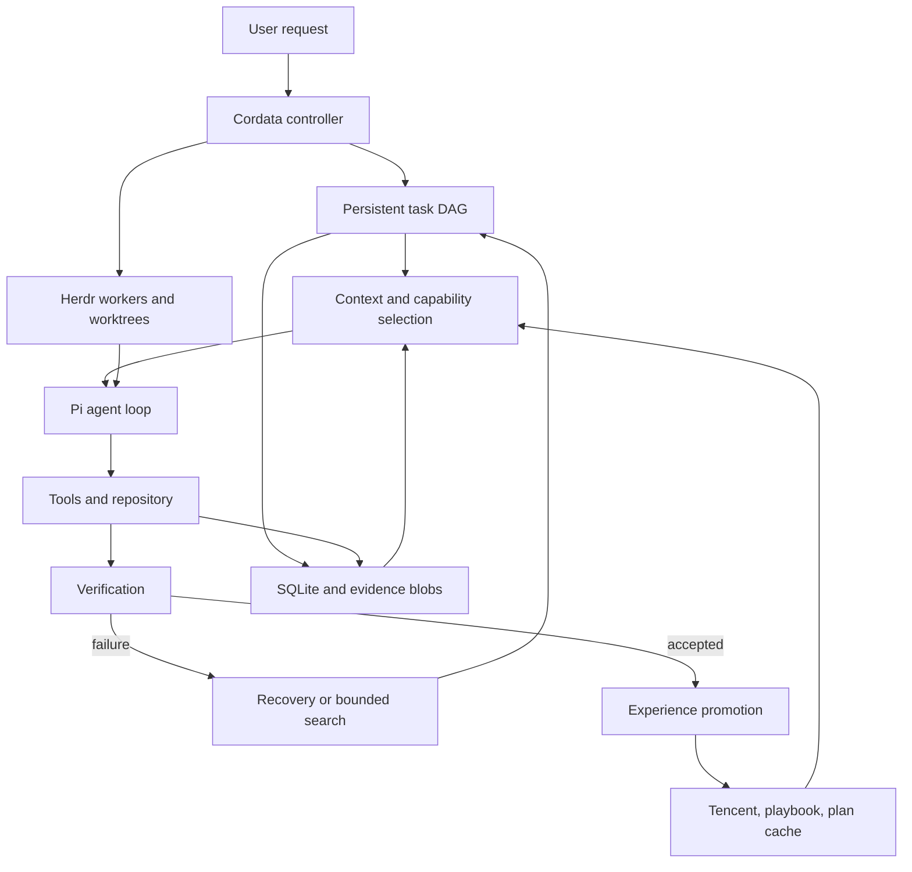
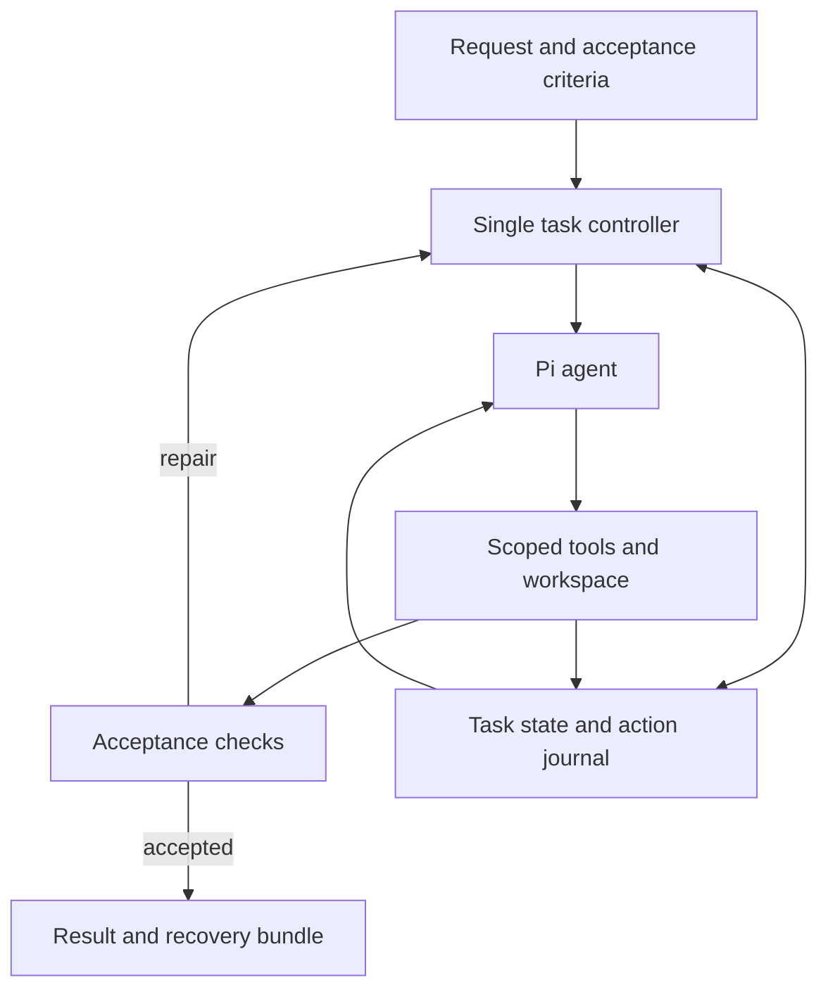
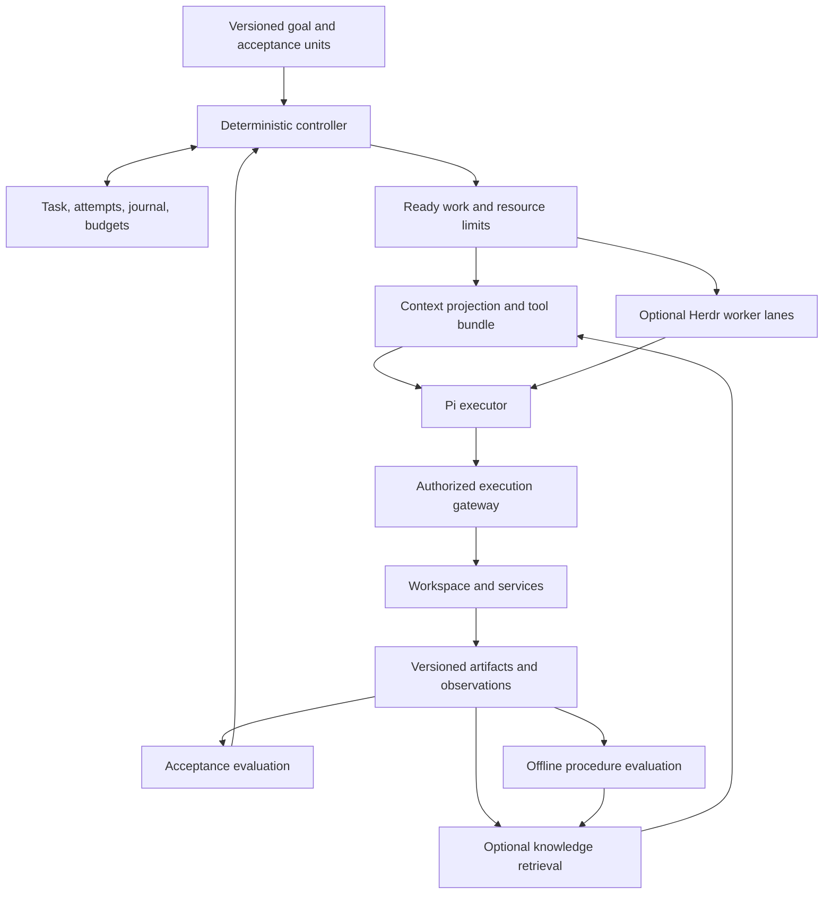
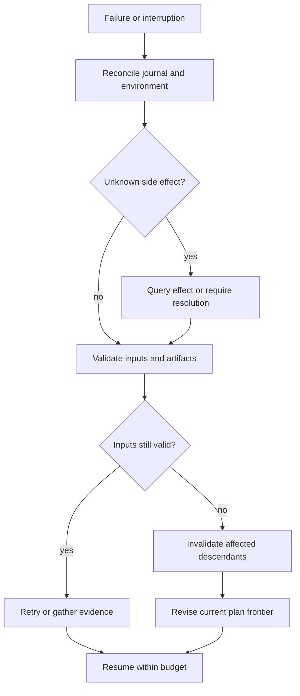
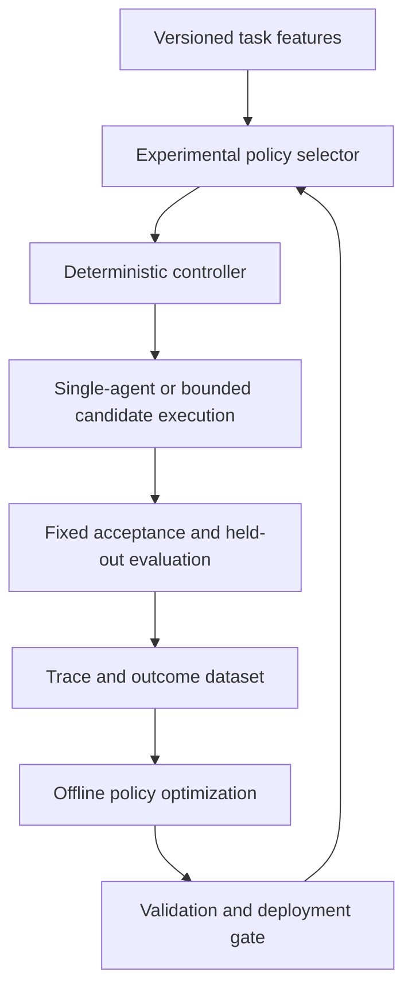

# Cordata Architecture Review

## 1. Executive assessment

**Cordata is a credible architecture proposal, but it is not yet an implementation-ready reliability specification. Build a smaller version of its existing single-agent design before committing to its full context, memory, and orchestration machinery.** The strongest practical starting point is Pi with a thin Cordata controller, durable task and action records, recoverable workspace artifacts, executable acceptance checks, and conservative context management. Keep Herdr as the terminal and worktree substrate. Make semantic memory, parallel workers, learned procedures, and search independently measurable additions.

This assessment concerns `CORDATA_DEVELOPMENT_SPEC(1).md`, marked “Last validated: 2026-09-13.” It evaluates public evidence available through 13 September 2026. The attachment is a design proposal; no Cordata implementation, production traces, or benchmark runs were supplied. Consequently, statements about its expected performance are hypotheses, not measurements.[^1]

The proposal already rejects permanent multi-agent teams, mandatory MCTS, indiscriminate memory injection, and model-only verification. Its Phase 1 explicitly excludes Tencent, multi-agent execution, and automatic memory promotion. Recommending those exclusions again would not constitute an improvement. The real improvements are in the implementation semantics and in deciding which later phases deserve to exist.

Seven changes have the highest practical value:

1. **Specify durable execution, not just durable records.** Add action identities, attempt identities, leases, fencing, uncertain-outcome reconciliation, and restorable code artifacts. A fingerprint can detect a changed worktree; it cannot reconstruct it.
2. **Replace unconditional context reconstruction with cache-aware context management.** Preserve stable prompt prefixes, mask bulky old observations first, and compact at measured boundaries. A shorter prompt can cost more if it destroys useful caching.
3. **Make acceptance depend on task requirements and artifact versions.** A passing test is evidence about a particular snapshot under particular conditions, not a permanent property of a DAG node.
4. **Separate tool exposure from executable permissions.** Pi hooks are useful policy controls; shell access and arbitrary extensions require an operating-system boundary for enforceable isolation.
5. **Reduce state duplication.** Use one authoritative task store, one observation archive, and one procedure registry with typed records and projections. Avoid three independently evolving versions of the same lesson in a playbook, Skill, and plan cache.
6. **Require measured justification for delegation, retrieval, and verification calls.** Price their complete downstream cost, including cache misses, integration, retries, and human review.
7. **Move the harness feasibility spike ahead of the broad scaffold.** Verify resource loading, final context control, lifecycle ordering, cancellation, and session recovery before stabilizing abstractions around them.

The literature supports conditional orchestration, but it does not establish a universal best topology. Controlled studies find large differences by task structure; matched-budget reasoning studies sometimes favor a single agent, while other experiments find efficient multi-agent configurations on different reasoning benchmarks. None is a direct prediction of Cordata’s coding performance.[^17][^19][^20]

**Foundation verdict:** retain Pi provisionally. Its control surface fits the intended product, but “best long-term foundation” is stronger than the available evidence permits. OpenCode is a legitimate fallback if it delivers the required integration with materially less maintenance. OpenHands is also usable locally, so the claim that it belongs only to a future hosted product is too categorical.[^2][^4][^12][^13][^14]

**Expected performance verdict:** remove the specification’s numerical uplift ranges from architectural justification. The proposed +5–15 percentage points in success, 15–35% token reduction, and 10–25% latency reduction have no Cordata measurements behind them. Retain them only as explicitly labeled targets, if useful. The defensible prediction is conditional: Cordata should help where repeated exploration, interruption, stale evidence, or unnecessary delegation are substantial sources of failure or cost.

### Evidence interpretation

The report uses **A** for strong, directly relevant empirical support; **B** for moderate empirical support; **C** for limited or indirect evidence; and **D** for an untested hypothesis. **E** separately identifies established engineering reasoning or documented behavior. E is not an empirical agent-performance grade. An API reference can establish that a hook exists; it cannot establish that using it improves task success.

Published results are identified as author-reported unless they come from an independent comparison. A paper can be independent of the model vendors while still evaluating its authors’ own method. Benchmark leaderboards also commonly mix models, prompts, scaffolds, sampling budgets, and submission policies. They are discovery tools, not causal comparisons of orchestration.

## 2. Reconstructed current architecture

Cordata is an outer policy and workflow controller around Pi’s inner model/tool loop. Herdr supplies observable processes and worktrees. Tencent supplies optional reusable memory assets. SQLite and a blob store retain execution state and evidence. This is a centralized system with conditional workers, not a decentralized swarm.[^1]



| Subsystem | Reconstructed responsibility | Ownership and persistence |
|---|---|---|
| Task Profiler | Estimate complexity, uncertainty, risk, parallelism, and verifier strength | Cordata; profile and decision logged |
| Loop Governor | Choose `FAST_PATH`, `SINGLE_AGENT`, `PARALLEL_DAG`, or `SEARCH_MODE` | Cordata; deterministic initial thresholds |
| Runtime DAG | Dependencies, attempts, outputs, node status, scoped retries | SQLite; coordinator is authoritative |
| Context Workspace | Pins, working summaries, evidence, recent interactions, archives | Cordata context items and event references |
| Evidence ledger | Provenance, contradictions, confidence, commit and file freshness | SQLite claims; remotely retrieved items are inputs |
| Capability Router | Select tools, skills, MCP services, and specialist roles | Cordata policy; enforced through host adapters where possible |
| Pi adapter | Intercept lifecycle, context, tools, compaction, and provider events | Pi session JSONL plus references into Cordata |
| Herdr adapter | Start and prompt workers, observe status, manage worktrees | Herdr owns process/worktree infrastructure |
| Verifier Engine | Discover and run tests, diagnostics, invariants, optional reviewers | Results stored with evidence references |
| Recovery Engine | Classify failures; retry, reread, invalidate, replan, branch, or block | Cordata transitions and checkpoints |
| Experience pipeline | Derive facts, procedures, and reusable plans | Tencent assets, ACE-style playbook, plan cache |
| Memory promotion | Route corrections to temporary state, facts, knowledge, procedures, or rules | Approval/configuration governs instruction and hook changes |
| Observability | Context selection, routing, tool use, verifiers, costs, memory, recovery | Event log and proposed OpenTelemetry-compatible traces |

The normal control sequence is request → profile → choose mode → create or advance a node → assemble context → act through Pi → capture observations → verify → accept or recover. Successful execution can enqueue asynchronous memory writes. The core must run with a null memory provider and without Herdr.

The proposed node lifecycle is `PENDING → READY → RUNNING → VERIFYING → PASSED`, with `FAILED`, `BLOCKED`, `SKIPPED`, and `CANCELLED` alternatives. Dependencies become eligible after `PASSED` or policy-approved `SKIPPED`. Retries are intended to reopen only affected work. Search branches retain failed hypotheses to avoid repetition after compaction.

Agent roles include a central coordinator, explorer, implementer, verifier/test generator, and reviewer. These are roles available to the system, not a mandatory team. A worker receives a versioned context envelope with IDs, objective, permitted paths, inputs, outputs, verifiers, and budgets. It returns artifacts or a blocked reason and cannot complete the parent task or directly promote shared memory.

The concurrency model allows independent DAG nodes in isolated worktrees, followed by integration verification. The example configuration limits parallel nodes and search branching to three, with search depth two. Background monitors are deferred. Communication is coordinator-mediated through assignments, artifacts, Herdr prompting, and events; a durable acknowledged worker protocol is described in intent but not fully specified.

External dependencies include Pi and its model providers, Herdr’s socket API, Tencent services, Git, SQLite, language tooling, test environments, and optional MCP/network tools. TypeScript, Node, schemas, and a small optional daemon are proposed. There is no supplied implementation demonstrating that these dependencies compose as assumed.

## 3. Architectural assumptions

| Assumption | Assessment | Consequence or required validation |
|---|---|---|
| More selective context improves decisions | Often plausible, not monotonic | Test retention failures and cache effects, not just token reduction |
| A 12,000-token target is a useful default | Unvalidated | Treat as one experimental arm, not a model-independent optimum |
| Hand-weighted relevance scores approximate utility | Weakly supported | Begin with hard inclusion, freshness, simple ranking, and ablations |
| Model confidence measures root-cause uncertainty | Uncalibrated | Prefer observable progress, failed probes, and calibrated historical features |
| All important plans need a DAG | Too broad | Persist a milestone list first; introduce dependency edges when needed |
| Passing a verifier establishes completion | Incomplete | Acceptance must cover requirements, regressions, scope, and exact code state |
| Worktree isolation means execution isolation | False | Worktrees still share the host, credentials, ports, services, and some Git state |
| A pre-tool hook can enforce every forbidden operation | False for unrestricted interpreters or extensions | Use an execution boundary and scoped credentials |
| Archived observations make compression reversible | True only for bytes still retained | Behavioral equivalence and code restoration are separate problems |
| A completed successful run reveals a reusable lesson | Confounded | Success may be unrelated to the inferred lesson; validate transfer |
| A semantic-memory service is worth its maintenance | Unproven for this workload | Compare null memory and local project records before choosing a backend |
| Several specialist models produce independent evidence | Often false | Role prompts do not remove shared training, context, or test blind spots |
| A skipped dependency is safe for descendants | Not generally | Require substitute artifacts or explicit optional-edge semantics |
| Git ancestry is a sufficient freshness test | False | Ancestry neither proves current validity nor invalidates identical cherry-picked content |
| Pi extension hooks give Cordata final exclusive control | Conditional | Control extension order and resource loading; audit the final request |
| Herdr’s semantic completion means task completion | False | Treat it as an execution signal; validate the worker artifact separately |
| Reduced tokens imply lower cost and latency | False | Count cached/uncached tokens, output, queueing, retries, and tool time |
| The system learns when a correction stops recurring | Not necessarily | Check opportunities for recurrence and controlled comparisons |

The most consequential implicit assumption is that adding representations of a task makes the representations agree. In fact, Pi history, the DAG, evidence claims, worktree contents, summaries, and Tencent assets can each describe a different point in time. Their consistency rules are a larger reliability concern than the choice of multi-agent topology.

## 4. State-of-the-art landscape

### 4.1 Control loops and planning

ReAct established the usefulness of alternating reasoning and environment actions. Its enduring lesson is feedback-driven interaction, not a requirement to expose or repeatedly restate reasoning. For Cordata, Pi already provides this inner loop.[^16]

Agentless demonstrates that localization, repair, and validation can be organized as a simple pipeline for repository issues. Mini-SWE-agent provides an especially useful minimal baseline: a small shell-oriented agent with a linear trajectory. Their relevance is architectural restraint; their published scores do not establish how a current Pi configuration would perform.[^9][^10]

| Family | What it provides | Evidence and recommendation |
|---|---|---|
| ReAct-style loop | Adaptation to observations | Retain as the inner execution pattern; B for the general technique |
| Planner/executor and plan-and-execute | Explicit objectives and steps | Use a short plan when dependencies matter; avoid a mandatory planner call |
| Hierarchical planning | Scope control across larger objectives | Useful for long tasks, but levels should correspond to verifiable milestones |
| Dynamic planning | Revise plans when facts change | Prefer event-triggered revision to rewriting the full plan every turn |
| Graph/state-machine orchestration | Explicit transitions and resumability | E for software control; a graph itself adds no reasoning ability |
| Event-driven execution | React to completion, failure, changes, and cancellation | Recommended deterministic mechanism; avoid polling the LLM |
| LLMCompiler-style scheduling | Execute independent tool dependencies concurrently | Evidence on parallel function calls; do this before adding worker agents[^37] |
| LATS and search | Explore alternative trajectories with evaluators | B on studied tasks; C for repository-wide deployment. Restrict to resettable environments[^33] |
| Test-time interaction | Spend compute obtaining observations and revising actions | Promising web-agent evidence, including training; not proof that longer coding runs always help[^34] |

A planner’s usefulness depends on how much uncertainty can be resolved cheaply before implementation. Requiring an up-front detailed DAG for an unfamiliar repository can harden wrong assumptions. A rolling plan with a stable goal, current milestone, explicit dependencies, and unresolved questions is a better default. Anthropic’s distinction between predefined workflows and autonomous agents is a useful engineering reference for this separation, without proving a particular Cordata policy.[^32]

### 4.2 Multi-agent orchestration and conflicting evidence

The scaling study evaluates canonical topologies across task domains and model families. It reports approximately 81% relative improvement for centralized coordination on a parallelizable financial task, but 39–70% degradation for multi-agent variants on sequential PlanCraft tasks. Its headline 87% architecture-selection result concerns held-out configurations within its evaluation setting, not universal prediction of unseen software projects. The reported roughly 45% single-agent saturation threshold should not become a Cordata routing constant.[^17]

An independent-of-framework failure analysis identifies 14 failure modes across five multi-agent frameworks, including design, alignment, and verification/termination problems. It is a useful failure taxonomy, not an estimate of the failure rate of all production agents.[^18]

A 2026 matched-thinking-budget study favors single agents on multi-hop reasoning. In contrast, ACL 2026 Student Research Workshop experiments on MMLU-Pro and BBH find Pareto-efficient debate and mixture-of-agents configurations; some gains require much larger compute budgets. These results differ in models, tasks, baselines, and compute accounting. They jointly support measuring a cost–quality frontier rather than adopting a universal pro- or anti-multi-agent rule.[^19][^20]

| Topology or mechanism | Cordata implication |
|---|---|
| Supervisor/worker | Best default for conditional workers because one authority owns integration |
| Hierarchical teams | Add only when one coordinator demonstrably becomes a bottleneck |
| Decentralized mesh or swarm | Weak fit for a single repository with shared acceptance criteria |
| Blackboard | Use a typed artifact board, with provenance and subscriptions; avoid shared free-form conversation |
| Role specialization | Assign distinct evidence-producing work, not decorative personas |
| Dynamic creation and routing | Require a bounded task, capability need, budget reservation, and termination condition |
| Handoffs | Transfer state and artifacts with explicit ownership; do not clone the whole transcript |
| Debate/consensus | Optional candidate-selection experiment; votes are not executable evidence |

SupervisorAgent is a newer, relevant alternative: deterministic filtering triggers occasional supervision instead of continuously running another agent. Its authors report token savings on GAIA and additional tasks. Adopt the trigger-first idea as an experiment, not the assumption that an additional supervisor will pay for itself.[^61]

### 4.3 Context engineering

The strongest directly relevant simplification is observation masking. A controlled comparison across five model configurations in SWE-agent finds that omitting older observations can match summarization while sharply reducing cost. The paper also reports a hybrid improvement, but a naive hybrid configuration worsens efficiency. Its limits include a coding-heavy benchmark, heuristic triggers, and limited scaffold generalization.[^23]

Recent research does not invalidate that baseline; it suggests variants worth testing against it:

| Work | Demonstrated mechanism | Transfer limitation |
|---|---|---|
| Context as a Tool / SWE-Compressor, ACL Findings 2026 | Structured context workspace and learned context-management behavior; 57.6% SWE-bench Verified solved rate reported | Trained-model result; adding similar tool names to a frozen model is not equivalent[^24] |
| TRACE, August 2026 | Evaluate compaction by paired continuations from the same environment state | Preliminary AppWorld study; useful evaluation method before production policy[^25] |
| CoACT, July 2026 | Train observation compression to preserve subsequent actions; authors report 33% average token reduction across three agents | A learned compressor and its training/evaluation cost must be included[^26] |
| AttnCompress, September 2026 | Structure-aware segmentation, proxy attention, and rolling retrieval | Uses a separate scoring mechanism; published reduction is not a guarantee on API-only Cordata workloads[^27] |
| Don’t Break the Cache, January 2026 revision | Measure provider-specific cache placement across agent sessions | Research tasks and specific prompts; cost and TTFT results need coding replication[^28] |
| Recursive Language Models | Treat very large input as an external environment and recursively query subsets | Strong conceptual fit for corpus analysis; not evidence for routine multi-agent coding[^62] |

Prompt caching deserves an architectural invariant of its own. OpenAI’s Codex writeup specifically identifies tool-set changes, model changes, and prompt-prefix changes as cache hazards. This conflicts with changing the full capability bundle and reordering context every turn. Resolve the conflict through stable tool schemas within an execution segment and event-driven changes, with authorization checked on every call.[^29]

Hierarchical context should mean a small current task projection with addressable supporting evidence. Anthropic’s context-engineering guidance provides a practical reference for selective retrieval and managed context, rather than an empirical optimum.[^30] Context graphs can help preserve dependencies between claims and files, but an LLM-generated graph of every conversation concept is not justified. Code symbols, imports, tests, and artifact provenance are better initial graph edges because they can be checked mechanically.

### 4.4 Memory and learning

LongMemEval measures extraction, cross-session reasoning, time, updates, and abstention. It is useful for retrieval diagnostics, but conversational recall is not a substitute for evaluating whether memory improves a patch.[^41]

Mem0, Zep/Graphiti, A-MEM, and Hindsight offer competing designs: extracted memory with optional graphs, temporal knowledge graphs, linked evolving notes, and explicit distinctions among facts, experiences, summaries, and beliefs. Their results are mostly method-author evaluations on memory tasks. There is no established evidence here that any one is the best Cordata backend.[^42][^43][^44][^45]

WhenLoss offers a particularly useful diagnostic distinction: separate information lost at write time from information stored but missed at retrieval time. Cordata should evaluate these separately before replacing a retriever or adding graph traversal.[^46]

ACE supports incremental procedure updates instead of rewriting a complete playbook. Agentic Plan Caching supports reusable plan templates in repetitive applications. Voyager supplies an older precedent for executable skill accumulation. These results justify controlled procedure-reuse experiments, not automatic promotion after every coding session.[^38][^39][^40]

Forgetting needs two mechanisms: demoting irrelevant or stale items from retrieval, and actually deleting retained data. Neither is equivalent to overwriting a summary. Preserve negative outcomes, temporal scope, source lineage, and an abstention path. Memory poisoning research shows that normal interactions can influence persistent retrieval; follow-up work also shows attack success depends strongly on the memory and evaluation setup.[^47][^48]

### 4.5 Verification, execution, and interoperability

Older work found intrinsic self-correction unreliable without external feedback. CorrectBench reports improvements from some correction strategies, but limited gains and high cost for additional correction on reasoning models. These are not contradictory universal laws: model capability, feedback availability, and task type differ. Cordata should use evidence-triggered review and executable checks, while measuring false acceptance and correction-induced regressions.[^21][^22]

CodeMonkeys and CORTEXA show that diverse patches plus tests can improve repository repair. They also expose selection as a bottleneck: having a correct candidate is not equivalent to selecting it. Search should therefore allocate budget to discriminating tests and patch selection, not only candidate generation.[^35][^36]

Durable execution systems separate deterministic control state from retryable activities and explicitly consider idempotency. LangGraph also separates thread checkpoints from cross-thread stores. These are valuable precedents for Cordata’s state design, without implying that either framework must become a dependency.[^49][^50]

MCP and A2A solve different boundary problems. MCP standardizes access to external tools and resources; A2A describes interoperable agent tasks, messages, artifacts, and lifecycle operations. Neither supplies Cordata’s acceptance policy, memory trust model, or workspace transaction semantics. The current MCP `latest` endpoint resolves to the 2026-07-28 specification, so implementations should pin a tested revision rather than copy older protocol assumptions.[^51][^52]

## 5. Comparison with competing systems

The comparison below concerns publicly documented architecture. It does not rank commercial products by private internals or incomparable leaderboard scores.

| System | Architecture and optimization target | Difference from Cordata; useful adoption | Disadvantage and evidence limit |
|---|---|---|---|
| Plain Pi | Extensible individual coding-agent loop | Closest causal baseline; retain its mature inner loop | Cordata must supply its own durable task semantics and isolation policy[^2][^3] |
| Mini-SWE-agent | Minimal shell actions and linear history; transparent evaluation | Establish the minimum scaffold needed for the chosen model | Limited product workflow and persistent task governance; repository scores are self-reported[^10] |
| Agentless | Localization → repair → validation | Use as a bounded repair baseline and fast-path inspiration | Less suited to interactive, ambiguous, evolving tasks[^9] |
| OpenCode | Integrated coding host, plugins, sessions, SDK | Plausible lower-effort alternative to a Pi extension plus coordinator | Per-turn ownership and native behaviors need a concrete integration spike[^13][^14] |
| OMO-slim | Specialist agents and orchestration layered onto OpenCode | Configuration UX and role prompts are reference material | No controlled evidence establishes its default policy as the efficiency optimum; keep it out of Cordata’s runtime dependencies[^15] |
| OpenHands SDK / CodeAct | Code-oriented actions with local/remote execution APIs | Mature execution surface; inspect before rebuilding sandbox/server features | Python boundary and product integration costs; the SDK is not inherently cloud-only[^11][^12] |
| Codex | Model/tool loop with session handling, caching, and compaction | Stable-prefix discipline and preservation of provider-specific continuation artifacts | Published engineering details are not a head-to-head Cordata comparison[^29] |
| Claude long-running harness | Initial environment setup, feature records, incremental sessions | Explicit acceptance work and progress reconstruction | Engineering experience, not a controlled proof of the exact proposed workflow[^31] |
| Cursor long-running experiments | Planner/worker separation and iterative coordination | Distinct task ownership and periodic recovery from drift | Large autonomous builds are a different operating point; authors also report removing an integrator bottleneck[^53] |
| Magentic-One | Orchestrator plans, tracks progress, and directs specialist tools/agents | A concrete alternative for recovery-oriented supervision | Generalist benchmark results do not establish token-efficient coding orchestration[^54] |
| LangGraph | Stateful execution graph with checkpointers and stores | Reference semantics for interruption and state ownership | Another graph framework does not solve artifact consistency or side effects automatically[^49] |
| Temporal | Durable workflows orchestrating activities | Reference for idempotency, history, retries, and uncertain outcomes | A service dependency may be excessive for a local single-user MVP[^50] |
| CodeMonkeys / CORTEXA | Candidate repair trajectories, localization, tests, selection | Bounded escalation when a good oracle exists | Material compute and selector overhead; evaluation is author-reported[^35][^36] |
| TencentDB Agent Memory | Governed memory/knowledge/skill/code assets | Replaceable shared knowledge provider, when needed | More services and synchronization; no direct Cordata performance comparison[^6] |
| Hindsight / Zep / Mem0 / A-MEM | Different temporal, graph, note, and fact-memory designs | Borrow temporal validity and separation of inference from observation | Memory QA success does not establish repository-level improvement[^42][^43][^44][^45] |
| ACE / APC | Evolving procedures and reusable plan templates | One versioned procedure registry with distinct typed entries | Can overfit repeated benchmark tasks or amortize costs unrealistically[^38][^39] |
| SupervisorAgent | Cheap filter plus conditional intervention | Event-triggered supervision as an ablation | Extra diagnosis can still be redundant with a strong coding model[^61] |
| RLM / Recursive Agent Harnesses | Recursion over external input or complete sub-harnesses | Experimental large-corpus investigation mode | High fan-out and training/task differences; not a default repository-editing loop[^62][^63] |

Goose and Claude Agent SDK remain optional adapters, but implementing them now would spread maintenance across unproven contracts. Public documentation is insufficient to infer the hidden orchestration of every commercial coding product; no such inference is needed to choose the MVP.

## 6. Component-by-component critique

### 6.1 Pi foundation and exclusive context ownership

The documented Pi hooks broadly support the proposal. However, `resources_discover` contributes resource paths at startup/reload; it is not documented as a per-node replacement for all previously loaded skills. Provider-request hooks and tool-result handlers run in extension order. A later extension can therefore change what Cordata previously assembled or observed. Pi’s `after_provider_response` event reports response metadata before consuming the response stream; it is not a complete model-output or verification event.[^2]

**Recommendation:** retain the extension for interactive operation, but define a supported resource-loading configuration and reject unsupported competing mutators when strict ownership is enabled. Keep the provider-payload hook primarily as an audit/compatibility boundary. Use the SDK’s resource-loader control where extension-only isolation is insufficient.[^4]

The invariant should be: **one authoritative application-context policy per model request, with the host preserving provider serialization and continuation requirements.** Cordata need not hand-build every provider payload. Test tool-call/result pairing, message roles, streaming cancellation, opaque continuation items, and model switching. Otherwise “host-independent” context can silently break model-specific protocols.

Do not destabilize Pi’s inner loop by turning every lifecycle callback into an outer planning decision. Coalesce observations and make scheduling decisions at defined boundaries. Assign ownership for retryable provider errors, host auto-compaction, outer task retries, and maximum budgets so two layers do not independently repeat the same attempt.

### 6.2 Loop Governor and task profiling

The four modes are sensible labels, but the current scores are not operational definitions. How is `complexity=0.55` obtained deterministically from a new natural-language request? A deterministic threshold over an LLM’s subjective score is not a deterministic task classifier. Estimated file count is often unavailable before localization.

**Simplify:** begin with one agent and optional focused repair behavior. Use inexpensive observable features: known target path, executable reproduction, number of independent acceptance units, file-overlap estimate, existing task template, tool permissions, and available budget. Represent unknown features explicitly. Route to parallel work only after independence is established, not merely predicted from an initial request.

Search triggers also need refinement. Repeated failure can mean flaky tests, unavailable dependencies, an impossible requirement, or a weak oracle. “Same verifier failed twice” is insufficient justification for branching. Escalate only after diagnosis says there are meaningfully distinct hypotheses and a feasible observation that can discriminate them.

### 6.3 DAG, replanning, and state transitions

Keep durable workflow state, but do not make a detailed DAG mandatory. A one-node task or a short milestone list is enough for most single-agent work. Add a DAG when distinct outputs have real dependencies or parallel execution.

The current schema needs these semantics before multi-agent execution:

| Gap | Required behavior |
|---|---|
| Node ID conflates work and attempts | Immutable attempt records with attempt ID and outcome |
| Upstream output changes | Version inputs; invalidate descendants whose recorded inputs no longer match |
| Dependencies marked `SKIPPED` | Require an optional edge or an approved substitute output |
| Node fails while descendants run | Cancel or quarantine affected descendants; reject obsolete results |
| Replanning replaces the graph | Commit a new plan version and retain historical attempts |
| Concurrent controller updates | Compare-and-swap state revision inside a transaction |
| `PASSED` node refers to old code | Associate acceptance with artifact hash, environment, and verifier version |
| `ERROR` or `SKIP` verifier status | Explicitly remain unverified unless policy provides acceptable alternative evidence |
| Goal changes during execution | New goal/acceptance version; assess which completed work remains applicable |

A DAG should remain acyclic at each plan version. Repetition belongs in attempt state or a control state machine, not cyclic dependencies hidden inside `dependsOn`. Replan only the affected frontier; do not preserve stale downstream outputs merely because they were once successful.

### 6.4 Durable execution and recovery

The event store records what was observed. It does not settle what happened when the process died between a tool side effect and recording its result. Mature durable-execution practice treats activities as potentially repeated and encourages idempotency.[^50]

**Add a write-ahead action journal.** Before dispatch, persist an action ID, attempt ID, input hash, policy decision, and intended effect. After execution, persist its outcome and artifact references. If dispatch occurred but completion was not recorded, mark the action’s outcome unknown and reconcile it with the environment. Never blindly rerun an unknown non-idempotent action.

Examples include a local file already patched before a crash, a worker started but its acknowledgement lost, and a remote request accepted before its response disappeared. Reads can usually be retried. Patches need precondition hashes or a fresh snapshot. External mutations need provider idempotency, a status lookup, or explicit recovery handling. “Exactly once” should not be promised for arbitrary tools.

Checkpoints must reference restorable content: base commit, tracked diff including binary changes, relevant untracked files, and owned artifacts. Record environment setup and dependencies. A private snapshot/ref or content-addressed patch bundle can avoid adding permanent commits to the user’s branch. Protect uncommitted user changes and never clean up a worktree based only on its age.

Finally, distinguish four operations: replay recorded events to reconstruct controller state; reconstruct model-visible context; restore a workspace snapshot; and resume external execution. Each has different guarantees.

### 6.5 Context Workspace and compression

Retain the four-tier design, but replace fixed category allocations with an adaptive envelope. Reserve space for response tokens, tool schemas, protocol overhead, and the next plausible large observation. Keep exact task constraints and active failures; fill the remaining capacity based on the current action. Do not force 1,200 CodeGraph tokens into a task that does not benefit from them.

“Reversible compression” should be renamed **recoverable context reduction**. Archiving allows omitted bytes to be retrieved, but it does not ensure the model realizes that retrieval is needed. TRACE’s paired-continuation approach is useful precisely because a factually plausible summary can still change the subsequent execution path.[^25]

Start with deterministic omission of redundant and old bulky observations, stable segment boundaries, and retrieval by event/file ID. Preserve the recent causal chain: command → output → failed assumption → next unresolved question. Use LLM summarization only when masking cannot maintain sufficient coherence within budget. Compare this policy with native Pi compaction and a generous-context baseline.[^23]

Repeatedly rewriting the beginning of the prompt or replacing the tool schema can undermine cache savings. Keep a stable prefix, append short state deltas where appropriate, and perform a deliberate context reset only when its future savings justify the cache rebuild.[^28][^29]

### 6.6 Evidence ledger

An evidence record is useful for high-impact claims: acceptance criteria, repository assumptions, architecture decisions, failed hypotheses, and memory likely to drive an edit. Reifying every factual claim would add extraction, deduplication, contradiction detection, and invalidation costs to ordinary exploration.

**Narrow the ledger.** Raw observations already preserve low-level details. Promote a claim only when it will outlive the immediate action or affect a consequential decision. Derive provenance automatically from tool events where possible. Do not spend an LLM call classifying every log line.

Separate freshness, support, and trust. A newly retrieved statement can still be false; a valid old statement can still be current. `confidence: 0.9` has little value without calibration. Prefer fields for observation time, applicable scope, source hash, validation result, and unresolved contradictions. Use confidence only where a calibrated scoring procedure exists.

Freshness should follow relevant content and dependency hashes. Commit ancestry is useful provenance, not proof. A cherry-pick can preserve a fact without preserving ancestry; a descendant commit can invalidate it. Negative facts such as “no caller exists” need especially careful invalidation after new files or symbols appear.

### 6.7 Memory, knowledge, history, and learned procedures

The specification separates these concepts directionally, but its physical layout still risks overlap. Tencent L0 conversations duplicate local events; Tencent Skills can duplicate ACE entries; cached plans can duplicate procedural instructions; human-readable projections can become independent competing facts.

| State class | Authoritative representation in the revised design | LLM visibility and update rule |
|---|---|---|
| Conversation context | A request-specific ordered manifest derived from state and observations | Disposable; never the only location of pending work |
| Working state | Task record, goal version, acceptance units, plan version, attempts, active hypotheses | Small projection injected at milestones and resume |
| Persistent memory | Selected cross-session facts, preferences, and episodes with provenance | Retrieved conditionally; temporal and project scope mandatory |
| Knowledge base | Versioned repository files, documentation, symbols, and optional indexes | Current source outranks stale derived knowledge |
| Execution history | Append-oriented action/observation records plus artifacts | Retrieved on demand; not automatically summarized into truth |
| Learned procedures | One versioned registry for strategies and workflow templates | Candidate → evaluated → active → deprecated; export Skills as projections |

These are logical categories, not a requirement for six databases. In the initial product, SQLite and content-addressed files can hold task/history metadata and selected project records. Tencent can own optional shared semantic assets. A local lexical index over existing evidence is not an unnecessary second semantic-memory service.

### 6.8 Tencent integration and alternative memory backends

The current repository documents the four asset families and the v2.0.0 release, while its API documentation uses v3 routes. Those are different version namespaces. The knowledge API confirms discovery and invocation routes and distinguishes resource readiness. Direct integration is credible; a deployed compatibility test is still necessary.[^6][^7][^8]

**Retain the adapter, postpone the dependency.** First compare no memory against curated local facts plus lexical search. Add Tencent when cross-session or cross-user reuse has demonstrated value. Avoid introducing Zep, Mem0, or Hindsight alongside Tencent merely to collect features.

The interface currently combines memory, code search, knowledge search, and skills. Split these logical capabilities so a provider can support only some of them. Add readiness, scope, consistency/version, deletion, pagination, and provenance contracts. Ensure ACL filtering occurs before retrieval results or scores become visible, including cached results.

Queue remote writes with idempotency keys and retain a deletion tombstone so retries cannot resurrect forgotten material. Cache a negative lookup briefly and invalidate it when indexing advances. On outage, skip unavailable memory promptly; do not wait 2.5 seconds at every turn before rediscovering the same outage. Include memory synthesis, embedding, indexing, and storage costs in evaluation.

Proxy-owned injection should be an explicitly reduced-control compatibility mode. Cordata cannot truthfully claim full prompt budgeting if a downstream proxy adds content it cannot inspect. That does not make the mode unusable; it changes what guarantees and experiments apply.

### 6.9 Experience, playbooks, plan caching, and promotion

The proposal correctly distinguishes facts, strategies, and plans. It does not follow that each needs a separate autonomous update pipeline. Merge operational management into one procedure registry, retaining distinct schemas for narrative strategies and executable templates.

ACE’s generator is part of task execution, not necessarily a separate post-task lesson agent. A literal extra Generator → Reflector → Curator sequence after every completed task would add cost beyond the useful conceptual pattern. Run bounded candidate extraction asynchronously for informative successes and failures, and batch curation.[^38]

A validated procedure needs applicability conditions, expected artifacts, validation commands, known counterexamples, repository/tool versions, and an evaluation history. Do not call it validated merely because it appeared in successful runs. Record exposures and selection policy: success counts without a denominator cannot measure utility.

Cached plans should reuse structure, not stale tool results, old environment observations, credentials, or approvals. Read and validate current preconditions. Include extraction and adaptation costs and cache-hit rate when evaluating the savings reported by APC.[^39]

### 6.10 Verification and acceptance

Replace the universal verifier ranking with a **requirement-to-evidence map**. A compiler may be decisive for one change and nearly irrelevant for another. Existing tests can encode old behavior; generated tests can reproduce the implementer’s misunderstanding. A passing test suite can still omit the requested feature.

For each acceptance unit, record required evidence, permitted alternatives, applicability, and the exact artifact/environment version. Run cheap relevant checks first, then focused regression checks, then broader integration checks where changed dependencies justify them. Lint is not a semantic correctness oracle; an LLM review is not a substitute for execution.

Preserve the anti-tampering design, but move beyond comparing test text. A patch can disable test discovery, change a dependency, alter environment variables, or manipulate the runner. Capture the command, configuration, collected tests, result parser, and actual code snapshot. Baseline failing tests must be recorded so unrelated pre-existing failures do not cause infinite repair.

Generated regression tests should fail on the buggy baseline for the intended reason and pass on the candidate. Useful additions include property, metamorphic, differential, and mutation-based checks, chosen by task. A separate test-generating worker is justified when it can produce an independent oracle; independence is reduced if it is shown the candidate implementation before deriving expected behavior.

### 6.11 Capability routing, MCP, and permissions

Retain lazy discovery, but avoid treating every tool as a separate reason to add an agent. Programmatic tool composition can execute several independent queries and filter results before returning to the model. CodeAct research and modern tool-use engineering support investigating this path.[^11][^55]

Keep a small stable tool bundle per execution segment. Add explicit discovery when a capability is missing; log routing failures and allow a bounded expansion path. Tool visibility should be optimized for usability and caching, while authorization is checked separately at execution time.

**Pi’s security documentation explicitly says there is no built-in sandbox.** Disabling an edit tool does not prevent a shell or Python interpreter from writing. A pre-tool string match cannot enforce transitive restrictions on code, scripts, subprocesses, or network access.[^3]

Use sandboxed workers for autonomous or untrusted execution, scoped mounts, restricted network access, and short-lived credentials when external capabilities are needed. Run policy checks at the actual effect boundary. The proposed hooks remain useful for understandable denials and auditing; they are one layer, not the entire security model. Claude Code’s sandboxing writeup is a practical reference for combining filesystem and network constraints.[^56]

MCP servers must be authenticated and schema-validated; tool results remain untrusted input. A2A is worthwhile only when collaborating with independently operated remote agents. Local workers do not need an interoperability stack merely to exchange typed artifacts.[^51][^52]

### 6.12 Herdr, worker lifecycle, and concurrency

Herdr documents event-driven `agent.wait`, occupant pinning, and an atomic prompt-with-wait option. These avoid specific UI lifecycle races. They do not replace Cordata’s own attempt identity or verified output contract.[^5]

Keep Herdr for terminals, process visibility, and worktrees. Use a structured local channel between each Cordata extension and the coordinator for acknowledgements, heartbeats, artifact publication, and completion. Do not parse terminal prose as authoritative state. A process can be idle, blocked, or exited while its task remains unverified.

Add worker leases and monotonically increasing fencing tokens. A disconnected old worker must not publish an accepted result after reassignment. Version task inputs and reject late results from superseded attempts. Cancellation requires acknowledgement and process-tree cleanup; marking a database row `CANCELLED` is insufficient.

Schedule by dependency readiness, write conflicts, resource capacity, provider quota, and deadline. Worktrees do not isolate ports, databases, build caches, or external services. Introduce one integration writer per target checkout. Read-only tool concurrency should precede parallel patch writers in the rollout.

### 6.13 Local persistence and observability

SQLite is a reasonable single-machine choice. Use one authoritative writer/coordinator once multiple workers exist, with transactional transitions and explicit durability settings. A per-project database on shared network storage is not a distributed coordination service. Add another backend only when deployment requirements demand it.

The minimum schema needs action attempts, worker leases, artifact versions, acceptance units, plan versions, budget reservations, event deduplication keys, and ingestion outbox identities. Avoid duplicating mutable status in JSON and columns without a single update path. Retain immutable historical attempts while materialized task state evolves.

Hash chaining is optional for the MVP. It provides tamper evidence only relative to a trusted anchor and does not prevent a process that owns the database from rewriting history. Prioritize atomic append/update semantics, backup/recovery, and correct access boundaries over a forensic feature with no current consumer.

Observability should record causal IDs, outcomes, policy versions, input manifests, artifacts, timing, and provider usage. Do not log raw sensitive output and postpone redaction until Phase 5. Define sanitization before persistence and model delivery; retain encrypted originals only under an explicit policy. Record unavailable provider usage honestly rather than estimating it as observed data.

### 6.14 Evaluation metrics and economics

“Context precision = fraction later cited” is a weak proxy. A model can cite irrelevant memory or silently benefit from relevant code. Measure controlled task outcomes, gold supporting-evidence recall where labels exist, distractor acceptance, retrieval abstention, and intervention-based utility.

“Routing regret” is not directly observable from a single chosen route. Estimate it with paired evaluation or randomized exploration on safe tasks. Similarly, successful memory retrieval does not establish that memory caused success. Keep telemetry proxies separate from causal metrics.

The system’s objective should be verified success under resource and risk limits. Human intervention and review time belong in the product metric. METR’s 2025 randomized study found a slowdown for experienced developers on familiar repositories using then-current tools; it is dated and context-specific, but demonstrates why perceived speed and benchmark success are insufficient productivity evidence.[^60]

## 7. What the current architecture gets right

The core invariants are stronger than the typical fixed-role agent proposal. It separates workflow state from the conversation, keeps memory optional, makes the host replaceable, prefers external evidence, retains failed approaches, and scopes parallel workers by contracts. Its branch-aware memory and prohibition on silent verifier weakening are particularly appropriate for coding.

The existing Phase 1 boundary is also correct. Cordata should be judged first as a useful enhancement to one agent. Preserving this boundary is more important than adopting every recent paper. The revised design retains the intent of the original architecture and makes its guarantees narrower and testable.

## 8. Weaknesses, unnecessary complexity, and orchestration overhead

The main overengineering risk is the combination of a profiler, governor, executable planner, semantic scorer, claim extractor, recovery classifier, generator, reflector, curator, plan adapter, and optional reviewer. Each component sounds useful individually. Their combined cost and correlated mistakes can erase the benefit.

For a task, account for:

\[
C = \sum_i (u_i p_{u,i} + h_i p_{h,i} + o_i p_{o,i})
  + C_{tools} + C_{memory} + C_{compute}.
\]

Here, \(u\) is uncached input, \(h\) cached input, and \(o\) provider-billed output including reported reasoning usage as applicable. Include failed attempts, verifiers, compressors, selectors, and background learning. Track human review time separately rather than pretending it is free.

Wall time is approximately serial control overhead plus the execution graph’s critical path, queueing, and integration. Total work is the sum of all branches, including cancelled and discarded ones. Parallel execution can reduce wall time while increasing tokens and dollars.

### Illustrative call and context accounting

The following is a synthetic accounting example, not an empirical forecast. It assumes exactly one model call per listed model operation and excludes tool execution time.

| Configuration | Model calls | What the comparison reveals |
|---|---:|---|
| One agent, 12 action/response cycles | 12 | Baseline |
| Same trajectory plus profiler, planner, reviewer, three lesson stages | 18 | 50% more calls before any retry or benefit |
| Three workers with four cycles each, plus planner and synthesis | 14 | Potentially shorter critical path, but duplicated setup and integration |
| Above plus per-worker review and two compression calls | 19 | Auxiliary stages can dominate the orchestration margin |

If each of three workers receives the same 12,000-token parent context, the first worker requests contain 36,000 input tokens before their own instructions. Passing 3,000 relevant tokens each would reduce that initial allocation to 9,000. Neither number determines billed cost without cache accounting, and narrower context may omit necessary cross-cutting constraints.

### When orchestration pays

With baseline expected cost \(C_0\) and success probability \(p_0\), compare cost per solved task against \(C_1/p_1\). Ignoring other product value for this illustration, added cost \(\Delta C\) and success \(\Delta p\) improve this ratio only if:

\[
\Delta p > p_0\frac{\Delta C}{C_0}.
\]

For example, a 20% cost increase from a 60% success baseline needs more than a 12 percentage-point success gain to improve that ratio. A latency reduction or a valuable reliability guarantee could still justify it, but should be stated separately.

For a verifier, the relevant inequality is whether its expected reduction in undetected-error loss exceeds verification, false-alarm, delay, and repair costs. For delegation, add startup, duplicated context, expected conflict resolution, selector error, and coordinator overhead. For caching or learned procedures, include the probability of reuse and amortized creation cost.

The principal feedback loops to guard against are: compression → missing information → rereading → more compression; memory → anchored plan → confirming tests → reinforced false memory; verification failure → broader scope → new failures; and delegation → summaries → disagreement → more delegation. A finite call budget alone limits damage but does not diagnose these loops.

## 9. Missing or insufficiently operationalized techniques

The proposal already names many recent techniques. Its gaps are primarily measurable control mechanisms:

- **Cache-aware request segments:** stable instructions/tools with explicit reset boundaries and logged cache consequences.
- **Action reconciliation:** distinct unknown outcomes and effect-aware retry policies.
- **Acceptance coverage:** task requirements tied to evidence and exact artifacts.
- **Monotone execution identity:** attempt IDs, lease epochs, and stale-result rejection.
- **Environment-aware scheduling:** write sets, shared services, ports, quotas, and actual critical-path estimates.
- **Uncertainty from observations:** disagreement between tests, repeated ineffective actions, changing diagnoses, and missing prerequisites.
- **Retrieval diagnostics:** no-retrieval, oracle-evidence, stored-evidence, and retrieved-evidence comparisons.[^46]
- **Offline policy optimization:** evaluate prompts and procedures on held-out tasks before deployment. GEPA and AFlow offer relevant optimization ideas, but do not justify letting a production agent rewrite its own controller.[^57][^58]
- **Budget reservation:** allocate worst-case worker budgets before dispatch; include cancellation latency and already-in-flight requests.
- **Human workflow measures:** acceptable-diff rate, review minutes, unwanted edits, and successful interruption/resumption.

These mechanisms improve the ability to test ambitious ideas. They should precede an expanded agent roster or a more elaborate semantic graph.

## 10. Tempting ideas I would not implement

1. **A permanent planner–implementer–critic–reviewer team.** Small tasks cannot amortize its calls; roles may repeat the same reasoning. Use a specialist only for a bounded evidence gap.
2. **Debate as the default correctness mechanism.** Agreement does not establish correctness, and extra agents share failure modes. Compare any debate experiment against equal-cost independent candidates and a stronger single run.[^19][^20]
3. **MCTS over every coding task.** Repositories and external services are expensive to clone/reset, and weak evaluators make search optimize the wrong target.[^33]
4. **A learned context scorer before a simple masking baseline.** The hand-weighted formula already has unvalidated parameters; replacing it with a model before obtaining labels increases opacity.
5. **A universal 12,000-token prompt target.** Different models, tasks, and cache policies have different useful operating points.
6. **A graph of every fact and conversation fragment.** Automatically maintaining that graph creates extraction and staleness work. Start with explicit artifact dependencies and available code structure.
7. **Tencent plus another full semantic-memory stack.** Multiple backends create conflicting identities, deletion semantics, and freshness rules without demonstrated marginal benefit.
8. **Automatic Skill creation after every success.** A successful episode is not a validated general procedure. Keep candidate generation offline and selective.
9. **Continuous reflection or self-critique.** More correction can add time or introduce errors; trigger review from evidence or risk.[^21][^22]
10. **Speculative external mutations.** Candidate execution belongs in isolated, resettable environments. Discarding a branch cannot undo a remote side effect.
11. **A2A for local Pi workers.** Adopt it when external interoperability is required, not to replace a simple typed local protocol.[^52]
12. **Cryptographic event chains as the main reliability feature.** They do not solve missing writes, stale results, or unsafe retries.
13. **A supervisor for supervising the supervisor.** Prefer deterministic budget and state invariants before another model layer.
14. **Broad model routing solely by price per token.** A cheaper model can require more steps, lose caches, or increase failures. Optimize cost per accepted task.
15. **An autonomous production self-improvement loop.** Policy changes need held-out evaluation, provenance, and rollback. Online learning is a future experiment, not a default governance model.

## 11. Proposed improvements

The implementation changes below are deliberately expressed as contracts and behaviors, not an additional roster of agents.

| ID | Modification | Concrete implementation outcome |
|---|---|---|
| M01 | Prove the Pi/Herdr integration early | A minimal fixture demonstrates controlled resources, final context audit, cancellation, resume, and structured worker identity |
| M02 | Introduce an action journal | Every effect has an action ID, precondition, dispatch state, result, and reconciliation policy |
| M03 | Make checkpoints restorable | Snapshot bundles recover tracked changes and relevant untracked artifacts without overwriting user work |
| M04 | Version tasks, plans, artifacts, and attempts | Descendants consume named input versions; obsolete attempts cannot complete current work |
| M05 | Start with milestones and a single worker | Full DAG scheduling is activated only for explicit dependencies or parallel branches |
| M06 | Add acceptance units | Each requirement has a status, evidence policy, and artifact-specific results |
| M07 | Use masking and cache-aware compaction | Stable request segments; measured resets; raw evidence remains addressable |
| M08 | Replace universal budgets and relevance weights | Configurable measured operating points, hard inclusion, source freshness, and simple retrieval |
| M09 | Narrow the evidence ledger | Persist consequential claims and unresolved assumptions; derive routine provenance from events |
| M10 | Decouple memory from code/knowledge/skill services | Providers expose capabilities independently; null and local baselines remain first-class |
| M11 | Unify procedure lifecycle management | Strategies, templates, and exported Skills share identity, evaluation history, and deprecation |
| M12 | Trigger verification by acceptance and risk | Cheap checks first; independent evidence where useful; no extra reviewer by default |
| M13 | Separate exposure from authorization | Stable tool descriptions plus per-call guards and an actual execution boundary |
| M14 | Add leases, fencing, and cancellation | Reassigned workers cannot commit stale results; cancellation cleans up owned resources |
| M15 | Add resource and cost accounting | Reserve budgets, schedule by actual independence, capture full cost and critical path |
| M16 | Use structured tool composition first | Parallelize safe independent reads without duplicating agent context |
| M17 | Make search diagnostic and bounded | Branch only when discriminating evidence is available; reserve selector and integration budget |
| M18 | Evaluate learned policies offline | Versioned prompt/procedure changes with frozen held-out evaluation and rollback |
| M19 | Move sanitization and retention to the foundation | Sanitize before persistence and delivery; deletion propagates through caches and outboxes |
| M20 | Correct the evaluation design | Same-model ablations, leakage controls, paired tasks, repeated runs, and human-review measures |

## 12. Ranked improvement matrix

Directions are expectations for Cordata, not measured results. “Conditional” means workload-dependent. Token impact includes auxiliary model calls; storage-only work may still have CPU or I/O cost. Confidence concerns the recommendation, not a claimed effect size. P0 precedes autonomous use; P1 belongs in the useful single-agent product; P2 requires evidence of need; P3 is experimental.

| Change | Subsystem | Evidence | Task performance | Reliability | Tokens | Latency | Complexity | Engineering risk | Confidence | Priority |
|---|---|---|---|---|---|---|---|---|---|---|
| M01 Integration spike | Host | C + E | Indirect | High | Neutral | Prevents rework | Low | Low | High | P0 |
| M02 Action journal | Execution | C + E | Indirect | High | Neutral / fewer retries | Small local overhead | Medium | Medium | High | P0 |
| M03 Restorable checkpoints | Persistence | C + E | Higher completion after interruption | High | Less repeated work | Small snapshot overhead | Medium | Medium | High | P0 |
| M04 Versioned state | Runtime | C + E | Fewer stale integrations | High | Neutral / lower rework | Small overhead | Medium | Medium | High | P0 |
| M06 Acceptance units | Verification | B + E | Positive when coverage was weak | High | Small / conditional | Targeted checks add time | Medium | Medium | High | P0 |
| M13 Execution boundary | Tool use | B + E | Neutral / possible friction | High containment value | Neutral | Startup overhead | Medium | Medium | High | P0 |
| M19 Early sanitization | Persistence | C + E | Neutral | High data integrity value | Neutral | Small overhead | Low–medium | Medium | High | P0 |
| M20 Controlled evaluation | Evaluation | B + E | Enables valid selection | High | Evaluation budget ↑ | Offline | Medium | Low | High | P0 |
| M05 Milestones first | Planning | B / C | Neutral to positive on simple tasks | Positive | ↓ | ↓ | Low | Low | High | P1 |
| M07 Masking and cache stability | Context | B | Preserve quality if tuned | Conditional | ↓ expected | ↓ expected | Medium | Medium | High | P1 |
| M08 Measured context budgets | Context | C | Avoid avoidable context loss | Positive | Variable | Variable | Low | Low | High | P1 |
| M09 Narrow claim ledger | Evidence | C | Usually neutral | Easier consistency | ↓ auxiliary calls | ↓ | Low | Low | Medium–high | P1 |
| M10 Optional local/provider memory | Memory | B for memory methods; C for Cordata | Conditional | Fewer dependencies initially | ↓ initially | ↓ initially | Low–medium | Low | High | P1 |
| M12 Conditional verification | Verification | B | Conditional; false negatives matter | Positive if coverage retained | ↓ versus always-review | ↓ expected | Medium | Medium | Medium–high | P1 |
| M15 Budget/resource accounting | Scheduling | B + E | Better allocation | High runaway control | ↓ waste | ↓ queueing or ↑ waiting | Medium | Low–medium | High | P1 |
| M16 Tool concurrency first | Execution | B | Usually neutral | Simpler than agent teams | ↓ versus duplicate agents | ↓ for independent calls | Low–medium | Medium | High | P1 |
| M14 Worker leases/fencing | Concurrency | C + E | Fewer stale outputs | High | Neutral / lower rework | Small overhead | Medium | Medium | High | P0 before workers |
| M11 Unified procedures | Learning | B for reuse; C for registry design | Conditional | Easier rollback/conflict handling | ↓ if reused enough | ↓ on hits | Medium | Medium | Medium | P2 |
| M17 Bounded diagnostic search | Recovery | B research; C transfer | Higher ceiling on stuck tasks | Depends on oracle | ↑ per escalation | ↑ unless parallel savings | Medium–high | High | Medium | P2 |
| M18 Offline learned policies | Learning/routing | B research; C transfer | Potential positive | Must be validated | Training ↑; serving variable | Offline ↑ | High | High | Medium | P3 |

No proposed end-to-end Cordata uplift receives an A grade: there is no direct evaluation of this system. This is compatible with high confidence in basic engineering requirements such as preserving code needed for recovery. Popularity and a persuasive diagram are not substitutes for a causal performance result.

## 13. Conservative architecture

**Purpose:** obtain a useful, recoverable Pi enhancement with the smallest implementation surface.

Use one Pi agent, an in-process Cordata controller, SQLite, artifact files, an explicit acceptance checklist, and a bounded recent-context policy. Retain `FAST_PATH` and `SINGLE_AGENT` as reporting categories if helpful, but avoid separate orchestration implementations. A task can have a single milestone. Herdr remains the user’s terminal environment; no automated worker spawning is required.



Context management consists of pins, the active milestone, current diff, recent exact failures, and retrievable observation references. There is no mandatory embedding search or model-driven summary. Existing human project instructions remain source material under an explicit loading policy.

Implement action reconciliation, code recovery, cancellation, acceptance versioning, sanitization, and cost telemetry. Exclude Tencent, the procedure pipeline, full DAG planning, learned routing, search trees, and automatic multi-agent execution. This is a smaller interpretation of the original MVP, with stronger recovery semantics.

**Trade-off:** low development and maintenance cost, but less benefit for repeated project work or truly parallel tasks. It is the right stopping point if later layers fail to improve the measured frontier.

## 14. Recommended architecture

**Purpose:** a deterministic outer controller with an adaptive but bounded single-agent default, adding workers and memory only where the task evidence supports them.

### 14.1 High-level structure



### 14.2 Components and ownership

| Component | Responsibility | Model calls? |
|---|---|---|
| Goal/acceptance registry | Current request, amendments, constraints, measurable completion | Optional help drafting ambiguous criteria |
| Controller | State transitions, budget decisions, retry eligibility, cancellation | No mandatory calls |
| Scheduler | Ready milestones, dependency DAG when needed, resources and write ownership | No mandatory calls |
| Pi executor | Diagnose, propose actions, edit, explain, request help | Main reasoning calls |
| Context projector | Stable prompt segment, working-state projection, evidence selection | Deterministic first; optional bounded summary |
| Execution gateway | Authorization, sandbox routing, action journal, effect classification | No |
| Artifact store | Snapshots, diffs, logs, test outputs, source hashes | No |
| Acceptance evaluator | Requirement coverage and artifact-specific verdict | Primarily executable; conditional review |
| Recovery policy | Reconcile unknown outcomes, restore, reread, retry, replan | Optional diagnostic call |
| Retrieval providers | Local code/lexical search, optional Tencent or other single backend | Retrieval infrastructure; synthesis costs accounted separately |
| Procedure registry | Evaluated strategies and templates; Skill export | Offline selective generation/evaluation |
| Telemetry | Causal trace, costs, context changes, accepted outcome | No |

### 14.3 Minimum logical records

The following are proposed schemas, not verified Pi or Herdr APIs:

```typescript
type ActionState =
  | "PREPARED" | "DISPATCHED" | "SUCCEEDED" | "FAILED"
  | "OUTCOME_UNKNOWN" | "RECONCILED";

interface Attempt {
  id: string;
  taskId: string;
  goalVersion: number;
  planVersion: number;
  milestoneId: string;
  inputArtifactHashes: string[];
  workerId: string;
  leaseEpoch: number;
  stateRevision: number;
  budgetReservationId: string;
}

interface AcceptanceEvidence {
  criterionId: string;
  goalVersion: number;
  artifactHash: string;
  environmentHash: string;
  verifierVersion: string;
  status: "PASS" | "FAIL" | "INCONCLUSIVE";
  evidenceRefs: string[];
}

interface ActionRecord {
  id: string;
  attemptId: string;
  leaseEpoch: number;
  inputHash: string;
  preconditionHashes: string[];
  effectClass: "READ" | "LOCAL_WRITE" | "REMOTE_WRITE";
  idempotencyKey?: string;
  policyDecisionRef: string;
  state: ActionState;
  reconciliationMethod?: string;
  outputArtifactRefs: string[];
}
```

Lease epochs protect controller acceptance, but they do not magically fence arbitrary remote services. An old worker’s capabilities must expire or be revoked, and external writes need service-side preconditions/idempotency where available. Otherwise the controller can reject a late result while the underlying side effect has still happened.

### 14.4 Control flow

1. Resolve project/worktree identity and record the request plus acceptance units. Incorporate amendments as versions, without silently rewriting prior intent.
2. Inspect the local environment and choose the smallest active milestone. Default to one worker and a stable base tool bundle.
3. Reserve a task budget, including verification and a recovery allowance. Route only to an available authorized execution environment.
4. Construct a context manifest. Preserve required constraints and the current causal state; retrieve extra code or memory only for an identified information need.
5. Let Pi act. Each consequential tool invocation passes through authorization and action journaling; observations become artifacts with causal IDs.
6. At a milestone boundary, test the candidate against applicable acceptance and regression checks on the exact snapshot.
7. If accepted, advance the task. If evidence is incomplete, gather it. If failed, diagnose the cheapest next informative step. Replan or branch only when justified.
8. On completion, publish the accepted artifact and outstanding limitations. Queue selected experience candidates; do not make completion wait for memory synthesis.

### 14.5 State, context, and memory flow

Working state is transactional and authoritative. Pi conversation history is a continuation resource, while the context manifest is a derived view. Pi’s session format is a host persistence concern; Cordata should retain references rather than invent an incompatible replacement.[^59] Raw observations are retained according to explicit retention policy. Knowledge indexes and memory are derived sources with revision and readiness metadata.

Do not retrieve a fixed 5–15 memories merely because a turn starts. Query when a milestone changes, the model asks for a known fact, an error suggests missing knowledge, or the task matches a validated reusable procedure. Cache within a task where valid. Resolve conflicting retrieved statements against source files or explicit user intent.

Store procedure candidates after informative outcomes. Validate them across distinct tasks or controlled repeats, retaining counterexamples and cost. Export active procedures to Skills rather than maintaining an unrelated second editable copy. A Skill’s executable resources receive the same permission and version treatment as other tools.

### 14.6 Failure-recovery flow



On restart, acquire controller ownership, load the last committed state, verify retained artifacts, reconcile live workers, and inspect incomplete actions. A checkpoint with missing blobs is reported as incomplete; it is not treated as a verified restore. Resume only after current worktree contents and recorded inputs agree, or after explicitly creating a new attempt against the changed state.

Do not confuse a transient provider failure with a failed software hypothesis. Provider backoff, tool retry, patch repair, plan revision, and requirement clarification are different policies with different budgets. A failure signature should include the relevant environment and test version, so unrelated failures are not grouped by a shared error string.

### 14.7 Worker lifecycle and concurrency

Workers transition through allocation, assignment acknowledgement, leased execution, artifact submission, verification, and retirement. Heartbeats describe liveness, not correctness. A worker never becomes the authoritative owner of parent-task state.

Dispatch parallel work only when its output contract and independence are explicit. Begin with parallel read-only investigations or a separate test derivation task. Later allow isolated patch writers with known input versions. A single integration lane combines results and runs tests on the merged snapshot.

A worker’s envelope contains the current goal version, acceptance units relevant to it, exact inputs, permitted effects, artifact destinations, quota/deadline, and cancellation channel. It receives enough global constraints to avoid local optimization that violates the overall task, but not a full cloned transcript.

Herdr displays and hosts these lanes. Cordata uses its own structured worker acknowledgements and attempt IDs. After reconnect, reconcile a fresh infrastructure snapshot with controller state rather than assuming every lifecycle event was observed. Resource cleanup is ownership-aware and preserves artifacts needed for review.

### 14.8 Original-to-revised component disposition

| Original component | Disposition | Revised form |
|---|---|---|
| Pi | Retained, conditional on spike | Inner model/tool loop and interactive host |
| Herdr | Retained | Process/worktree visibility; structured Cordata protocol carries task truth |
| Task Profiler + Loop Governor | Merged and simplified | Cheap controller policy using observable features |
| Runtime DAG | Modified | Milestones first; versioned dependency graph when required |
| Context Workspace | Retained and modified | Cache-aware derived manifest plus recent causal state |
| Fixed budget/scoring formula | Replaced | Measured configurable policies and simple ranking baseline |
| Universal evidence ledger | Narrowed | Consequential claims and assumptions; observation provenance remains automatic |
| Capability Router | Modified | Stable exposure per segment; separate per-effect authorization |
| Verifier Engine | Modified | Acceptance coverage bound to exact artifacts and environment |
| Recovery Engine | Expanded | Action reconciliation, invalidation, restoration, and bounded diagnosis |
| Tencent provider | Retained as optional | Independent memory/knowledge/code/skill capabilities |
| ACE playbook + plan cache + Skills | Merged operationally | One procedure lifecycle with distinct record types and projections |
| Memory promotion | Retained and constrained | Typed candidates, temporal scope, offline evaluation, controlled publication |
| Event log | Retained | Sanitized observations and causal action history |
| Hash chain | Deferred | Optional forensic feature after durability works |
| SQLite | Retained | Single-machine transactional control state |
| Markdown projection | Retained as optional | Generated view; no independent mutable task authority |
| Multi-agent search | Deferred and bounded | Evidence-triggered candidates with resettable execution and selector budget |
| Background monitors | Deferred | Coalesced structured events when a measured need exists |
| Alternate adapters | Deferred | Add only after core behavior survives contract tests |
| Action journal, artifact snapshots, leases, acceptance units | Added or made explicit | Concrete reliability semantics missing from the original schema |

## 15. Experimental architecture

**Purpose:** investigate higher performance without allowing research components to become hidden control-plane dependencies.

Keep the recommended deterministic controller as the trusted runtime. Add a versioned policy selector that can choose among measured context policies, model/reasoning budgets, bounded candidate searches, and evaluated procedures. It may recommend actions; it cannot expand permissions, alter acceptance criteria, or remove budget limits.

Candidate experiments include:

- A trained action-preserving compressor compared with masking, native compaction, and structured summaries.[^24][^26][^27]
- TRACE-style boundary evaluation and offline compression-prompt selection.[^25]
- A contextual router using observed task and trace features, with conservative fallback when out of distribution.
- A small heterogeneous candidate portfolio with executable discriminators and a separately budgeted selector.[^35][^36]
- GEPA-style prompt optimization and AFlow-style workflow search on a frozen development set, evaluated on unseen projects.[^57][^58]
- Recursive analysis for unusually large repositories or document corpora, with fixed depth, fan-out, and total budget.[^62][^63]
- Failure memories that encode condition → failed action → observation → validated correction, rather than generic advice.



The evaluation gate requires improved quality at equal budget, or reduced cost/latency under a declared non-inferiority margin. Report selection overhead and failed optimization attempts. Keep a champion policy, one challenger at a time, a versioned dataset, and a rollback path.

No empirical basis supports a numerical performance ceiling for this combined experimental stack. Improvements from compression, memory, routing, and search cannot be added together: they change each other’s distributions and may compete for the same savings.

## 16. Benchmark and experiment plan

### 16.1 Baselines and controls

Use two separate comparison tracks. **Causal ablations** hold the model, reasoning setting, tool permissions, repository snapshot, environment, and budget constant while adding one Cordata feature. **Product comparisons** use practical Pi, OpenCode, and OMO-slim configurations, reporting their complete differences. A product comparison cannot identify whether the model, prompt, host, or orchestrator caused the outcome.

The minimum causal ladder is plain Pi → Pi plus task journal/recovery → plus acceptance tracking → plus context policy → plus retrieval → plus procedure reuse → plus conditional workers. Run a minimal shell-agent baseline on compatible benchmark tasks. Keep native host compaction as an explicit baseline rather than silently disabling it only for competitors.[^10]

Freeze dataset versions, container images, dependency resolution, prompts, model identifiers, and policies. Run cold-memory and warm-memory tracks separately. Clear candidate memories and caches between unrelated evaluation arms unless the experiment explicitly measures accumulated experience. Split by repository and time for reusable-procedure evaluation, not merely by randomly selected task messages.

### 16.2 Benchmark portfolio

| Area | Benchmark or scenario | Role in Cordata evaluation | Important limitation |
|---|---|---|---|
| Local code correctness | HumanEval+/MBPP+ | Cheap smoke tests for tool and verifier regressions | Small isolated functions; not long-horizon evidence[^77] |
| Fresh coding tasks | LiveCodeBench, frozen date window | Model/reasoning and self-repair calibration | Contest tasks do not resemble all repository work[^76] |
| Repository repair | SWE-bench Verified | Comparable harness/context ablations | Static and potentially contaminated; not sufficient alone[^64] |
| Multilingual repository work | SWE-bench Multilingual and SWE-rebench V2 | TypeScript, Python, and other-language coverage | Automated task construction still needs instance audits[^64][^65] |
| Hard repository work | SWE-bench Pro public split | Larger, more demanding changes | Public/held-out/commercial splits are not interchangeable[^66] |
| Verifier validity | SWE-Bench Pro Verified | New anti-leakage and task-quality stress test | September 2026 release; treat as promising, not already established consensus[^67] |
| Long software projects | RoadmapBench | Multi-target version upgrades and degradation with task scope | Expensive; task completion is not a measure of every product-quality dimension[^69] |
| Terminal execution | Terminal-Bench | Command use, environment handling, difficult integrated tasks | Pin the version; current site advertises 4.0, so 2.0 results are historical[^68] |
| Tool routing and arguments | BFCL | Schema adherence, selection, irrelevance/abstention cases | Do not mistake tool-call accuracy for full task success[^70] |
| Stateful tool/user interaction | τ-bench and τ²-bench | Policy following, environment updates, repeated-run reliability | Simulated domains/users; different from software development[^71][^72] |
| Interactive coding and recovery | AppWorld | Rich API workflows, collateral-state checks, resettable continuations | Application sandbox is not a repository build environment[^73] |
| Web/environment interaction | WebArena | Browser state, web tools, planning from observations | Web execution has distinct failure modes and latency[^74] |
| Planning | PlanCraft tasks from the scaling study, plus custom dependency fixtures | Sequential/parallel distinction and infeasible-goal handling | Synthetic planning should not dictate production routing thresholds[^17] |
| Long-term memory | LongMemEval | Updates, temporal scope, retrieval, and abstention | Conversational memory benchmark; add actual code-change tasks[^41] |
| Poisoning and goal drift | MINJA-derived fixtures and AgentLAB | Untrusted memory, multi-step injection, policy bypass | Report exact threat model and allowed attacker capability[^47][^75] |
| Multi-agent coordination | Custom paired independent/coupled repository tasks | Measure whether delegation and integration actually pay | Requires carefully matched task construction |
| Failure recovery | Custom kill/reconnect/duplicate-delivery suite | Action reconciliation and restorable state | No single public leaderboard establishes these guarantees |
| Human usefulness | Shadow-mode work on representative real tasks | Review minutes, accepted diffs, interruptions, recurring errors | Requires prospective measurement and separation from subjective speed |

SWE-Bench Pro Verified specifically challenges evaluation leakage and flawed task definitions. Its existence is a reason to audit benchmark environments, not to replace one unquestioned leaderboard with another. The official SWE-bench site now offers a common mini-SWE-agent view, which is more informative about model comparisons than arbitrary mixed-harness rows, but still does not evaluate Cordata’s persistent workflow features.[^64][^67]

### 16.3 Metrics and statistical design

Primary metrics are verified success at a fixed task budget and total cost per solved task, with p50/p95 completion time and reliability across repeats. Count all attempted-task costs in the numerator of cost per solved task, including failures. Report success and cost separately as well, since ratios can obscure which changed.

Record input, output, cached input, cache writes where relevant, reasoning usage when available, model calls, tool calls, compressor calls, verifier time, memory construction/retrieval, queueing, integration, and cancelled work. Add unnecessary actions, plan revisions, stale-memory acceptance, false completion, regression rate, and user-review minutes.

Distinguish **pass@k**, the probability that at least one of k candidates succeeds, from **pass^k**, repeated reliable success across k attempts. Also report the selected candidate’s success; oracle pass@k can hide a poor selector. Do not estimate repeated reliability by multiplying average success rates across heterogeneous tasks. Measure per-task repetitions and aggregate them.[^71]

Use a small engineering fixture suite first, followed by a stratified pilot of roughly 100 tasks to estimate costs and paired outcome variance. That pilot cannot establish a narrow 1–2 percentage-point non-inferiority claim. Determine the subsequent sample size from paired discordance, target effect, and the desired power; it may require hundreds or thousands of tasks. Use paired confidence intervals or appropriate paired tests, and cluster by repository where relevant. Repeated seeds are not independent new repositories.

Pre-register the primary endpoint, minimum worthwhile effect, maximum budget, and stopping rule. Use fixed sample sizes or a valid group-sequential design; do not repeatedly peek at ordinary confidence intervals and stop when favorable. Report timeouts, blocked tasks, infrastructure failures, and exclusions under a predeclared rule.

The gates below are **proposed decision thresholds**, not research-derived constants. A reasonable efficiency gate to discuss and freeze is at least 10% lower cost per solved task with a success non-inferiority margin of 2 percentage points. High-risk acceptance or unauthorized side effects require separate zero-observed-violation engineering gates; passing those tests does not prove universal safety.

### 16.4 Experiments

**E01 — Harness control and maintenance.** Hypothesis: Pi supports the required control without fragile patching. Baseline: plain Pi extension plus recorded lifecycle; variants: controlled SDK launcher and a minimal OpenCode adapter. Tasks: context mutation, competing extension, queued input, provider retry, compaction, session switch, cancellation. Metrics: contract violations, unsupported features, implementation surface, startup/runtime overhead. Expected outcome: Pi remains viable, but resource ownership needs explicit configuration. Stop: reject a route if it cannot preserve the required protocol or depends on unstable undocumented behavior.

**E02 — Milestones versus mandatory DAG.** Hypothesis: a milestone controller matches a full DAG on sequential work with lower overhead. Baseline: one-agent milestone state; variant: mandatory detailed DAG planning. Tasks: localized fixes, exploratory bugs, and coupled cross-file changes. Metrics: success, calls, plan revisions, invalidations, tokens, latency. Expected outcome: little DAG benefit on sequential tasks. Stop: keep the simpler controller unless a preregistered target stratum shows material improvement.

**E03 — Durable recovery.** Hypothesis: action journaling and artifact snapshots improve correct resumption. Baseline: event log plus metadata checkpoint; variant: journal, snapshots, reconciliation, and leases. Tasks: deterministic crash injection before dispatch, after effect, before result commit, during snapshot write, and during reassignment. Metrics: exact artifact recovery, duplicate effects, stale acceptance, recovery rate/time. Expected outcome: clear recovery benefit. Stop: any duplicated non-idempotent action, overwritten user work, or stale accepted result blocks release until corrected.

**E04 — Context policy.** Hypothesis: masking is a competitive low-cost default. Baselines: native Pi compaction and generous uncompressed context where feasible; variants: observation masking, structured summary, tuned hybrid. Tasks: matched repository fixes with long logs and repeated reads. Metrics: success, all tokens/costs, rereads, context size, cache hits, latency. Expected outcome: masking or hybrid wins on verbose traces, with task-dependent losses. Stop: choose the cheapest policy meeting the preregistered quality margin; stop an arm for a concrete retention failure pattern.

**E05 — Cache stability versus minimal context.** Hypothesis: stable request segments outperform per-turn reconstruction in billed cost. Baseline: rerank and replace context/tools each turn; variant: stable prefixes, append-only deltas, boundary resets. Tasks: 10–50-call trajectories using at least two provider APIs. Metrics: cached/uncached usage, TTFT, total cost, success, schema changes. Expected outcome: provider-dependent savings, possibly despite more visible tokens. Stop: adopt per provider only when measured total cost or latency improves without quality loss.

**E06 — Context budget and relevance scoring.** Hypothesis: fixed 12k and weighted semantic scores are not universally optimal. Baseline: simple ranker at 12k; variants: 24k, 48k, model-relative budget, and the specification’s weighted scorer. Tasks: small fixes, cross-cutting changes, long failures, and distractors. Metrics: success, missing evidence, tokens, rereads, selection time. Expected outcome: different operating points by task/model. Stop: select a small Pareto-efficient policy set; discard scoring complexity without meaningful out-of-project gains.

**E07 — Evidence-ledger scope.** Hypothesis: a narrow ledger preserves usefulness with lower extraction overhead. Baseline: raw events and consequential claims; variant: exhaustive claim extraction and contradiction processing. Tasks: stale docs, branch updates, repeated exploratory reads. Metrics: stale decisions, success, claim maintenance calls, invalidation errors, latency. Expected outcome: narrow claims capture most benefit. Stop: reject exhaustive extraction unless it prevents enough observed failures to pay for its overhead.

**E08 — Memory’s marginal value.** Hypothesis: cross-session memory helps repeated project work more than one-off fixes. Baseline: no semantic memory; variants: curated local records plus lexical search, Tencent direct retrieval, and one alternative provider only if needed. Tasks: repeated repository families split by time/project, with fresh and stale variants. Metrics: patch success, exploration actions, cost, retrieval latency, precision/recall, abstention. Expected outcome: positive value on some repeated tasks, little on cold unrelated tasks. Stop: retain no-memory operation unless a variant clears the predeclared efficiency or success gate.

**E09 — Memory write versus retrieval failure.** Hypothesis: some failures arise because evidence was never retained. Baseline: normal retrieved memory; variants: all stored evidence within a matched budget, oracle supporting evidence, and original source access. Tasks: LongMemEval plus code-change histories with known supporting facts. Metrics: answer/patch success and gaps attributable to storage, retrieval, or reader use. Expected outcome: multiple failure sources, not one universally weak retriever. Stop: optimize only the bottleneck shown by the diagnostic; do not add a graph without a measurable target.[^46]

**E10 — Temporal scope, deletion, and poisoning.** Hypothesis: scoped source validation and promotion controls reduce harmful reuse. Baseline: similarity retrieval; variant: project/branch ACL checks, source hashes, temporal validity, candidate quarantine, deletion tombstones. Tasks: identical names across projects, reverted changes, malicious memory, delayed outbox delivery after deletion. Metrics: cross-scope leakage, stale acceptance, attack success, false rejection, task success. Expected outcome: fewer harmful recalls with some retrieval cost. Stop: any unauthorized cross-scope disclosure or deleted-item resurrection fails the engineering gate.

**E11 — Procedure and plan reuse.** Hypothesis: validated reuse reduces repeated work only above a sufficient reuse rate. Baseline: no learned procedures; variants: manually curated procedures, ACE-style deltas, cached plan templates, and their combination. Tasks: repeated migration/refactor patterns with deliberately incompatible versions and novel projects. Metrics: success, adaptation calls, creation/amortized cost, stale-plan failures, reuse rate. Expected outcome: curated templates may dominate early. Stop: reject automatic generation if held-out savings do not exceed extraction, validation, and maintenance cost.

**E12 — Verification policy.** Hypothesis: requirement-driven checks outperform a fixed verifier hierarchy. Baseline: focused existing tests plus diff review; variants: acceptance mapping, generated regression tests, an LLM reviewer, or an independent test worker. Tasks: underspecified features, weak tests, pre-existing failures, modified test discovery, regressions. Metrics: true completion, false acceptance/rejection, test mutation sensitivity, total cost, latency. Expected outcome: executable coverage helps; reviewer value varies. Stop: keep the least expensive policy satisfying the required false-acceptance threshold on labeled cases.

**E13 — Single agent versus parallel workers.** Hypothesis: workers pay only for genuinely independent work. Baselines: one agent at normal budget and one agent at matched expanded budget; variants: two/three workers with artifact contracts. Tasks: paired independent modules, shared-interface work, shared database, and misleadingly separable tasks. Metrics: success, critical path, all calls/tokens, conflict effort, duplicate work, integration failure. Expected outcome: latency wins on independent work, penalties on coupled tasks. Stop: enable by task stratum only when benefits survive matched-budget comparison.

**E14 — Tool concurrency before agent concurrency.** Hypothesis: concurrent independent tool calls capture much of the latency gain. Baseline: sequential tools; variants: bounded tool composition and separate research workers. Tasks: code search, diagnostics, documentation lookup, and independent tests. Metrics: success, wall time, calls, context duplication, shared-resource faults. Expected outcome: tool composition wins for mechanical parallel work. Stop: prefer it unless workers add measured decision quality beyond tool concurrency.

**E15 — Search and selector budget.** Hypothesis: a diagnostic probe often beats immediate branch expansion. Baseline: another single-agent repair attempt; variants: one discriminating probe, two/three patch candidates, and a small search tree. Tasks: reproducible ambiguous bugs and weak-oracle controls. Metrics: selected success, oracle pass@k, selector regret, unique hypotheses, tokens, time. Expected outcome: probes win when cheap; portfolios help selected hard cases. Stop: cease branching when residual budget cannot verify/select a candidate or when the expected marginal benefit is below the declared threshold.

**E16 — Model and reasoning routing.** Hypothesis: measured task-specific routing can lower cost without increasing rework. Baseline: one strong model; variants: cheaper initial model with escalation, role-specific models, and reasoning-budget changes. Tasks: representative coding strata, fixed permissions. Metrics: cost per accepted task, reasoning/output usage, retries, cache loss, p95 latency, failure type. Expected outcome: savings on some bounded subtasks, possible regressions on diagnosis. Stop: use a routed configuration only when held-out results clear the quality/cost gate; unknown task types use the strong baseline.

**E17 — Learned compression and continuation stability.** Hypothesis: learned compression can improve on masking in difficult long contexts. Baseline: best E04 policy; variants: action-preserving compressor or TRACE-tuned summary. Tasks: paired continuations from identical environment snapshots with repeated compactions. Metrics: next-action divergence, constraint loss, unnecessary exploration, pass^k, total cost including compressor inference. Expected outcome: possible gains, uncertain transfer. Stop: promote only if improved end-to-end outcomes survive unseen projects and model changes; semantic summary scores alone cannot pass.[^25][^26]

**E18 — Offline policy optimization.** Hypothesis: trace-informed prompt/workflow optimization generalizes. Baseline: frozen manually tuned policy; variant: GEPA-style optimization or bounded workflow search. Tasks: development repositories with entirely separate held-out repositories and time periods. Metrics: verified success, Pareto frontier, optimization cost, regressions, stability across repeats. Expected outcome: improvements on patterned work, overfitting risk on small data. Stop: deploy only after a fixed evaluation gate; reject gains that vanish outside the tuning distribution.[^57][^58]

**E19 — Quotas, cancellation, and degraded providers.** Hypothesis: budget reservations and effect-aware cancellation prevent runaway execution. Baseline: simple maximum-worker count; variant: per-provider quotas, global reservations, cancellation acknowledgement, circuit breakers. Tasks: rate limits, delayed workers, memory outage, interrupted streams, unavailable build service. Metrics: budget overshoot, orphan processes, resume success, blocked duration, lost artifacts. Expected outcome: improved predictability with limited scheduling overhead. Stop: unresolved orphan mutations or unbounded retries block worker release.

**E20 — Practical usefulness.** Hypothesis: Cordata reduces accepted-work effort rather than merely benchmark token use. Baseline: the same developer using plain Pi or their existing workflow; variant: conservative then recommended Cordata in counterbalanced task blocks. Tasks: actual representative development with similar difficulty and project familiarity. Metrics: accepted diff, human review/correction time, total elapsed time, interruptions, unwanted changes, satisfaction separately. Expected outcome: benefit concentrated in repeated and interrupted work. Stop: keep only features whose gains persist in prospective use, not just retrospective anecdotes.

### 16.5 Custom fault and long-horizon scenarios

Include an external edit after verification; a dirty-tree crash with untracked code; a worker completion received after reassignment; duplicate delivery of an assignment; a test passing only because its discovery was disabled; a dependency upgrade that invalidates cached procedures; a source file that retains its name but changes semantics; and an API mutation whose response is lost.

Add multi-session tasks with several compactions and a user amendment halfway through. Preserve fixed acceptance targets for evaluation while allowing legitimate plan changes. Track degradation by milestone count, elapsed work, and number of context resets—not just prompt length. Test both beneficial memory and plausible distractors, and include a correct “insufficient evidence” outcome.

No evaluation should permit the agent to read hidden test implementations, gold patches, later repository commits, or a memory populated from the test answer. Restrict irrelevant network and Git-history access in benchmark environments. Keep the evaluator outside the agent’s writable scope. This is part of measuring the claimed capability, not merely hardening the runtime.

## 17. Migration path from the current architecture

| Stage | Change to the existing roadmap | Deliverable and exit gate |
|---|---|---|
| 0: Validate boundaries | Move Pi/Herdr control spike before broad contracts/scaffold | E01 passes; choose extension, SDK, or fallback from evidence |
| 1: Recoverable single agent | Keep original Phase 1 scope; simplify DAG and add M02–M06 | Real fixture patched, accepted, interrupted, and restored with correct artifacts |
| 2: Context economics | Evaluate native compaction, masking, stable caching, and budgets | E04–E07 establish a non-inferior economical default |
| 3: Useful project reuse | Start local; add Tencent only after measurable need | E08–E10 show value, freshness, deletion, and outage behavior |
| 4: Procedure reuse | Merge original playbook/plan/Skill management | E11 clears amortized cost and transfer gates |
| 5: Parallelism | Add safe tool concurrency, then Herdr workers | E13–E14 and E19 pass; contracts and cancellation are reliable |
| 6: Adaptive search | Add diagnosis-led portfolios with selector budget | E15 improves selected success on its target stratum |
| 7: Experimental policies | Add learned routing/compression/optimization separately | E16–E18 outperform frozen baselines on unseen tasks |

Move sanitization, execution policy, and retention into Stage 0/1. They cannot safely wait until monitors and UI, since early stages already capture tool outputs and may execute arbitrary repository code. Move general MCP and secondary adapters later unless a concrete MVP task requires them.

For the first implementation, prefer a compact package with clearly separated modules over the entire proposed monorepo. Split packages when real adapter boundaries and release needs emerge. The first useful vertical slice should include Pi, one task, one artifact, one verifier, and one restart. A polished database CLI without an agent integration does not validate the main architectural risk.

Preserve the original attachment as the design baseline. Record adopted changes in ADRs and produce a revised implementation specification only after the host spike fixes the actual contracts. Do not describe this report as a tested replacement implementation.

## 18. Unresolved research questions

1. How much benefit remains from orchestration as the chosen coding model improves?
2. Which measurable task features predict useful parallelism before substantial repository exploration?
3. Can uncertainty estimates be calibrated cheaply enough to guide verification and search?
4. What context information is causally necessary for the next action, rather than merely relevant to the topic?
5. When does preserving a cache prefix matter more than reducing visible context?
6. How well do learned compressors transfer across models, languages, tool formats, and repository sizes?
7. Can branch-scoped semantic knowledge remain fresh without expensive dependency maintenance?
8. Which procedure-reuse benefits survive time and repository splits rather than repeated benchmark templates?
9. How should credit be assigned to a memory or procedure when multiple changes contributed to success?
10. How independent are tests or reviews produced by different agents from the same model family?
11. When is a stronger selector better than another candidate generation?
12. How should weakly testable requirements be evaluated without creating an expensive judge loop?
13. How much of long-horizon failure comes from context, planning, environment drift, or incorrect acceptance?
14. What is the best stopping policy when additional computation can also introduce regressions?
15. At what deployment scale does a local transactional controller justify a distributed durable-execution service?
16. Which benchmark gains translate into less human review and better maintainable software?

These are experiment targets. Assigning a decimal threshold, a graph database, or a new agent role does not resolve them.

## 19. Key conclusions

**Build Cordata, but build the recoverable single-agent controller first.** The existing proposal’s central direction is strong; its largest risks are incomplete execution semantics and an accumulation of individually plausible mechanisms whose combined value is unknown.

Retain Pi and Herdr provisionally, source-backed context, explicit task state, optional memory, and executable verification. Make recovery operational, preserve caching, version acceptance, and narrow the ledger. Treat learned procedures, semantic memory, and multi-agent search as independently removable experiments.

The strongest practical architecture is not the one that contains the most state-of-the-art techniques. It is the smallest tested configuration that completes the intended work reliably within its budget, survives interruption without corrupting state, and provides enough evidence to improve the next version.

## Sources

Numbered notes identify the original source, publication/version where available, and its use. Living documentation was accessed on 13 September 2026; this does not imply that an installed release was tested. Repository and method-author claims remain self-reported unless explicitly described otherwise. Some studies have later revisions with different experimental counts or results; the linked version takes precedence over older summaries.

The original CoACT arXiv page could not be retrieved directly; its official implementation and model description were available and support the limited claims used here. TRACE’s full HTML was available. No experimental Cordata benchmark was run for this review.

[^1]: **Supplied architecture.** `CORDATA_DEVELOPMENT_SPEC(1).md`, marked validated 13 September 2026. Private uploaded source; particularly §§3–16, 19–29. Architecture and numerical targets are claims of the proposal, not independently measured results.

[^2]: **Pi documentation.** [Extensions](https://pi.dev/docs/latest/extensions). Living reference, accessed 13 September 2026. Lifecycle, resource discovery, ordered hooks, active tools, and provider metadata. Documentation evidence, not a performance evaluation.

[^3]: **Pi documentation.** [Security](https://pi.dev/docs/latest/security). Living reference, accessed 13 September 2026. Project trust and the absence of a built-in sandbox.

[^4]: **Pi documentation.** [SDK](https://pi.dev/docs/latest/sdk). Living reference, accessed 13 September 2026. Programmatic sessions, resource loading, tools, and embedding options.

[^5]: **Herdr documentation.** [Socket API](https://herdr.dev/docs/socket-api/). Living reference, accessed 13 September 2026. Agent/worktree operations, event-driven waits, occupant pinning, and prompt-with-wait semantics.

[^6]: **TencentCloud/TencentDB Agent Memory contributors.** [TencentDB Agent Memory repository](https://github.com/TencentCloud/tencentdb-agent-memory). README and linked documentation accessed 13 September 2026. Asset families, service topology, release statement, and project maturity; no independent Cordata benchmark.

[^7]: **TencentDB Agent Memory contributors.** [Memory Core v3 API reference](https://github.com/TencentCloud/TencentDB-Agent-Memory/blob/feat/server_team/MemoryCore/v3-api-memorycore-doc.md). Mutable branch reference, accessed 13 September 2026. API/version boundary; must be pinned against a deployed service.

[^8]: **TencentDB Agent Memory contributors.** [Memory Knowledge v3 API reference](https://github.com/TencentCloud/TencentDB-Agent-Memory/blob/feat/server_team/MemoryKnowledge/v3-api-memoryknowledge-doc.md). Accessed 13 September 2026. Wiki/CodeGraph readiness, `/v3/tools/list`, and `/v3/tools/call`.

[^9]: **Xia et al.** [Agentless: Demystifying LLM-based Software Engineering Agents](https://arxiv.org/abs/2407.01489). First posted July 2024. Simple localization, repair, and validation; author-reported repository-repair experiments.

[^10]: **SWE-agent team.** [Mini-SWE-agent](https://github.com/SWE-agent/mini-swe-agent). Living repository, accessed 13 September 2026. Minimal shell-agent baseline and linear trajectory architecture; repository performance claims are not independent evaluation.

[^11]: **Wang et al.** [Executable Code Actions Elicit Better LLM Agents](https://arxiv.org/abs/2402.01030). ICML 2024; June 2024 revision. CodeAct and executable tool composition; results depend on studied models and tasks.

[^12]: **OpenHands documentation.** [Software Agent SDK](https://docs.openhands.dev/sdk). Accessed 13 September 2026. Python/REST APIs, local/cloud execution, and predefined tools.

[^13]: **OpenCode documentation.** [Plugins](https://opencode.ai/docs/plugins/). Accessed 13 September 2026. Public integration and event surface.

[^14]: **OpenCode documentation.** [SDK](https://opencode.ai/docs/sdk/). Accessed 13 September 2026. Programmatic host control; no causal performance comparison.

[^15]: **alvinunreal and contributors.** [oh-my-opencode-slim](https://github.com/alvinunreal/oh-my-opencode-slim). Accessed 13 September 2026. Specialist roles, orchestration, and configuration. Maintainer documentation.

[^16]: **Yao et al.** [ReAct: Synergizing Reasoning and Acting in Language Models](https://arxiv.org/abs/2210.03629). 2022 preprint, revised March 2023. Foundational interleaving of reasoning, actions, and observations.

[^17]: **Kim et al.** [Towards a Science of Scaling Agent Systems](https://arxiv.org/html/2512.08296). First posted December 2025; full text accessed 13 September 2026. Controlled topology comparisons, budget effects, and limitations. The current text includes expanded experiments beyond the earlier 180-configuration summary. See also the authors’ [January 2026 research summary](https://research.google/blog/towards-a-science-of-scaling-agent-systems-when-and-why-agent-systems-work/).

[^18]: **Cemri et al.** [Why Do Multi-Agent LLM Systems Fail?](https://arxiv.org/abs/2503.13657). March 2025. Cross-framework failure taxonomy based on annotated tasks; observational analysis rather than a universal production failure-rate estimate.

[^19]: **Tran and Kiela.** [Single-Agent LLMs Outperform Multi-Agent Systems on Multi-Hop Reasoning Under Equal Thinking Token Budgets](https://arxiv.org/abs/2604.02460). April 2026, v2. Matched-budget reasoning comparisons; preprint and task-specific findings.

[^20]: **Wunderlich et al.** [Multi-Agent Reasoning Improves Compute Efficiency: Pareto-Optimal Test-Time Scaling](https://aclanthology.org/2026.acl-srw.1/). ACL Student Research Workshop, July 2026. MMLU-Pro/BBH compute-frontier comparisons; useful counterevidence to universal single-agent claims.

[^21]: **Huang et al.** [Large Language Models Cannot Self-Correct Reasoning Yet](https://arxiv.org/abs/2310.01798). 2023 preprint, revised 2024. Intrinsic self-correction without external feedback; historical model setting.

[^22]: **Tie et al.** [Can LLMs Correct Themselves? A Benchmark of Self-Correction in LLMs](https://arxiv.org/abs/2510.16062). October 2025, v2. CorrectBench; improvements and efficiency limitations across correction strategies.

[^23]: **Lindenbauer et al.** [The Complexity Trap: Simple Observation Masking Is as Efficient as LLM Summarization for Agent Context Management](https://arxiv.org/html/2508.21433v3). October 2025 camera-ready revision, DL4C workshop co-located with NeurIPS. Direct coding-agent context ablations, hybrid results, cache interactions, and limitations.

[^24]: **Liu et al.** [Context as a Tool: Context Management for Long-Horizon SWE-Agents](https://aclanthology.org/2026.findings-acl.1032/). Findings of ACL, July 2026, pp. 20604–20617. CaT and trained SWE-Compressor; author-reported results.

[^25]: **Min et al.** [Toward Reliable Context Compression for Long-Horizon Agents: An Empirical Study of Execution Instability](https://arxiv.org/html/2608.06503v1). 6 August 2026. Preliminary TRACE study; paired boundary-local continuations on AppWorld. [Official code](https://github.com/nokia-applied-research/Trace).

[^26]: **THU-Agent/CoACT authors.** [CoACT official implementation](https://github.com/THU-Agent/CoACT). July 2026 paper; repository accessed 13 September 2026. Action-preserving observation compression, training pipeline, checkpoint, and reported token results. [Paper identifier](https://arxiv.org/abs/2607.02911); direct paper endpoint unavailable during this review.

[^27]: **Zeng et al.** [AttnCompress: Dynamic Attention-Guided Trajectory Compression for Software Engineering Agents](https://arxiv.org/html/2609.08318v1). 8 September 2026; arXiv record reports ISSTA 2026 acceptance. Proxy attention, structure-aware segmentation, rolling context, and author-reported ablations. Newly available evidence with limited independent replication.

[^28]: **Lumer et al.** [Don’t Break the Cache: An Evaluation of Prompt Caching for Long-Horizon Agentic Tasks](https://arxiv.org/abs/2601.06007). January 2026, v2 dated 31 January. Provider-specific agent caching evaluation; research-task setting.

[^29]: **OpenAI engineering.** [Unrolling the Codex agent loop](https://openai.com/index/unrolling-the-codex-agent-loop/). 2026; accessed 13 September. Public architecture, prompt-cache hazards, and compaction. First-party engineering evidence.

[^30]: **Anthropic engineering.** [Effective context engineering for AI agents](https://www.anthropic.com/engineering/effective-context-engineering-for-ai-agents). 29 September 2025. Context selection and long-running-agent practices; engineering guidance rather than controlled comparative evidence.

[^31]: **Anthropic engineering.** [Effective harnesses for long-running agents](https://www.anthropic.com/engineering/effective-harnesses-for-long-running-agents). 2025; accessed 13 September 2026. Initializer/coding sessions, progress artifacts, features, and testing; first-party experiments.

[^32]: **Anthropic engineering.** [Building effective agents](https://www.anthropic.com/engineering/building-effective-agents). 19 December 2024. Workflow/agent distinction and composable patterns. The page explicitly notes subsequent tooling changes.

[^33]: **Zhou et al.** [Language Agent Tree Search Unifies Reasoning, Acting, and Planning in Language Models](https://proceedings.mlr.press/v235/zhou24r.html). ICML 2024, PMLR 235. LATS; search with environmental feedback on several task families.

[^34]: **Shen et al.** [Thinking vs. Doing: Improving Agent Reasoning by Scaling Test-Time Interaction](https://proceedings.neurips.cc/paper_files/paper/2025/hash/f7c4783621a20f5f11a316cd249e0252-Abstract-Conference.html). NeurIPS 2025. Web-agent interaction scaling including online RL; not a direct coding-harness ablation.

[^35]: **Ehrlich et al.** [CodeMonkeys: Scaling Test-Time Compute for Software Engineering](https://arxiv.org/abs/2501.14723). January 2025, revised February. Multi-trajectory repair, generated tests, and selection; author-reported benchmark results.

[^36]: **Sohrabizadeh et al., NVIDIA ADLR.** [Nemotron-CORTEXA: Enhancing LLM Agents for Software Engineering Tasks via Improved Localization and Solution Diversity](https://research.nvidia.com/labs/adlr/cortexa/). 9 April 2025. Localization and candidate selection; historical author-reported results, not current leadership.

[^37]: **Kim et al.** [An LLM Compiler for Parallel Function Calling](https://arxiv.org/abs/2312.04511). 2023 preprint / 2024 research. Dependency-aware tool execution; transfer to multi-agent code editing requires separate evaluation.

[^38]: **Zhang et al.** [Agentic Context Engineering: Evolving Contexts for Self-Improving Language Models](https://arxiv.org/abs/2510.04618). October 2025; March 2026 v3, ICLR 2026. ACE’s incremental playbooks and adaptation; author-reported results.

[^39]: **Zhang, Wornow, and Olukotun.** [Agentic Plan Caching: Test-Time Memory for Fast and Cost-Efficient LLM Agents](https://proceedings.neurips.cc/paper_files/paper/2025/hash/9549f7d06700f0966d5f938f1d11022a-Abstract-Conference.html). NeurIPS 2025. Extraction/adaptation of reusable plan templates and application-specific efficiency results.

[^40]: **Wang et al.** [Voyager: An Open-Ended Embodied Agent with Large Language Models](https://arxiv.org/abs/2305.16291). May 2023 onward. Executable skill-library precedent in Minecraft, not direct evidence for software-project memory.

[^41]: **Wu et al.** [LongMemEval: Benchmarking Chat Assistants on Long-Term Interactive Memory](https://arxiv.org/abs/2410.10813). October 2024, March 2025 revision. Memory abilities, updates, abstention, and retrieval design.

[^42]: **Chhikara et al.** [Mem0: Building Production-Ready AI Agents with Scalable Long-Term Memory](https://arxiv.org/abs/2504.19413). April 2025. Fact extraction/retrieval and graph variant; provider-authored conversational-memory evaluation.

[^43]: **Rasmussen et al.** [Zep: A Temporal Knowledge Graph Architecture for Agent Memory](https://arxiv.org/abs/2501.13956). January 2025. Temporal graph architecture; provider-authored memory evaluation.

[^44]: **Xu et al.** [A-MEM: Agentic Memory for LLM Agents](https://arxiv.org/abs/2502.12110). February 2025 onward. Evolving linked-note memory; method-author evaluation.

[^45]: **Latimer et al.** [Hindsight is 20/20: Building Agent Memory that Retains, Recalls, and Reflects](https://arxiv.org/abs/2512.12818). December 2025. Facts, experiences, summaries, and beliefs; method-author memory evaluation.

[^46]: **Yu, Lin, and Wu.** [WhenLoss: Diagnosing Write and Retrieval Bottlenecks in Long-Context Memory Systems](https://arxiv.org/abs/2605.24579). May 2026. Controlled diagnostic conditions for write, retrieval, and reader bottlenecks; preprint.

[^47]: **Dong et al.** [Memory Injection Attacks on LLM Agents via Query-Only Interaction](https://arxiv.org/abs/2503.03704). March 2025 onward. MINJA and persistent-memory attack mechanisms; attack results depend on the specified setup.

[^48]: **Sunil et al.** [Memory Poisoning Attack and Defense on Memory Based LLM-Agents](https://arxiv.org/abs/2601.05504). January 2026. Sensitivity of poisoning and defenses to realistic memory conditions; domain-specific preprint.

[^49]: **LangChain documentation.** [LangGraph persistence](https://docs.langchain.com/oss/python/langgraph/persistence). Accessed 13 September 2026. Thread checkpointers versus cross-thread stores. Engineering reference.

[^50]: **Temporal documentation.** [What is a Temporal Activity?](https://docs.temporal.io/activities). Accessed 13 September 2026. Activities, retries, persisted results, and idempotency. Engineering reference, not an agent performance study.

[^51]: **Model Context Protocol maintainers.** [MCP specification, 2026-07-28](https://modelcontextprotocol.io/specification/2026-07-28). Revision resolved by the current `latest` endpoint on 13 September 2026. Tools/resources and protocol boundaries; pin a tested revision.

[^52]: **A2A Protocol maintainers.** [A2A specification](https://a2a-protocol.org/latest/specification/). Accessed 13 September 2026. Task, message, artifact, cancellation, and interoperability semantics. Living specification.

[^53]: **Cursor engineering.** [Scaling long-running autonomous coding](https://cursor.com/blog/scaling-agents). 2026; accessed 13 September. Planner/worker experiments and removed coordination bottlenecks; first-party engineering account.

[^54]: **Fourney et al.** [Magentic-One: A Generalist Multi-Agent System for Solving Complex Tasks](https://arxiv.org/abs/2411.04468). November 2024. Orchestrator, specialists, replanning, and benchmark methodology.

[^55]: **Anthropic engineering.** [Introducing advanced tool use on the Claude Developer Platform](https://www.anthropic.com/engineering/advanced-tool-use). Accessed 13 September 2026. Tool discovery and programmatic tool composition; vendor engineering evidence.

[^56]: **Anthropic engineering.** [Making Claude Code more secure and autonomous with sandboxing](https://www.anthropic.com/engineering/claude-code-sandboxing). Accessed 13 September 2026. Filesystem/network sandboxing as an execution-layer control.

[^57]: **Agrawal et al.** [GEPA: Reflective Prompt Evolution Can Outperform Reinforcement Learning](https://arxiv.org/abs/2507.19457). July 2025; February 2026 v2, ICLR 2026 oral. Offline trace-informed prompt optimization; task-dependent author-reported gains.

[^58]: **Zhang et al.** [AFlow: Automating Agentic Workflow Generation](https://arxiv.org/abs/2410.10762). October 2024; April 2025 v4. Search over executable workflows; training/development cost and distribution transfer matter.

[^59]: **Pi documentation.** [Session file format](https://pi.dev/docs/latest/session-format). Accessed 13 September 2026. Host persistence format and continuation references.

[^60]: **METR.** [Measuring the Impact of Early-2025 AI on Experienced Open-Source Developer Productivity](https://metr.org/blog/2025-07-10-early-2025-ai-experienced-os-dev-study/). 10 July 2025. Randomized field study; historical, experienced-developer/familiar-repository setting.

[^61]: **Lin et al.** [Stop Wasting Your Tokens: Towards Efficient Runtime Multi-Agent Systems](https://arxiv.org/abs/2510.26585). October 2025; March 2026 v2, ICLR 2026. SupervisorAgent’s model-free trigger and conditional intervention; method-author evaluation.

[^62]: **Zhang, Kraska, and Khattab.** [Recursive Language Models](https://arxiv.org/abs/2512.24601). December 2025 onward. Recursive processing of externalized long input; not a direct repository orchestration comparison.

[^63]: **Lumer et al.** [Recursive Agent Harnesses](https://arxiv.org/abs/2606.13643). June 2026. Recursion over full harnesses; reported matched-backbone long-context analysis, with coding transfer unresolved.

[^64]: **SWE-bench team.** [Official SWE-bench leaderboards](https://www.swebench.com/). Accessed 13 September 2026. Benchmark variants and common mini-SWE-agent evaluation view. Avoid mixed-harness causal inference.

[^65]: **Badertdinov et al.** [SWE-rebench V2: Language-Agnostic SWE Task Collection at Scale](https://arxiv.org/abs/2602.23866). February 2026. Executable multilingual task construction and quality metadata. Earlier foundation: [SWE-rebench](https://arxiv.org/abs/2505.20411), May 2025.

[^66]: **Deng et al.** [SWE-Bench Pro: Can AI Agents Solve Long-Horizon Software Engineering Tasks?](https://arxiv.org/abs/2509.16941). September 2025. Public, held-out, and commercial splits; long-horizon repository evaluation.

[^67]: **Zheng et al.** [SWE-Bench Pro Verified: A Reliable Benchmark for Software Engineering Agents](https://arxiv.org/abs/2609.08149). 8 September 2026. Task refinement and anti-hacking evaluation; very recent preprint.

[^68]: **Terminal-Bench team.** [Terminal-Bench benchmarks](https://www.tbench.ai/benchmarks) and [current benchmark landing page](https://www.tbench.ai/). Accessed 13 September 2026. Current landing page advertises Terminal-Bench 4.0; older releases require separate versioned reporting.

[^69]: **Xu et al.** [RoadmapBench: Evaluating Long-Horizon Agentic Software Development Across Version Upgrades](https://arxiv.org/abs/2605.15846). May 2026. Multi-target repository version upgrades; newly established benchmark.

[^70]: **Patil et al. / Berkeley Function Calling team.** [Berkeley Function Calling Leaderboard](https://gorilla.cs.berkeley.edu/leaderboard.html). Accessed 13 September 2026; page labeled V4 and cites ICML 2025. Function/agent evaluation with a pinned reproduction checkpoint on the page.

[^71]: **Yao et al.** [τ-bench: A Benchmark for Tool-Agent-User Interaction in Real-World Domains](https://arxiv.org/abs/2406.12045). June 2024. Stateful evaluation and pass^k reliability metric.

[^72]: **Sierra Research.** [τ²-bench repository](https://github.com/sierra-research/tau2-bench). Accessed 13 September 2026. Tool-agent-user and dual-control evaluation infrastructure; vendor-maintained benchmark.

[^73]: **Trivedi et al.** [AppWorld: A Controllable World of Apps and People for Benchmarking Interactive Coding Agents](https://arxiv.org/abs/2407.18901). ACL 2024. Interactive code/API tasks with state-based success and collateral-change checks.

[^74]: **Zhou et al.** [WebArena: A Realistic Web Environment for Building Autonomous Agents](https://arxiv.org/abs/2307.13854). 2023 preprint, April 2024 revision. Reproducible functional web-task evaluation.

[^75]: **Jiang et al.** [AgentLAB: Benchmarking LLM Agents against Long-Horizon Attacks](https://arxiv.org/abs/2602.16901). February 2026. Multi-turn attacks, goal drift, tool chaining, and memory poisoning.

[^76]: **Jain et al.** [LiveCodeBench](https://livecodebench.github.io/). 2024 onward; accessed 13 September 2026. Time-windowed coding, self-repair, execution, and test-prediction evaluation.

[^77]: **EvalPlus team.** [Benchmarks by EvalPlus](https://evalplus.github.io/). Accessed 13 September 2026. HumanEval+/MBPP+, code efficiency, and repository-understanding evaluation resources.
