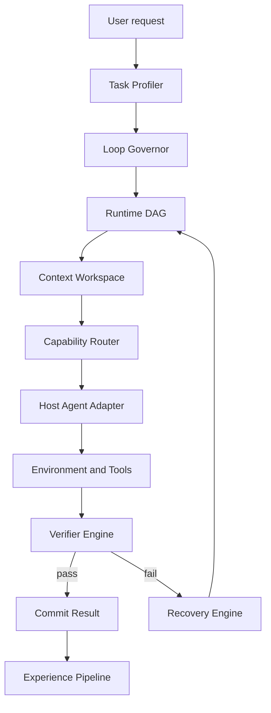
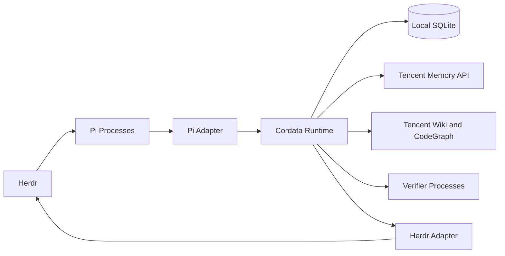
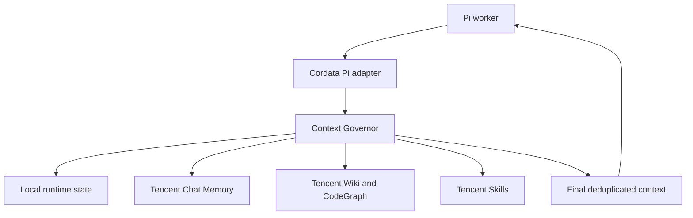

# Cordata — Development Specification

> Status: implementation-ready architecture proposal  
> Last validated: 2026-09-13  
> Primary target: Pi extension/package coordinated through Herdr  
> Secondary targets: OpenCode, Claude Agent SDK, and other harness adapters  
> Memory backend: TencentDB Agent Memory through a replaceable provider interface

## 0. Instructions for the development agent

Treat this document as the initial product and technical specification. Start by implementing the Phase 0 and Phase 1 milestones described below. Do not attempt the entire design in one pass.

Before changing a major architectural decision:

1. Confirm the current Pi extension/SDK and Herdr socket APIs against their official documentation.
2. Confirm the current TencentDB Agent Memory API from its OpenAPI definitions or running service; the project is evolving quickly.
3. Record the change as an ADR under `docs/adr/`.
4. Preserve the invariant that exactly one component owns final context assembly.

The first deliverable must run without TencentDB, embeddings, multiple agents, MCP, or a live Herdr server. These are adapters and later capabilities, not prerequisites for the core runtime. The Pi adapter may initially operate in a single process with a null memory provider and an in-memory or SQLite-backed task.

## 1. Product definition

Cordata is an adaptive runtime for software-development agents. It is not merely a memory plugin, a fixed multi-agent team, or an alternative terminal multiplexer.

Its job is to decide:

- what kind of execution loop a task needs;
- what context the model should see now;
- which tools and skills should be available;
- how work is decomposed into executable, independently verifiable units;
- what evidence counts as success;
- when to retrieve, retry, replan, backtrack, branch, or ask the user;
- what should be remembered after the task;
- which rules require deterministic enforcement rather than prompt-based reminders.

The intended result is a persistent development environment in which an agent inherits useful project knowledge without receiving the entire history, and in which the runtime—not the model's unaided memory—owns task state, verification, and recovery.

### One-sentence architecture

Cordata is the policy and orchestration layer; Pi is the first agent harness; Herdr owns persistent terminals, worktrees, and observable worker processes; TencentDB Agent Memory is the semantic memory substrate; environment verifiers are the primary source of truth.

### Core responsibility split

| Component | Question it answers | Owns |
|---|---|---|
| Cordata | What does the agent need, and what loop should run now? | Task profiling, loop selection, DAG state, context assembly, capability routing, verification policy, recovery |
| TencentDB Agent Memory | What has been learned or indexed? | Chat memory, Skills, Wiki, CodeGraph, layered retrieval, ACLs, durable semantic assets |
| ACE-style playbook | What strategies have worked? | Incremental procedural lessons and anti-patterns |
| Plan cache | Which validated workflow can be adapted? | Reusable plans, preconditions, verification history |
| Pi | How does one agent reason and act? | Model interaction, provider access, coding tools, sessions, extension lifecycle, interactive TUI |
| Herdr | Where do agents run and how are they observed? | Persistent terminals, panes, workspaces, worktrees, process lifetime, agent state, prompting and waits |
| Verifier stack | Did the change actually work? | Tests, compiler, types, lint, runtime signals, invariants, generated tests |

## 2. Product goals and non-goals

### Goals

1. Reduce repeated repository exploration and repeated explanations across sessions.
2. Keep active context bounded, relevant, sourced, and recoverable.
3. Select a cheap/simple loop for easy tasks and escalate only when evidence justifies it.
4. Persist task state independently from the model's conversation context.
5. Make every important claim traceable to source evidence and staleness metadata.
6. Make compaction reversible by retaining raw observations outside the active prompt.
7. Prefer objective verification over model self-assessment.
8. Support isolated parallel work only when the task graph is genuinely parallel.
9. Keep memory, model host, and verification integrations replaceable.
10. Produce enough telemetry to evaluate whether each runtime policy improves quality, latency, and cost.

### Non-goals for the first release

- Building a new vector database or a replacement for TencentDB Agent Memory.
- Implementing permanent MCTS for every task.
- Spawning multiple identical agents by default.
- Automatically promoting every conversation detail into durable memory.
- Building a complex graphical UI before the runtime works.
- Depending on OMO/oh-my-opencode-slim as a runtime dependency.
- Forking Pi or Herdr when their public extension/socket APIs are sufficient.
- Relying on experimental host-specific middleware for core behavior.
- Automatically weakening or rewriting tests to make a patch pass.
- Injecting all available skills, memories, tools, or repository files into the prompt.

## 3. Design principles and invariants

### 3.1 One owner for context assembly

Cordata is the only component allowed to assemble the final context supplied to the model. If TencentDB's proxy performs automatic memory injection, Cordata must not inject the same memory. The preferred integration is direct API/tool access with proxy-side injection disabled or bypassed.

This prevents duplicated facts from being injected through memory, `AGENTS.md`/`CLAUDE.md`, Skills, Wiki, and the proxy simultaneously.

### 3.2 Raw evidence is immutable; active context is disposable

Every relevant tool call, result, file change, verifier result, context transformation, decision, and checkpoint is appended to a raw event log. Active prompt context may be summarized, archived, or replaced, but the underlying evidence remains addressable.

### 3.3 The runtime owns workflow state

Plans are executable DAGs with persistent node state, dependencies, attempts, outputs, and verifier results. They are not numbered lists that exist only in the prompt.

### 3.4 Verification drives continuation

The runtime uses verifier results to decide whether to finish, retry, replan, retrieve more context, branch, or ask the user. A model's statement that the task is complete is not sufficient.

### 3.5 Retrieved memory is evidence, not truth

Every retrieved item carries provenance, confidence, timestamps, code-version relevance, and a status such as `CURRENT`, `UNVERIFIED_CURRENT`, `STALE`, or `CONTRADICTED`.

### 3.6 Capabilities are least-loaded

The agent should see only the tools, MCP servers, Skills, and specialist agents useful for the current subtask. Capability routing is about reducing ambiguity and context interference, not only permissions.

### 3.7 Escalation is evidence-based

Use the simplest viable loop. Parallel agents and search/branching modes are escalation paths triggered by task structure or repeated failure.

### 3.8 Hard rules are enforced deterministically

Preferences may live in instructions. Reusable procedures may become Skills. Facts may live in memory. Actions that must never occur require Pi `tool_call` interception or an equivalent deterministic host guard.

## 4. High-level architecture



Cross-cutting services:

- immutable event store;
- evidence ledger;
- project/worktree identity;
- telemetry and evaluation;
- policy and permission enforcement;
- provider adapters for memory, code intelligence, skills, and model hosts.

### Logical deployment



SQLite stores local runtime state and immutable execution events. It is not a second semantic-memory database. TencentDB stores durable semantic assets and indexed project knowledge. Pi owns the inner model/tool loop; Herdr exposes the processes but does not make scheduling decisions; Cordata remains the only workflow governor.

## 5. Adaptive agent loops

The Loop Governor selects one of four execution modes.

### 5.1 `FAST_PATH`

Use for localized, low-risk tasks with a clear target and strong verifier.

Sequence:

1. Localize relevant files and symbols.
2. Construct a minimal patch.
3. Run focused diagnostics and tests.
4. Inspect the diff.
5. Finish or escalate on failure.

Examples: rename a parameter, update a constant, fix a known typo, add a small test.

### 5.2 `SINGLE_AGENT`

Use for sequential tasks requiring exploration, iterative diagnosis, or coordinated edits that should share one reasoning trajectory.

The runtime creates checkpoints after meaningful milestones and compacts the active context only at stable boundaries.

Examples: diagnose intermittent authentication, understand an unfamiliar subsystem, implement a change across tightly coupled files.

### 5.3 `PARALLEL_DAG`

Use only when dependency analysis identifies branches that can proceed independently and be integrated through explicit contracts.

Requirements:

- a central coordinator owns the DAG;
- each worker has a narrow output contract;
- implementation branches use isolated worktrees where possible;
- workers do not independently mutate shared semantic memory;
- integration waits for dependency nodes and runs cross-branch verification;
- heterogeneous roles are preferred: implementation, test generation, static analysis, or domain review.

Examples: independent frontend/backend work after a stable API contract; implementation and adversarial test generation; parallel investigation of distinct hypotheses.

### 5.4 `SEARCH_MODE`

Use adaptive branching only after evidence of uncertainty or stagnation.

Default triggers:

- the same verifier fails twice after materially different fixes;
- files or decisions are repeatedly reverted;
- evidence is contradictory;
- root-cause confidence remains below threshold;
- two or more plausible fixes cannot be cheaply discriminated;
- the current plan reaches an explicit dead end.

Search mode creates a checkpoint, branches a small number of hypotheses, evaluates each with the strongest available verifier, compares them, and continues with one branch. Initial implementation should cap branching at three candidates and depth at two.

### 5.5 Initial routing heuristic

The MVP should use deterministic rules plus logged scores, not an opaque learned router.

```ts
type LoopMode = "FAST_PATH" | "SINGLE_AGENT" | "PARALLEL_DAG" | "SEARCH_MODE";

interface TaskProfile {
  complexity: number;        // 0..1
  uncertainty: number;       // 0..1
  risk: number;              // 0..1
  parallelism: number;       // 0..1
  verifierStrength: number;  // 0..1
  estimatedFiles: number;
  requiresUserDecision: boolean;
}

function selectInitialLoop(p: TaskProfile): LoopMode {
  if (p.requiresUserDecision) return "SINGLE_AGENT";
  if (p.parallelism >= 0.75 && p.complexity >= 0.55) return "PARALLEL_DAG";
  if (
    p.complexity <= 0.30 &&
    p.uncertainty <= 0.25 &&
    p.risk <= 0.35 &&
    p.verifierStrength >= 0.60 &&
    p.estimatedFiles <= 3
  ) return "FAST_PATH";
  return "SINGLE_AGENT";
}
```

`SEARCH_MODE` is normally entered during recovery rather than selected initially.

All profile inputs, routing decisions, and later escalations must be logged so heuristics can be evaluated and tuned.

## 6. Runtime DAG

### 6.1 Required node model

```ts
type NodeStatus =
  | "PENDING"
  | "READY"
  | "RUNNING"
  | "BLOCKED"
  | "VERIFYING"
  | "PASSED"
  | "FAILED"
  | "SKIPPED"
  | "CANCELLED";

interface TaskNode {
  id: string;
  taskId: string;
  title: string;
  description: string;
  dependsOn: string[];
  status: NodeStatus;
  assignedRole?: string;
  worktreeId?: string;
  inputArtifactIds: string[];
  outputArtifactIds: string[];
  verifierIds: string[];
  attemptCount: number;
  maxAttempts: number;
  createdAt: string;
  updatedAt: string;
}
```

### 6.2 State-transition rules

- A node becomes `READY` only when every dependency is `PASSED` or explicitly `SKIPPED` by policy.
- Only `READY` nodes may become `RUNNING`.
- A node may enter `VERIFYING` only after producing its declared outputs.
- Only verifier policy may mark a node `PASSED`.
- Failure increments `attemptCount` and creates a failure-classification event.
- Retry resumes the failed node, not the entire task, unless the failed invariant invalidates upstream outputs.
- Any manual override records the user, reason, prior state, and new state.

### 6.3 Example persisted DAG

```yaml
task: add-refresh-tokens
mode: PARALLEL_DAG
nodes:
  inspect_auth:
    status: PASSED
    outputs: [auth-map]
  design_schema:
    depends_on: [inspect_auth]
    status: PASSED
    outputs: [refresh-token-contract]
  implement_backend:
    depends_on: [design_schema]
    status: RUNNING
    verifiers: [typecheck, auth-tests]
  implement_frontend:
    depends_on: [design_schema]
    status: RUNNING
    verifiers: [typecheck, frontend-tests]
  integration:
    depends_on: [implement_backend, implement_frontend]
    status: PENDING
    verifiers: [integration-tests]
```

### 6.4 Checkpoints

A checkpoint must contain:

- task and node state;
- git HEAD and dirty-tree fingerprint;
- worktree identities;
- relevant configuration version;
- active context manifest;
- assumptions and unresolved questions;
- evidence references;
- verifier results;
- modified symbols/files;
- last known-good node outputs.

Checkpoints are metadata references, not copies of the entire repository. Git commits or temporary worktree commits may be used for code state, but Cordata must not create permanent commits unless configured or requested.

## 7. Context Workspace

The active workspace is structured instead of being an undifferentiated transcript.

```ts
interface ContextWorkspace {
  taskSpec: ContextItem[];            // immutable user intent
  constraints: ContextItem[];
  currentPlan: ContextItem[];
  currentSubtask: ContextItem[];
  assumptions: ContextItem[];
  evidence: ContextItem[];
  unresolvedQuestions: ContextItem[];
  attemptedApproaches: ContextItem[];
  verifierResults: ContextItem[];
  modifiedSymbols: ContextItem[];
  recentInteractions: ContextItem[];
}
```

### 7.1 Context operations

Expose these operations internally first and later as agent-callable tools:

```ts
interface ContextManager {
  pin(ids: string[], reason: string): Promise<void>;
  archive(ids: string[], summary?: string): Promise<string>;
  retrieve(query: ContextQuery): Promise<ContextItem[]>;
  compress(ids: string[], policy: CompressionPolicy): Promise<CompressionResult>;
  restore(archiveOrEventIds: string[]): Promise<ContextItem[]>;
  checkpoint(label: string): Promise<Checkpoint>;
  assemble(request: AssemblyRequest): Promise<AssembledContext>;
}
```

### 7.2 Context tiers

1. **Pinned semantics:** task specification, explicit user constraints, safety rules, current acceptance criteria.
2. **Condensed working state:** plan, decisions, current hypotheses, validated facts, unresolved questions.
3. **High-fidelity recent window:** recent actions and outputs likely to determine the next action.
4. **Archived evidence:** full historical material retrievable by ID or query.

### 7.3 Reversible compression

Compression creates a new derived event with:

- source event IDs;
- compressor version and policy;
- summary text;
- retained exact fragments;
- omitted categories;
- token counts before and after;
- confidence;
- validation result, if continuation-equivalence checking is available.

It never deletes or mutates the source events.

Compression policy should retain verbatim:

- failing assertions;
- exception types and stack frames nearest project code;
- compiler/type errors;
- commands that caused state changes;
- security warnings;
- user constraints and corrections;
- exact paths, symbols, versions, and IDs required for later actions.

It may collapse:

- repeated warnings;
- successful test lists;
- duplicated log lines;
- source text that is unchanged and already indexed;
- verbose progress output.

### 7.4 Initial context budget

Use configurable budgets. A reasonable initial software-task budget is:

| Category | Target tokens |
|---|---:|
| Task specification and constraints | 800 |
| Current DAG node and plan | 1,000 |
| Relevant source code | 4,500 |
| CodeGraph/dependency context | 1,200 |
| Retrieved semantic memories | 1,000 |
| Scenario/playbook/plan context | 1,500 |
| Git diff and worktree state | 700 |
| Architecture and policy constraints | 800 |
| Recent interactions and reserve | 500 |
| **Total** | **12,000** |

These are starting values, not constants. Budgets must be adjustable by model context window, task mode, and measured retrieval utility.

### 7.5 Candidate scoring

Each context candidate receives a normalized score based on:

```text
score =
  0.28 * semantic_relevance
+ 0.18 * task_dependency_relevance
+ 0.14 * recency
+ 0.14 * source_authority
+ 0.12 * verifier_support
+ 0.08 * user_explicitness
+ 0.06 * diversity_bonus
- 0.18 * staleness_risk
- 0.14 * duplication_penalty
- 0.10 * token_cost_penalty
```

Apply hard inclusion before scoring for explicit user constraints and required policy. Deduplicate by semantic claim plus provenance, not only exact text.

## 8. Evidence ledger

Every factual claim used for planning or code modification should be representable as:

```ts
type EvidenceStatus =
  | "CURRENT"
  | "UNVERIFIED_CURRENT"
  | "STALE"
  | "CONTRADICTED"
  | "SUPERSEDED";

interface EvidenceClaim {
  id: string;
  projectId: string;
  claim: string;
  sourceType: "USER" | "CODE" | "TEST" | "DOC" | "MEMORY" | "TOOL" | "MODEL";
  sourceRefs: string[];
  observedAt: string;
  lastVerifiedAt?: string;
  repositoryCommit?: string;
  fileFingerprints?: Record<string, string>;
  confidence: number;
  status: EvidenceStatus;
  contradicts?: string[];
}
```

Staleness rules:

- Mark code-derived claims `UNVERIFIED_CURRENT` when relevant files change after observation.
- Mark claims `STALE` when their referenced symbol disappears, their commit ancestry no longer contains the observation, or a configured TTL expires.
- Never silently replace contradictory claims; link them and require resolution.
- Give user statements high authority for preferences and intent, but not automatic technical correctness.
- Give existing tests high authority for current behavior, but distinguish intended behavior from accidental behavior.

## 9. Capability Router

The router selects the smallest capability bundle that can perform the active DAG node.

### Capability categories

- local filesystem and code search;
- shell/build/test tools;
- git/worktrees;
- LSP/code intelligence;
- Tencent Chat Memory;
- Tencent Wiki;
- Tencent CodeGraph;
- Tencent Skills;
- project Skills;
- external MCP servers;
- specialist agents;
- browser/network tools;
- deployment or destructive tools.

### Required capability metadata

```ts
interface CapabilityDescriptor {
  id: string;
  kind: "TOOL" | "SKILL" | "MCP" | "AGENT" | "VERIFIER";
  description: string;
  taskTags: string[];
  inputSchemaHash?: string;
  risk: "LOW" | "MEDIUM" | "HIGH" | "DESTRUCTIVE";
  sideEffects: string[];
  requiresApproval: boolean;
  availabilityCheck?: string;
  estimatedContextTokens: number;
  overlapGroup?: string;
}
```

### Routing policy

1. Start with capabilities required by the current verifier and declared node type.
2. Add at most one primary capability per overlap group unless a fallback is required.
3. Prefer deterministic/local capabilities over model-mediated capabilities for search, formatting, compilation, and testing.
4. Hide destructive capabilities until the plan reaches an explicitly authorized node.
5. Log rejected as well as selected capabilities to debug routing failures.
6. If required capabilities are unavailable, mark the node `BLOCKED` and explain the missing dependency.

The Pi MVP must call `pi.setActiveTools()` to enforce tool selection. Skills and prompts are supplied through `resources_discover`; provider-specific or external capabilities remain behind adapter boundaries. On hosts that cannot dynamically hide capabilities, the adapter must explicitly report degraded enforcement.

## 10. Verifier Engine

### 10.1 Evidence hierarchy

Use the strongest available evidence in roughly this order:

1. existing focused tests;
2. property or invariant tests;
3. generated regression tests reviewed against the task specification;
4. compiler/build;
5. type checker and LSP diagnostics;
6. static analyzer and linter;
7. runtime observations/logs;
8. diff invariants and policy checks;
9. LLM reviewer.

An LLM reviewer is supplementary evidence, not a substitute for executable checks.

### 10.2 Verifier contract

```ts
interface Verifier {
  id: string;
  applies(ctx: VerificationContext): Promise<boolean>;
  run(ctx: VerificationContext): Promise<VerifierResult>;
}

interface VerifierResult {
  verifierId: string;
  status: "PASS" | "FAIL" | "ERROR" | "SKIP";
  strength: number;
  command?: string;
  startedAt: string;
  durationMs: number;
  summary: string;
  rawEventIds: string[];
  affectedNodeIds: string[];
  suspectedCauses?: string[];
}
```

### 10.3 Verification plan discovery

During repository initialization, discover but do not automatically run:

- package-manager scripts;
- test framework configuration;
- CI workflow commands;
- formatter/linter/type-checker configuration;
- language-server availability;
- project instructions such as `CLAUDE.md`, `AGENTS.md`, or equivalent;
- changed-file-to-test mappings when available.

Store discovered commands with provenance and safety classification. Do not execute unknown deployment, migration, release, or destructive scripts as verification.

### 10.4 Prevent verifier tampering

- Snapshot verifier definitions and relevant tests before implementation.
- Treat changes to tests, fixtures, snapshots, CI config, or lint/type rules as high-scrutiny modifications.
- Do not accept a passing result if the patch weakens the verifier without an explicit task requirement.
- Generated tests execute in a verifier worktree or isolated environment when possible.
- Compare tests before and after the candidate patch.

## 11. Recovery and adaptive search

Classify each failure before retrying:

```ts
type FailureClass =
  | "LOCAL_IMPLEMENTATION_ERROR"
  | "BAD_ASSUMPTION"
  | "MISSING_CONTEXT"
  | "STALE_CONTEXT"
  | "PLAN_ERROR"
  | "DEPENDENCY_FAILURE"
  | "ENVIRONMENT_FAILURE"
  | "PERMISSION_BLOCK"
  | "AMBIGUOUS_REQUIREMENT"
  | "VERIFIER_DEFECT"
  | "UNKNOWN";
```

Default recovery mapping:

| Failure | Default action |
|---|---|
| Local implementation error | Retry current node with focused failure evidence |
| Bad assumption | Invalidate claim, restore related evidence, revise node |
| Missing context | Query code/memory/docs within a capped budget |
| Stale context | Re-read source of truth and update ledger |
| Plan error | Rebuild affected DAG subgraph |
| Dependency failure | Reopen invalid upstream node and descendants |
| Environment failure | Retry only if transient; otherwise block with diagnostics |
| Permission block | Stop and request the minimum required authorization |
| Ambiguous requirement | Ask the user; do not invent product behavior |
| Verifier defect | Escalate; do not edit verifier silently |
| Unknown | One diagnostic pass, then enter capped search or ask the user |

Search branches must record hypothesis, predicted observation, patch or diagnostic action, cost, verifier result, and comparison outcome. Failed branches remain in the event log so the agent does not repeat them after compaction.

## 12. Experience system

The experience system has three separate stores because facts, strategies, and plans have different update semantics.

### 12.1 TencentDB Agent Memory

Use TencentDB for:

- L0 raw conversations;
- L1 atomic facts, preferences, constraints, and events;
- L2 project/scenario memory;
- L3 durable user/team/project patterns;
- Wiki pages and their link graph;
- CodeGraph files, symbols, callers, callees, and impact paths;
- versioned Skills and their resources;
- asset ownership, visibility, ACL, and agent bindings.

Do not make Cordata dependent on Tencent's internal database schema. Integrate through a provider abstraction and versioned HTTP client.

```ts
interface MemoryProvider {
  health(): Promise<ProviderHealth>;
  recall(query: ContextQuery): Promise<MemoryItem[]>;
  remember(event: MemoryEvent): Promise<RememberResult>;
  searchCode(query: CodeQuery): Promise<CodeContext[]>;
  searchKnowledge(query: KnowledgeQuery): Promise<KnowledgeItem[]>;
  getSkills(context: SkillQuery): Promise<SkillAsset[]>;
}
```

Required providers:

- `NullMemoryProvider`: always available; makes the core work offline.
- `TencentMemoryProvider`: first real semantic-memory adapter.
- `InMemoryTestProvider`: deterministic integration testing.

Tencent's current public design exposes Wiki and CodeGraph through tool discovery/calls such as `/v3/tools/list` and `/v3/tools/call`. Exact endpoints and schemas must be generated from or validated against the deployed v3 OpenAPI specification rather than copied blindly into source.

### 12.2 ACE-style playbook

The playbook stores strategies, not project facts. Updates use explicit deltas:

```ts
type PlaybookDelta =
  | { op: "ADD"; entry: PlaybookEntry }
  | { op: "UPDATE"; id: string; patch: Partial<PlaybookEntry> }
  | { op: "REMOVE"; id: string; reason: string };

interface PlaybookEntry {
  id: string;
  scope: "GLOBAL" | "LANGUAGE" | "FRAMEWORK" | "PROJECT";
  trigger: string;
  procedure: string[];
  rationale: string;
  evidenceRefs: string[];
  successCount: number;
  failureCount: number;
  lastValidatedAt?: string;
  status: "CANDIDATE" | "VALIDATED" | "DEPRECATED";
}
```

Use a Generator → Reflector → Curator pipeline:

1. Generator proposes lessons from the completed trajectory.
2. Reflector checks whether outcomes support the proposed lesson.
3. Curator deduplicates and emits `ADD`, `UPDATE`, or `REMOVE` operations.

No playbook entry becomes `VALIDATED` after one unverified model reflection.

### 12.3 Plan cache

Store only generalized plans from successful, verified executions.

```ts
interface CachedPlan {
  id: string;
  name: string;
  taskSignature: string;
  preconditions: Record<string, string | number | boolean>;
  dagTemplate: TaskNodeTemplate[];
  verifierTemplateIds: string[];
  knownFailureConditions: string[];
  verifiedRuns: number;
  failedRuns: number;
  averageCost?: number;
  averageDurationMs?: number;
  lastValidatedAt: string;
}
```

Plan-cache retrieval must check preconditions. Semantic similarity alone must not apply an Odoo controller plan to an incompatible architecture or version.

## 13. Memory promotion system

When the user corrects the agent, create a candidate correction event. Do not immediately write it everywhere.

Classification targets:

| Correction type | Destination |
|---|---|
| Temporary observation | Session/task state only |
| Project fact or constraint | Tencent L1/L2 memory |
| Stable project knowledge | Tencent L3 or Wiki |
| Reusable procedure | Playbook and possibly Tencent Skill |
| Coding convention | `AGENTS.md`, `CLAUDE.md`, or scoped rule file after approval/configured policy |
| Forbidden operation | Deterministic Pi `tool_call` guard after approval/configured policy |

Promotion stages:

1. First occurrence: session-local candidate.
2. Repeated or high-confidence occurrence: persistent candidate.
3. Classification and conflict check.
4. Human confirmation by default for instruction files, Skills, and hooks.
5. Write to exactly the intended destination with provenance.

Example:

```text
Correction: Never run production migrations directly; generate the migration and request approval.

Fact:       deployment policy                  -> project memory
Procedure:  safe migration workflow            -> playbook/Skill
Guardrail:  block production migration command -> tool_call policy guard
```

## 14. Harness and Herdr integration

### 14.1 Foundation decision

The first supported stack is **Pi + Cordata + Herdr**:

- Pi supplies the inner single-agent model/tool loop, provider access, sessions, context history, and terminal UI.
- Cordata supplies policy, task/DAG state, context assembly, capability routing, verification, recovery, and multi-agent scheduling.
- Herdr supplies persistent terminals, panes, workspaces, worktrees, process visibility, semantic agent state, prompting, and event-driven waits.

Do not fork Pi or Herdr for the initial implementation. Cordata must be a Pi package/extension plus a small coordinator/daemon. The domain core must depend only on Cordata interfaces so another harness can be added later.

OMO/oh-my-opencode-slim is not a runtime dependency. It may be studied for model presets, specialist prompts, council-style comparison, verification heuristics, and installation UX. Do not inherit its prompt-driven scheduler, background-by-default policy, job board, worktree registry, or automatic context injection.

### 14.2 Pi lifecycle mapping

Pi currently exposes the control points Cordata needs through TypeScript extensions:

| Pi event/API | Cordata use |
|---|---|
| `project_trust` | Refuse or constrain untrusted project-local extensions and configuration |
| `session_start` | Resolve project/worktree, load current task, restore a checkpoint, start scoped resources |
| `resources_discover` | Expose only the Skills and prompt assets selected by the Capability Router |
| `input` | Intercept/transform a request before skill expansion; identify commands that Cordata owns |
| `before_agent_start` | Profile the task, choose the loop, inject the context envelope, and modify the system prompt |
| `agent_start` / `agent_end` / `agent_settled` | Track an attempt and decide whether verification, retry, or completion follows |
| `turn_start` / `turn_end` | Record bounded per-turn telemetry and checkpoints |
| `context` | Assemble, deduplicate, budget, and replace active messages while retaining raw evidence |
| `before_provider_request` | Audit or replace the final provider payload; enforce single-owner context assembly |
| `after_provider_response` | Capture provider metadata without treating it as verification |
| `tool_call` | Enforce policies, log intent, and block forbidden operations deterministically |
| `tool_result` | Retain raw output, redact/compress model-visible output, and schedule evidence updates |
| `session_before_compact` | Persist a structured checkpoint and optionally customize/cancel compaction |
| `session_compact` / `session_compact_failed` | Record the result and restore the minimal pinned state |
| `session_shutdown` | Flush fast local state and close session-scoped resources |
| `pi.setActiveTools()` | Dynamically expose only routed tools |
| `pi.appendEntry()` | Attach Cordata references/state to Pi's persistent JSONL session |

Cordata must store large/raw events in its own SQLite/blob store. Pi session entries should contain compact references, not duplicated transcripts or test logs.

### 14.3 Context injection behavior

At `session_start`, restore only:

- current goal;
- current branch/worktree;
- current DAG node;
- recent validated decisions;
- unfinished tasks/blockers;
- critical project rules;
- references for retrieving additional context.

At `before_agent_start`, retrieve roughly 5–15 highly relevant items subject to the configured token budget and deduplication. This number is a starting range, not a requirement. The `context` event is the final per-turn enforcement point. The full provider request may be inspected for audit and policy, but secrets and hidden reasoning must not be persisted unnecessarily.

### 14.4 Herdr adapter

The Herdr adapter uses the documented CLI/socket surface. Required initial operations:

| Herdr method | Cordata use |
|---|---|
| `session.snapshot` | Bootstrap a consistent view of current workspaces, panes, and agents |
| `events.subscribe` | Observe pane, agent-status, workspace, and worktree lifecycle events |
| `agent.start` | Start a Pi worker with a Cordata role/configuration |
| `agent.prompt` | Deliver one structured DAG-node assignment |
| `agent.wait` | Wait for semantic `done` or `blocked` state without polling terminal text |
| `agent.read` / `pane.read` | Inspect bounded worker output for diagnostics, never as the authoritative task state |
| `worktree.list` | Reconcile actual repository worktrees with Cordata state |
| `worktree.create` / `worktree.open` | Create or attach isolated execution lanes |
| `worktree.remove` | Retire a linked checkout only after Cordata verifies it is safe |
| `pane.report_metadata` / `workspace.report_metadata` | Surface task, node, role, verifier, and memory state in Herdr |

Herdr is infrastructure, not a second scheduler. Cordata decides whether to spawn, retry, cancel, or integrate. Herdr executes and exposes those decisions.

### 14.5 Worker protocol

Each worker is a normal Pi process in a Herdr pane, loading the Cordata Pi extension. Assignments use a versioned `ContextEnvelope` containing:

- project, worktree, task, and node IDs;
- role and explicit objective;
- allowed paths and capabilities;
- dependencies and input artifact references;
- expected output contract;
- verifier requirements;
- token, time, and retry budgets;
- context/evidence references rather than the entire parent transcript.

Workers may return findings, patches, tests, evidence, or a blocked reason. They cannot mark the parent task complete, mutate shared durable memory directly, weaken required verifiers, or schedule unrelated workers. Only the coordinator advances the authoritative DAG.

### 14.6 Worktree awareness

Project identity and worktree identity are different.

```text
global project knowledge
        +
branch/worktree task state
        +
branch decisions and evidence
        +
current diff and verifier state
```

Architecture knowledge may be shared across branches. Unmerged branch facts remain branch-scoped until integrated and verified. For `PARALLEL_DAG`, use Herdr worktree operations rather than maintaining a competing Cordata worktree registry. Cordata stores only IDs, provenance, ownership, and lifecycle state.

### 14.7 Background monitors

Later releases may run development servers, test watchers, Docker/service logs, and CI monitors in dedicated Herdr panes. Every monitor must emit structured rate-limited events, deduplicate repeats, redact secrets, declare its working directory, and shut down explicitly. Pane output is retained as raw evidence only when relevant; recurring successful noise should not enter active model context.

### 14.8 Alternative harness adapters

Keep the core host-independent. Current preference order:

1. **Pi adapter** — primary architecture and deepest relevant interception surface.
2. **OpenCode adapter** — fastest fallback/MVP alternative because it already includes agents, LSP, MCP, permissions, and a programmable SDK/server.
3. **OpenHands adapter** — future server/enterprise execution option; too heavy for the first terminal-first release.
4. **Claude Agent SDK adapter** — future high-control but Claude-specific option.
5. **Goose adapter** — possible general executor, not a preferred control-plane foundation.

Do not implement multiple adapters in Phase 1. Stabilize the Cordata contracts and Pi vertical slice first.

### 14.9 Foundation comparison and rationale

The foundation decision is based on control-plane fit rather than feature count:

| Foundation | Loop/context control | Herdr fit | Multi-model | Initial effort | Architectural assessment |
|---|---:|---:|---:|---:|---|
| Pi + Herdr | Very high | Native/detected | Yes | Medium | Best long-term foundation |
| OpenCode directly | High | Native/detected | Yes | Low–medium | Best fast-MVP fallback |
| OpenHands SDK | Very high | Custom integration | Yes | High | Best for hosted/enterprise execution |
| Claude Agent SDK | Very high | Claude CLI path | No | Medium | Strong but vendor-specific |
| Goose | Medium | CLI-compatible | Yes | Medium | Better as an executor than as the control plane |
| OMO fork | Medium | Existing adapter | Yes | Low initially | Fast prototype, long-term scheduler/context conflict |

Pi wins because Cordata needs deterministic access to the input, system prompt, per-turn context, provider request, tool call, tool result, compaction, active tool set, and persistent session entries. Pi exposes these directly while intentionally leaving subagents and background execution undefined. Herdr supplies observable processes, semantic waits, and worktrees, allowing Cordata to implement one scheduler rather than replacing another.

OpenCode remains strategically important. Its documented plugin API exposes tool, file, LSP, session, permission, todo, and compaction events, while its SDK can create/inspect sessions, inject no-reply context, select models, abort/revert sessions, and consume events. It may outperform Pi for development speed, but its documented plugin surface is less direct for replacing per-turn model context/provider payloads; full Cordata control may require an external SDK/server coordinator.

OpenHands should be reconsidered only if the product pivots toward remote multi-tenant execution, Docker/Kubernetes sandboxes, REST clients, and organizational automation. Claude Agent SDK should be an optional adapter only if Claude-specific functionality justifies model lock-in. Goose does not currently offer a clearer control-plane advantage over Pi or OpenCode.

## 15. TencentDB Agent Memory integration

### 15.1 Preferred topology



Cordata queries Tencent services programmatically, scores and deduplicates the results, and owns the final injection through Pi's context lifecycle.

### 15.2 Avoid double injection

Do not run this topology:

```text
Cordata retrieval + injection
          plus
Tencent proxy automatic injection
          plus
uncoordinated AGENTS.md/CLAUDE.md/Skill duplication
```

If the only available Tencent integration requires the proxy, introduce an explicit mode:

```ts
type TencentIntegrationMode =
  | "DIRECT_API_CORDATA_OWNS_INJECTION"
  | "PROXY_TENCENT_OWNS_INJECTION";
```

In proxy-owned mode, Cordata may manage task/DAG/verification state but must not independently inject Tencent memories. Direct API mode is the target architecture.

### 15.3 Current Tencent facts to design around

- Current project release shown in its repository is v2.0.0 and is evolving quickly.
- Memory assets include Chat Memory, Skills, Wiki, and CodeGraph.
- Chat Memory is layered as L0 Conversation, L1 Atom, L2 Scenario, and L3 Core/Persona.
- Retrieval combines layered context with BM25/vector/RRF behavior and item/character/timeout limits.
- Wiki and CodeGraph expose on-demand tools instead of requiring wholesale prompt injection.
- Wiki and CodeGraph are asynchronously built and have readiness states.
- Asset visibility supports private, team, restricted, and agent-targeted semantics.
- The default installation starts memory-core, memory-hub, and proxy services; MongoDB is experimental/off by default.
- Private/SSH repository support for CodeGraph is still being refined.
- Fully automatic asset routing is still under iteration.

All of these details must be capability-detected at runtime rather than assumed forever.

### 15.4 Failure behavior

- Tencent unavailability must not prevent local task execution.
- Use bounded timeouts and a circuit breaker.
- Mark incomplete Wiki/CodeGraph results as unavailable rather than empty truth.
- Cache only responses safe to reuse and retain their source/version metadata.
- Queue memory writes through an outbox; never block task completion on asynchronous memory synthesis.
- Do not send secrets, raw credentials, or denied files to Tencent.

## 16. Local persistence

Use SQLite for execution state, replay, outbox processing, and caches. Recommended initial library: `better-sqlite3`, hidden behind a repository interface so it can be replaced.

### 16.1 Storage locations

```text
~/.cordata/
├── config.json
├── projects/
│   └── <project-id>/
│       ├── runtime.sqlite
│       ├── blobs/
│       └── logs/
└── plugins/

<target-repository>/.cordata/
├── config.yaml
├── policies/
├── project-memory/        # optional human-readable projection
└── .gitignore             # ignores ephemeral branch/session state
```

Do not store runtime databases inside the target git repository by default.

### 16.2 Minimum tables

```sql
CREATE TABLE projects (
  id TEXT PRIMARY KEY,
  canonical_root TEXT NOT NULL,
  remote_fingerprint TEXT,
  created_at TEXT NOT NULL,
  updated_at TEXT NOT NULL
);

CREATE TABLE worktrees (
  id TEXT PRIMARY KEY,
  project_id TEXT NOT NULL,
  root_path TEXT NOT NULL,
  branch TEXT,
  head_commit TEXT,
  status TEXT NOT NULL,
  FOREIGN KEY(project_id) REFERENCES projects(id)
);

CREATE TABLE tasks (
  id TEXT PRIMARY KEY,
  project_id TEXT NOT NULL,
  worktree_id TEXT,
  title TEXT NOT NULL,
  specification_json TEXT NOT NULL,
  mode TEXT NOT NULL,
  status TEXT NOT NULL,
  created_at TEXT NOT NULL,
  updated_at TEXT NOT NULL
);

CREATE TABLE task_nodes (
  id TEXT PRIMARY KEY,
  task_id TEXT NOT NULL,
  node_json TEXT NOT NULL,
  status TEXT NOT NULL,
  attempt_count INTEGER NOT NULL DEFAULT 0,
  updated_at TEXT NOT NULL,
  FOREIGN KEY(task_id) REFERENCES tasks(id)
);

CREATE TABLE events (
  sequence INTEGER PRIMARY KEY AUTOINCREMENT,
  id TEXT UNIQUE NOT NULL,
  project_id TEXT NOT NULL,
  task_id TEXT,
  node_id TEXT,
  session_id TEXT,
  event_type TEXT NOT NULL,
  occurred_at TEXT NOT NULL,
  payload_json TEXT NOT NULL,
  content_hash TEXT NOT NULL,
  previous_hash TEXT,
  blob_ref TEXT
);

CREATE TABLE evidence_claims (
  id TEXT PRIMARY KEY,
  project_id TEXT NOT NULL,
  claim_json TEXT NOT NULL,
  status TEXT NOT NULL,
  updated_at TEXT NOT NULL
);

CREATE TABLE context_items (
  id TEXT PRIMARY KEY,
  project_id TEXT NOT NULL,
  task_id TEXT,
  tier TEXT NOT NULL,
  source_event_ids_json TEXT NOT NULL,
  content TEXT NOT NULL,
  token_count INTEGER,
  archived INTEGER NOT NULL DEFAULT 0,
  created_at TEXT NOT NULL
);

CREATE TABLE checkpoints (
  id TEXT PRIMARY KEY,
  task_id TEXT NOT NULL,
  node_id TEXT,
  state_json TEXT NOT NULL,
  created_at TEXT NOT NULL
);

CREATE TABLE verifier_runs (
  id TEXT PRIMARY KEY,
  task_id TEXT NOT NULL,
  node_id TEXT,
  result_json TEXT NOT NULL,
  created_at TEXT NOT NULL
);

CREATE TABLE outbox (
  id TEXT PRIMARY KEY,
  destination TEXT NOT NULL,
  operation TEXT NOT NULL,
  payload_json TEXT NOT NULL,
  status TEXT NOT NULL,
  attempt_count INTEGER NOT NULL DEFAULT 0,
  next_attempt_at TEXT,
  created_at TEXT NOT NULL
);
```

Use WAL mode, explicit migrations, foreign keys, transactional DAG transitions, and content-addressed blobs for large outputs. Hash chaining provides tamper evidence but is not a substitute for access control.

### 16.3 Optional Markdown projection

The original project-memory concept remains useful as a portable, human-readable projection, but it is not the runtime database or automatic semantic source of truth.

```text
.cordata/project-memory/
├── README.md
├── current-task.md
├── architecture.md
├── decisions.md
├── conventions.md
├── pitfalls.md
├── roadmap.md
└── history/
```

Projection rules:

- generated sections must be clearly marked;
- never overwrite human-authored sections silently;
- every projected claim links to evidence IDs where practical;
- `current-task.md` is branch-aware;
- architecture updates require validation against current code;
- projection is optional and can be regenerated.

## 17. Recommended repository structure

```text
cordata/
├── packages/
│   ├── core/
│   │   └── src/
│   │       ├── domain/
│   │       ├── loop-governor/
│   │       ├── dag/
│   │       ├── context/
│   │       ├── evidence/
│   │       ├── capabilities/
│   │       ├── verification/
│   │       ├── recovery/
│   │       └── experience/
│   ├── persistence-sqlite/
│   ├── provider-tencent/
│   ├── provider-null-memory/
│   ├── adapter-pi/
│   │   └── src/
│   │       ├── lifecycle.ts
│   │       ├── context.ts
│   │       ├── tools.ts
│   │       ├── compaction.ts
│   │       └── ui.ts
│   ├── adapter-herdr/
│   │   └── src/
│   │       ├── client.ts
│   │       ├── agents.ts
│   │       ├── worktrees.ts
│   │       ├── events.ts
│   │       └── metadata.ts
│   ├── adapter-opencode/         # later, not Phase 1
│   ├── protocol/
│   ├── sdk/
│   └── cli/
├── apps/
│   └── coordinator/
├── agents/
│   ├── explorer/
│   ├── implementer/
│   ├── verifier/
│   └── reviewer/
├── skills/
│   ├── context/
│   │   └── SKILL.md
│   ├── remember/
│   │   └── SKILL.md
│   ├── forget/
│   │   └── SKILL.md
│   ├── architecture/
│   │   └── SKILL.md
│   └── handoff/
│       └── SKILL.md
├── pi-package/
│   └── package.json             # publishes Cordata extension, skills, and prompts
├── herdr-plugin/                # optional UI/actions; never owns scheduling
│   └── herdr-plugin.toml
├── scripts/
├── evals/
├── docs/
│   ├── adr/
│   ├── api/
│   └── threat-model.md
├── examples/
│   └── demo-project/
├── pnpm-workspace.yaml
├── package.json
└── tsconfig.base.json
```

`packages/core` must not import Pi, Herdr, Tencent, OpenCode, or host-specific UI types. The Pi package is the first installable product surface. The Herdr plugin is optional presentation/action integration; the socket adapter is the authoritative programmatic boundary.

## 18. Recommended implementation stack

- TypeScript in strict mode.
- Node.js 22 or the minimum version required by the current Pi package/extension toolchain.
- `pnpm` workspaces.
- Zod or JSON Schema for all host/provider boundaries.
- SQLite through a replaceable repository implementation.
- Fastify or a minimal HTTP framework for the optional local coordinator; in-process operation must remain possible for the single-agent MVP.
- Vitest for unit and integration tests.
- OpenTelemetry-compatible structured traces where practical.
- ESLint plus Prettier, with repository-local versions.

Reasons for TypeScript:

- Pi extensions, its SDK, and Herdr protocol clients are TypeScript/JavaScript-friendly;
- shared types can cover the daemon, CLI, providers, and future UI;
- JSON hook/API payload validation is straightforward;
- the core remains easy to package as a local executable or Node service.

Do not let framework choices leak into the domain packages. The core should not import Pi-, Herdr-, OpenCode-, Claude-, or Tencent-specific code.

## 19. Configuration

Example repository configuration:

```yaml
version: 1

runtime:
  default_loop: auto
  event_retention_days: 90
  raw_blob_retention_days: 30
  max_parallel_nodes: 3
  max_search_branches: 3
  max_search_depth: 2

harness:
  provider: pi
  pi:
    min_version: "pin-after-spike"
    control: extension
    preserve_session_jsonl: true

execution:
  multiplexer: herdr
  herdr:
    mode: socket
    required_for_single_agent: false
    semantic_waits: true
    own_worktrees: true

context:
  target_tokens: 12000
  max_memory_items: 15
  preserve_raw_events: true
  compression:
    enabled: true
    min_output_tokens: 1200

memory:
  provider: tencent
  injection_owner: cordata
  tencent:
    base_url_env: TENCENT_MEMORY_BASE_URL
    token_env: TENCENT_MEMORY_TOKEN
    request_timeout_ms: 2500
    circuit_breaker_failures: 3

verification:
  require_diff_review: true
  prevent_test_weakening: true
  commands:
    unit: "pnpm test"
    typecheck: "pnpm typecheck"
    lint: "pnpm lint"

policies:
  protected_paths:
    - ".env*"
    - "**/generated/**"
  require_user_approval:
    - production_deploy
    - schema_migration
    - destructive_command

experimental:
  monitors: false
  opencode_adapter: false
  claude_adapter: false
  generated_tests: false
```

Configuration precedence should be:

1. managed/organization policy;
2. user configuration;
3. repository configuration;
4. branch/worktree overrides;
5. session overrides.

Lower-precedence configuration must not relax higher-precedence safety policy.

## 20. Security and privacy

### Threats to address

- secrets captured in raw tool output;
- prompt injection stored as durable memory;
- malicious repository instructions;
- stale or poisoned memories;
- cross-project or cross-team data leakage;
- automatic execution of dangerous cached plans;
- verifier tampering;
- shell injection in hooks and monitor commands;
- runaway background processes;
- overly broad tool permissions;
- local event database disclosure.

### Required controls

1. Redact configured secret patterns before model delivery and before remote memory ingestion. Preserve an optional encrypted local original only if explicitly enabled.
2. Classify source trust. Repository content and retrieved memory are untrusted data unless promoted through policy.
3. Store project, owner, team, agent, and visibility metadata with every remote asset reference.
4. Never transfer file contents outside allowed scopes merely because semantic retrieval requested them.
5. Use argument arrays or safe process APIs; do not concatenate untrusted text into shell commands.
6. Require explicit authorization for deployment, destructive changes, production access, and new external destinations.
7. Sign or hash plugin releases and schema migrations.
8. Maintain an auditable decision event for every blocked or auto-approved side effect.
9. Provide `cordata forget`, export, retention, and project purge operations.
10. Keep provider credentials in environment variables or OS secret storage, never in project configuration.

## 21. Observability and evaluation

Every task should produce a trace covering:

- task profile and selected loop;
- context candidates, scores, exclusions, and token use;
- capabilities selected and hidden;
- DAG transitions and retry scope;
- tool calls and compressed/raw sizes;
- verifier results;
- recovery decisions;
- memory reads/writes and latency;
- completion status, cost, duration, and user corrections.

### Primary metrics

| Metric | Purpose |
|---|---|
| Verified task success rate | Main quality measure |
| Regression rate | Detect patches that pass narrow checks but break other behavior |
| Time and tokens to first valid patch | Efficiency |
| Context precision | Fraction of injected items later used or cited |
| Context duplication rate | Detect double/overlapping injection |
| Stale-memory incident rate | Memory safety |
| Retry scope ratio | Whether DAG retries avoid rerunning unrelated work |
| Loop routing regret | Whether a different loop would likely have been cheaper/better |
| Search escalation success | Value of branching after failure |
| User correction recurrence | Whether promotion/playbook prevents repeated mistakes |
| Verifier tampering attempts | Safety/quality signal |
| Provider degradation success | Whether work continues when Tencent is unavailable |

### Evaluation method

Create paired evals against three baselines: unmodified Pi, OpenCode without Cordata, and OMO-slim with its default orchestration policy:

- small localized changes;
- sequential debugging;
- cross-layer feature implementation;
- stale-memory traps;
- misleading documentation;
- compaction/resume tests;
- Tencent outage and timeout;
- parallelizable and falsely parallelizable tasks;
- verifier-weakening temptations;
- repeated user correction scenarios.

Measure success and total resource use. Cordata is not an improvement if it reduces tokens while lowering verified task completion. Report cold-start overhead, single-agent overhead, unnecessary-delegation rate, worker utilization, and Herdr coordination latency separately.

### Expected impact hypotheses

These ranges are planning hypotheses, not promises. Validate them on the paired fixture suite before using them in product claims.

Compared with default OMO-slim orchestration on a mixed workload after Cordata reaches maturity:

| Outcome | Expected range | Primary mechanism |
|---|---:|---|
| Verified task success | +5 to +15 percentage points | Verifier-driven completion, scoped retries, stale-evidence handling |
| Total model tokens | 15% to 35% lower | Fast path, conditional delegation, reversible compression, capability routing |
| Wall-clock completion time | 10% to 25% lower | Avoid unnecessary agents, reuse verified plans, retry only failed DAG nodes |
| Repeated repository exploration | 25% to 50% lower | Evidence ledger, project memory, CodeGraph, plan cache |
| Simple-task latency | 0% to 10% higher until optimized | Profiling, persistence, and verification startup costs |

During the prototype stage, expect the opposite on some tasks:

- 10% to 30% additional latency from orchestration and verification;
- equal or higher token consumption before context routing is calibrated;
- lower reliability if stale memory, compression, or DAG transitions are incorrect;
- longer implementation time than an OMO fork because Cordata must provide permission policy, worker protocol, and optional MCP support.

The Pi foundation should reduce steady-state prompt overhead relative to a fixed multi-agent suite because it starts with a small tool loop and no mandatory agent roster. Herdr adds process/worktree coordination latency only when Cordata actually spawns workers. Measure Pi-only, Pi+Cordata single-agent, and Pi+Cordata+Herdr multi-agent paths separately so orchestration gains are not confused with model quality.

## 22. Test strategy

### Unit tests

- loop routing thresholds and escalation;
- DAG state transitions and invalid transition rejection;
- context scoring, budget enforcement, and deduplication;
- staleness propagation;
- compression manifests and restore behavior;
- capability conflict/overlap selection;
- failure classification and recovery mapping;
- playbook delta application;
- plan precondition matching;
- policy precedence;
- redaction.

### Integration tests

- Pi extension lifecycle input to Cordata core and output contracts;
- Herdr socket adapter against a recorded/fake server, including reconnect and event ordering;
- SQLite migrations, crash recovery, and concurrent reads;
- Tencent provider against a recorded or local test server;
- outbox retries and circuit breaking;
- git/worktree identity and branch scoping;
- focused verifier discovery and execution;
- `session_before_compact` checkpoint followed by post-compaction context restoration;
- no-memory-provider operation.

### End-to-end tests

Use fixture repositories with intentional bugs. Verify that the runtime:

1. creates a task and selects the expected loop;
2. assembles bounded context;
3. records every event;
4. edits through the host agent;
5. runs appropriate verifiers;
6. recovers from at least one controlled failure;
7. produces a validated final state;
8. restores the task after a simulated new session/compaction;
9. avoids reinjecting stale or duplicate memory.

## 23. Delivery roadmap

### Phase 0 — Repository and contracts

Deliverables:

- monorepo scaffold;
- domain types and schemas;
- SQLite migrations and repositories;
- event append/read API;
- project/worktree identity;
- minimal CLI and optional coordinator health endpoint;
- explicit `HarnessAdapter`, `WorkspaceAdapter`, `ContextAdapter`, `MemoryProvider`, and `Verifier` contracts;
- ADRs for storage, Pi boundary, Herdr boundary, and memory-provider boundary;
- test and lint/typecheck setup.

Acceptance criteria:

- `pnpm install`, `pnpm typecheck`, `pnpm test`, and `pnpm lint` pass;
- a CLI command initializes a project without modifying unrelated repository files;
- events survive daemon restart and retain order/integrity;
- the core has no imports from Pi, Herdr, OpenCode, Claude, or Tencent adapters.

### Phase 1 — Single-agent vertical slice

Deliverables:

- installable Cordata Pi package/extension;
- `session_start`, `input`, `before_agent_start`, `context`, `tool_call`, `tool_result`, `agent_settled`, `session_before_compact`, and `session_shutdown` integration;
- task profiler and `FAST_PATH`/`SINGLE_AGENT` governor;
- small runtime DAG;
- structured context workspace;
- `NullMemoryProvider`;
- command-based verifier engine;
- checkpoint and resume;
- bounded context assembly.

Acceptance criteria:

- a fixture bug can be localized, patched, verified, and resumed after simulated compaction;
- failure retries only the affected node;
- Cordata works completely offline with Pi and no live Herdr/Tencent services;
- raw tool evidence can be restored after compression;
- completion is blocked when required verification fails;
- forbidden tool calls are deterministically blocked;
- dynamic tool routing changes Pi's active tool set rather than merely recommending tools in a prompt.

### Phase 2 — Tencent memory and evidence

Deliverables:

- generated/validated Tencent v3 client;
- `TencentMemoryProvider`;
- evidence ledger with staleness propagation;
- result scoring, token budget, and semantic deduplication;
- outbox for non-blocking memory writes;
- circuit breaker and degraded mode;
- explicit injection-owner mode.

Acceptance criteria:

- Tencent outage adds bounded latency and does not prevent task execution;
- no item is injected twice from proxy and direct retrieval modes;
- changed files invalidate related memory/code claims;
- memory items always include provenance and freshness status;
- Wiki/CodeGraph not-ready states are represented distinctly from no results.

### Phase 3 — Advanced verification and experience

Deliverables:

- LSP integration where available;
- verifier discovery from repository/CI configuration;
- test-tampering detection;
- ACE-style playbook;
- validated plan cache;
- correction classification and promotion proposals;
- optional generated regression tests.

Acceptance criteria:

- a successful workflow can produce a reusable plan with preconditions;
- failed or contradicted playbook entries can be deprecated without rewriting history;
- changing a verifier is surfaced and cannot silently satisfy completion;
- repeated corrections produce a promotion candidate, not automatic uncontrolled writes.

### Phase 4 — Parallel DAG and adaptive search

Deliverables:

- dependency/parallelism analysis;
- Herdr socket adapter and reconnect-safe event stream;
- Herdr-backed agent start/prompt/wait protocol;
- Herdr worktree coordinator using native worktree operations;
- heterogeneous specialist roles;
- branch artifact contracts and integration node;
- search-mode branching and comparator;
- budgets for agents, branches, depth, tokens, and wall time.

Acceptance criteria:

- sequential fixtures remain single-agent;
- parallel branches cannot overwrite each other's worktree state;
- failed branches are recorded and not repeated after compaction;
- integration verification covers combined changes;
- budget exhaustion stops cleanly and reports the best known state.

### Phase 5 — Monitors, UI, and secondary adapters

Deliverables:

- opt-in structured monitors in Herdr panes;
- Herdr task/node/verifier/memory metadata and optional plugin actions;
- secret-redaction middleware;
- minimal status UI for task, context, verifier, branch, and memory state;
- OpenCode adapter spike using its plugin and SDK/server surfaces;
- optional Claude Agent SDK adapter spike;
- compatibility/version checks and feature flags.

Acceptance criteria:

- disabling Herdr UI/plugin features leaves all core workflows intact;
- raw output remains recoverable after tool-result compression;
- repeated monitor events are deduplicated and rate-limited;
- incompatible Pi or Herdr versions fail closed for the affected adapter with a useful message;
- secondary adapters pass the same contract tests without adding host types to the core.

## 24. MVP definition

The MVP is complete at the end of Phase 1, not after every feature in this document.

It must demonstrate this loop:

```text
request
  -> project/task identification
  -> deterministic task profile
  -> FAST_PATH or SINGLE_AGENT selection
  -> persistent DAG node
  -> bounded context assembly
  -> agent action
  -> raw event capture
  -> executable verification
  -> focused retry or verified completion
  -> checkpoint/resume
```

The MVP explicitly excludes Tencent, multi-agent execution, search trees, automatic memory promotion, background monitors, MCP, and secondary harness adapters. Designing interfaces for them is required; implementing them is not.

## 25. First implementation backlog

Execute in this order:

1. Scaffold the TypeScript/pnpm monorepo and quality gates.
2. Define IDs, clocks, event envelopes, task/DAG types, context items, verifier results, and provider interfaces.
3. Implement SQLite migrations and repositories.
4. Implement project identity using canonical root plus git remote fingerprint, with a fallback for non-git folders.
5. Implement the append-only event service and blob store.
6. Implement transactional DAG transitions.
7. Implement a deterministic task profiler and loop governor.
8. Implement context pin/archive/restore/assemble with simple token estimation.
9. Implement verifier registry and safe command runner.
10. Implement the coordinator boundary with in-process operation first and an optional local HTTP service.
11. Implement the Pi extension as a thin adapter to Cordata core.
12. Build one fixture repository and the Phase 1 end-to-end test.
13. Add compaction checkpoint/restore.
14. Add telemetry export and an evaluation report command.
15. Only then begin the Tencent provider.

### Suggested first pull request

Scope the first PR to:

- repository scaffold;
- `packages/core` domain contracts;
- `packages/persistence-sqlite` with migrations;
- append-only events;
- task and one-node DAG creation;
- `cordata init`, `cordata task create`, `cordata task show`, and `cordata events tail`;
- unit tests and one restart-persistence integration test.

Do not include the Pi adapter, Herdr adapter, or Tencent integration in the first PR. The goal is to stabilize the runtime's source of truth before connecting external lifecycle events.

## 26. Definition of done for any feature

A feature is done only when:

- behavior and boundaries are typed and schema-validated;
- unit tests cover success, failure, and invalid input;
- state changes emit events;
- failure and degraded behavior are defined;
- security/privacy implications are reviewed;
- relevant telemetry exists;
- documentation and configuration examples are updated;
- experimental dependencies are feature-gated;
- the feature does not silently bypass context ownership, verification, or authorization invariants.

## 27. Open decisions and validation tasks

Resolve these through small spikes/ADRs, not assumptions:

1. Exact Tencent v3 endpoints, authentication, pagination, ingestion, and readiness schemas in the deployed release.
2. Whether Tencent direct API mode can fully disable proxy-side context injection.
3. Minimum supported Pi version and which extension/SDK APIs require compatibility shims.
4. Whether `before_provider_request` replacement remains stable enough to be an enforcement point or should be audit-only.
5. Whether Cordata should use Pi's embedded SDK, extension-only control, or a hybrid coordinator for worker processes.
6. Permission model for Pi: Cordata confirmation UI, OS/container sandboxing, or both.
7. Scope and timing of a general MCP adapter; Tencent direct HTTP integration does not require MCP.
8. Herdr reconnect semantics, event replay gaps, agent identity, and safe worker cancellation.
9. Token counting strategy across different host models.
10. Safe lifecycle and cleanup of verifier worktrees.
11. Retention/encryption defaults for raw event blobs.
12. How to map CodeGraph source versions to git commit/fingerprint staleness.
13. Whether the optional Markdown projection is checked into each repository or maintained locally by default.
14. Which OMO prompts/heuristics are worth adapting, with attribution, after independent evaluation.
15. Whether OpenCode should be the second adapter after the Pi vertical slice.

## 28. Decisions already made

- The product name is Cordata; ContextOS is the superseded working name.
- Cordata is an adaptive runtime, not only memory management.
- One component owns final context assembly: Cordata in the preferred topology.
- Pi is the first agent harness and Cordata is delivered as a Pi package/extension without forking Pi.
- Herdr is the process/worktree/visibility substrate; it does not own scheduling or context assembly.
- Each parallel worker is a normal Pi process in a Herdr pane with a versioned Cordata assignment envelope.
- OMO/oh-my-opencode-slim is reference code only, not a dependency or base repository.
- OpenCode is the preferred fallback and likely second harness adapter, not a co-installed orchestration system.
- TencentDB is the first semantic-memory provider, not a hard-coded database dependency.
- Local SQLite stores runtime/event state, not duplicate semantic memory.
- Raw evidence is retained and compression is reversible.
- Workflow state is a persistent executable DAG.
- Verification is external and evidence-driven.
- Multi-agent execution is conditional and centrally coordinated.
- Search/branching is an escalation, not the default loop.
- Capabilities and Skills are lazy-routed.
- Memory claims carry provenance and staleness.
- Host-specific experimental middleware and background monitors cannot be required for core correctness.

## 29. Research rationale

The architecture incorporates these recurring findings from recent agent-system work:

- simple localization/repair/validation pipelines can outperform elaborate general loops for appropriate software tasks;
- executable runtime decomposition makes retries cheaper than prompt-only plans;
- proactive, structured context management performs better than indiscriminate transcript accumulation;
- compression can alter behavior, so source observations must remain recoverable;
- incremental playbook updates avoid repeatedly summarizing summaries;
- validated plan reuse can reduce latency and cost;
- too many overlapping tools and Skills create interference;
- multi-agent systems help parallelizable work but can degrade sequential tasks;
- objective environment feedback is more reliable than self-critique;
- adaptive interaction and limited search are most useful when the current trajectory is uncertain or stuck;
- persistent memory must represent provenance and staleness to avoid anchoring on obsolete knowledge.

These are design motivations, not benchmark guarantees for this implementation. Cordata must validate them through its own paired evaluations against plain Pi, plain OpenCode, and OMO-slim.

## 30. Primary references

Platform and integration references:

- Pi documentation: <https://pi.dev/docs/latest>
- Pi extension lifecycle and APIs: <https://pi.dev/docs/latest/extensions>
- Pi SDK: <https://pi.dev/docs/latest/sdk>
- Pi source repository: <https://github.com/earendil-works/pi>
- Herdr overview and supported agent CLIs: <https://herdr.dev/>
- Herdr socket, agent, event, pane, and worktree APIs: <https://herdr.dev/docs/socket-api/>
- OMO-slim reference implementation: <https://github.com/alvinunreal/oh-my-opencode-slim>
- OpenCode plugin API: <https://opencode.ai/docs/plugins/>
- OpenCode SDK/server client: <https://opencode.ai/docs/sdk/>
- OpenCode agents: <https://opencode.ai/docs/agents/>
- OpenHands Software Agent SDK: <https://docs.openhands.dev/sdk>
- Claude Agent SDK overview: <https://code.claude.com/docs/en/agent-sdk/overview>
- Goose repository and extensibility overview: <https://github.com/aaif-goose/goose>
- TencentDB Agent Memory repository and architecture: <https://github.com/TencentCloud/tencentdb-agent-memory>
- TencentDB installation guide: <https://github.com/TencentCloud/tencentdb-agent-memory/blob/feat/server_team/INSTALL.md>

Agent-loop and context research discussed during design:

- Agentless: <https://arxiv.org/abs/2407.01489>
- LATS: <https://proceedings.mlr.press/v235/zhou24r.html>
- Agentic Plan Caching: <https://proceedings.neurips.cc/paper_files/paper/2025/hash/9549f7d06700f0966d5f938f1d11022a-Abstract-Conference.html>
- Test-Time Interaction: <https://proceedings.neurips.cc/paper_files/paper/2025/hash/f7c4783621a20f5f11a316cd249e0252-Abstract-Conference.html>
- Google Research on scaling agent systems: <https://research.google/blog/towards-a-science-of-scaling-agent-systems-when-and-why-agent-systems-work/>
- NVIDIA CORTEXA: <https://research.nvidia.com/labs/adlr/cortexa/>
- Context as a Tool / SWE-Compressor: <https://aclanthology.org/2026.findings-acl.1032/>
- ACE: <https://arxiv.org/abs/2510.04618>
- TRACE: <https://arxiv.org/abs/2608.06503>
- CoACT: <https://arxiv.org/abs/2607.02911>
- AttnCompress: <https://arxiv.org/abs/2609.08318>

## 31. Final implementation warning

Do not begin by implementing the cleverest component. Begin by making task state, events, verification, and resume reliable.

If Cordata cannot accurately answer these questions after a crash, Pi session switch, Herdr reconnect, or compaction, it is not ready for semantic memory or parallel agents:

1. What did the user ask for?
2. Which task node was active?
3. What changed?
4. What evidence was observed?
5. What verification passed or failed?
6. Which assumptions remain unresolved?
7. What is the next permitted action?

Once those answers are durable and testable, Tencent memory, playbooks, plan reuse, search, Herdr workers, monitors, and secondary harness adapters can improve the loop without becoming hidden sources of state.
