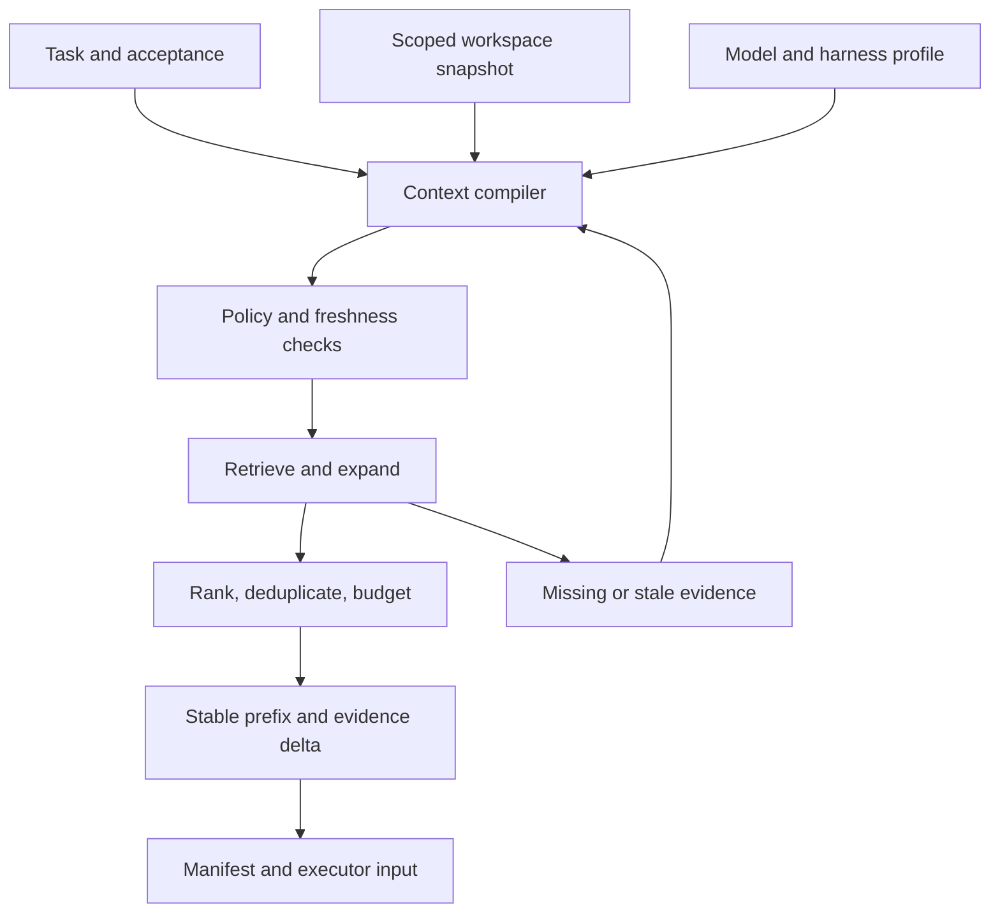
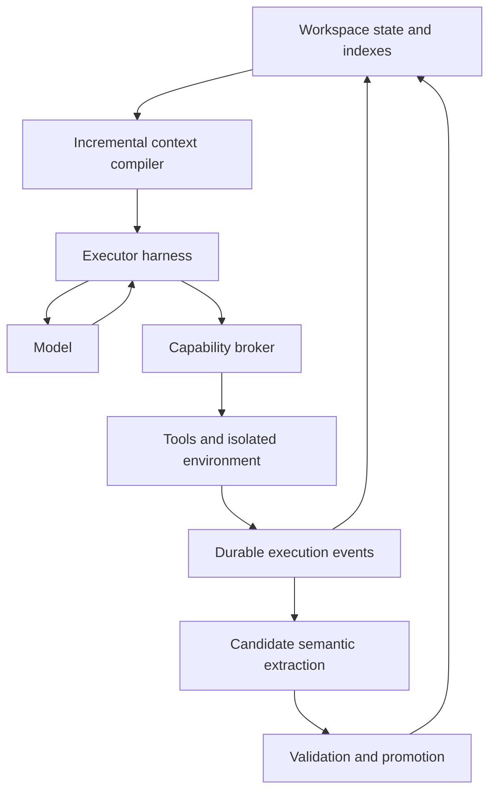
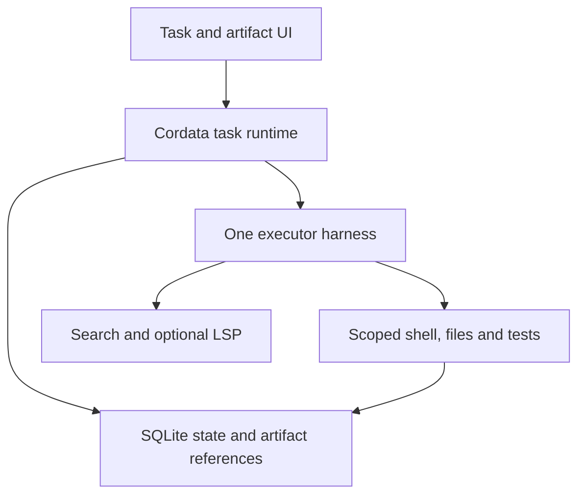
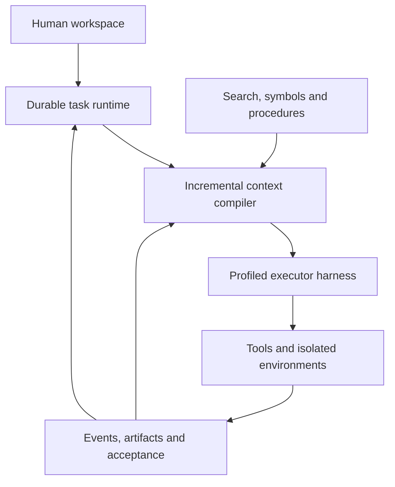
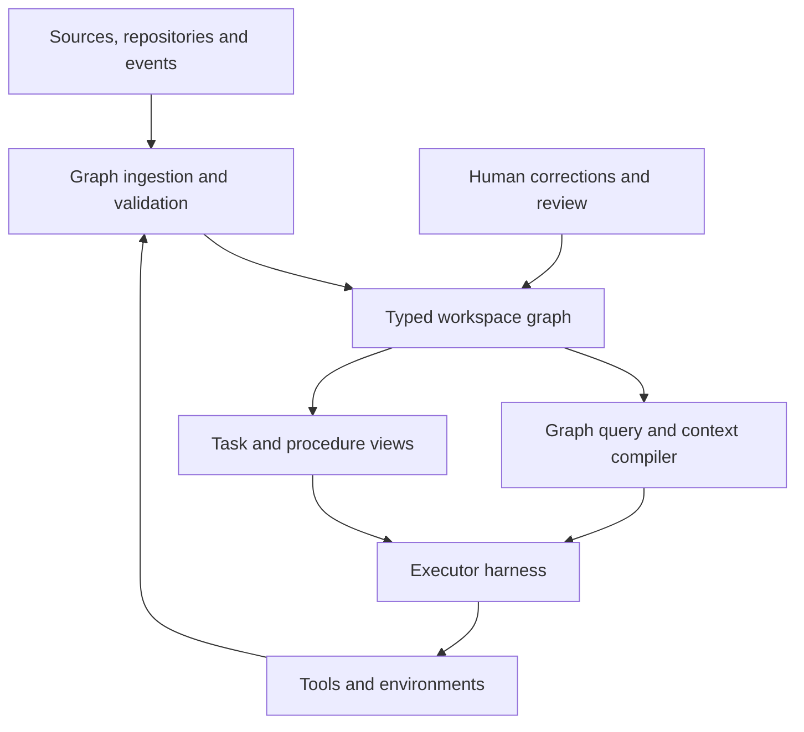
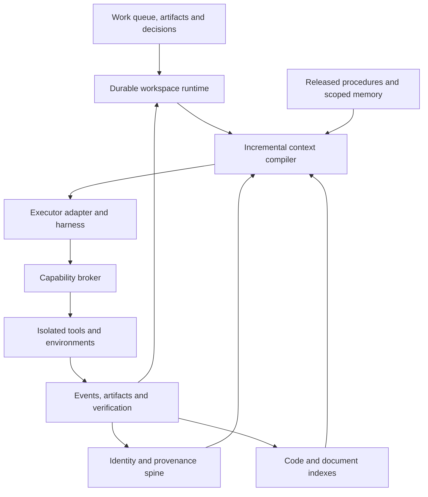

# Cordata: harness engineering, graph engineering, and the AI-native work environment

**Research cutoff: 13 September 2026**  
**Deliverable: focused architectural investigation and proposed specification**  
**Baseline:** CORDATA_DEVELOPMENT_SPEC(3).md and CORDATA_ARCHITECTURE_REVIEW(2).md, supplied with this request.

**Quick navigation:** [Recommended architecture](#26-architecture-d-recommended-architecture) · [Mechanism scorecard](#29-ranked-implementation-recommendations) · [Experiments](#30-experimental-validation-plan) · [Migration](#31-migration-path) · [Final specification](#33-final-architectural-specification)

## 1. Executive conclusion

**Build a durable, harness-first work environment with a thin, typed workspace relation layer and specialized indexes. Do not make a universal knowledge graph, a graph database, or a multi-agent topology the foundation of intelligence.**

The important architectural change is to make **task-specific access to executable environments and trustworthy workspace state** the main product capability. The model should repeatedly receive enough information to take a useful next action, observe its consequences, and verify progress. Graphs help when they encode a relationship that search would otherwise repeatedly rediscover: a symbol reference, a prerequisite, an artifact derivation, a decision's supporting source, or a procedure's applicable next step.

The evidence supports differentiated adoption. Code, retrieval and procedure graphs have distinct results and costs; §§7–11 examine those results. No reviewed comparison establishes that one continuously inferred graph of all a person's work maximizes general-purpose task performance.

**Recommended direction:**

1. Keep Cordata as the durable authority for work, authorization, artifacts, and acceptance.
2. Treat the executor harness as a performance-critical subsystem with measured, model-specific profiles.
3. Evolve Context Workspace into an **incremental context compiler**, preserving host continuation and prompt-cache locality.
4. Bring local code intelligence forward: lexical search, syntax, language-server symbols, references, diagnostics, and bounded dependency views.
5. Introduce shared identities and explicit artifact/provenance relationships in ordinary relational storage. Federate specialized code, document, event, and optional memory stores through bounded queries.
6. Use task dependencies only when they represent real constraints. Keep speculative semantic and procedural graphs separate from executable control state.
7. Learn procedures through an evaluated release process. Retain source episodes; do not recursively rewrite beliefs into presumed truth.
8. Make interruption, resumability, artifact review, pending decisions, and project-scoped continuity first-class human interfaces.

### Answers to the twelve core questions

| Question | Conclusion |
|---|---|
| What is state-of-the-art harness engineering? | Measured design of the model's action/observation interface, execution environment, context lifecycle, verification, and recovery, adapted to the model and workload. |
| What does graph engineering mean? | Designing typed relationships, their semantics, producers, validity, queries, and lifecycle. It is several distinct engineering problems, not one technique. |
| Which graphs measurably help? | Some repository graphs, associative retrieval graphs, and procedural structures on specific benchmarks. Scheduling and provenance graphs have clearer systems utility than demonstrated general reasoning gains. |
| Which graphs are unnecessary? | Unbounded inferred relationships, an agent society graph without real delegation needs, graph storage for simple lookup, and universal semantic modeling without evaluated queries. |
| How do harness, context, memory, planning, and tools interact? | Durable state supplies bounded context; the harness mediates model actions; authoritative tool outcomes update state; optional memory supplies defeasible evidence. |
| Should graphs be foundational? | Typed identity, dependency, and provenance semantics should be foundational. Graph traversal and graph databases should remain replaceable capabilities. |
| Could one graph model help? | A shared reference and relation protocol can help. One physical graph and universal ontology are unsupported and likely expensive. |
| Where should software replace reasoning? | Authorization, scheduling, freshness checks, indexing, dependency traversal, artifact accounting, budgets, and exact state transitions. |
| How should information be exposed? | Progressive disclosure through stable, typed, bounded tools plus concise views linked to original evidence. |
| What maximizes practical efficiency? | A strong single executor, reliable tools, measured context policies, incremental indexes, and conditional escalation. Optimize the task, not call count alone. |
| What distinguishes an AI-native environment? | Persistent work and artifacts independent of chat sessions, recoverable execution, human control, explicit acceptance, and selective reuse across time. |
| What changes in Cordata? | Elevate harness/context and local code intelligence; add a shared workspace spine; reduce mandatory orchestration and semantic-memory commitments; make procedure learning experimental. |

### Scope, method, and evidence limits

This is a **delta investigation**, not a second broad review. The previous report already identified durable execution, immutable attempts, cache-aware context, narrower evidence, isolated workers, and an evaluated single-agent baseline. Those conclusions are treated as prerequisites and referenced briefly where the new design depends on them.

The two attachments describe a design and its critique. They do not provide a runnable implementation, operational traces, current repository state, or deployment measurements. Consequently, this report critiques specified responsibilities and priorities, not verified implementation defects. “Current architecture” below means the supplied development specification.

Research emphasizes primary papers, repositories, official implementation documentation, and first-party engineering reports from 2024–2026, with older systems foundations where useful. September 2026 preprints are included explicitly as provisional evidence. Public documentation confirms exposed behavior; it does not establish proprietary internal architecture or comparative performance.

Evidence grades apply to the **particular claim**, not the prestige of its source:

| Grade | Meaning |
|---|---|
| A | Strong empirical support: convergent, well-controlled evidence with meaningful replication or broad relevant validation. |
| B | Moderate support: useful controlled experiments or substantial convergent engineering evidence, with transfer limitations. |
| C | Limited/promising evidence: narrow experiments, recent unreplicated results, or credible implementation experience. |
| D | Speculation: architectural hypothesis without persuasive task-level comparative evidence. |

A mature deterministic primitive can be necessary without an A-grade claim that it improves frontier-agent success. This report does not manufacture A grades for the proposed Cordata architecture. The rankings in §29 distinguish empirical support, engineering maturity, and confidence.

## 2. What harness engineering actually means

A useful operational definition is:

> **Harness engineering is the design, implementation, measurement, and adaptation of the software and environment that turn model outputs into bounded actions and turn environment state into usable model observations over an entire task.**

It includes the loop but is larger than the loop. A patch API that reports ambiguous matches accurately, a supervised shell that survives model calls, a test runner that exposes actionable failures, and a context policy that preserves needed evidence can matter more than a sophisticated planner.

The phrase currently has overlapping uses. OpenAI's February 2026 engineering account includes repository legibility, executable feedback, architecture enforcement, and the human engineering practices surrounding agent work. Google's September account emphasizes evaluating and iterating on agent behavior. Neither establishes a new theory of computation; the term usefully names a systems boundary that “prompt engineering” understates.[^1][^3]

| Term | Primary object being engineered | Relationship to the harness |
|---|---|---|
| Prompt engineering | Instructions and examples in a particular invocation | One harness input; cannot supply missing execution semantics. |
| Context engineering | What information reaches the model, when, and in what form | A major harness-adjacent subsystem; includes retrieval and lifecycle management. |
| Agent architecture | Overall component and authority structure | Defines where the harness sits and what it owns. |
| Orchestration | Scheduling and coordinating calls, tools, tasks, or agents | May be inside a single loop or outside across durable tasks. |
| Tool calling | Protocol for selecting and invoking operations | An interface mechanism, not the full environment. |
| Workflow engineering | Explicit procedure and control-flow design | Can constrain the harness for repeatable work. |
| Scaffolding | General external support around a model | Often synonymous; “harness” is more actionable when responsibilities are explicit. |
| Memory systems | Retained information and its retrieval/update policy | A source of evidence, not an execution authority. |
| Model training | Changing model parameters or policies | Complementary; inference-time harness changes need not change weights. |

The architectural value is **accountability**: name an owner, contracts, instrumentation, and evaluations for this boundary. The terminology becomes empty when every product component is called part of the harness and no causal ablation remains possible.

## 3. Current state of agent harness engineering

### Evidence that the surrounding system matters

| Evidence | Reported observation | What it supports—and does not |
|---|---|---|
| SWE-agent, NeurIPS 2024 | Agent-computer interfaces were deliberately designed for navigation, editing, and feedback, with experimental evaluation.[^4] | Interface design can materially affect a fixed model. Historical benchmark results do not rank today's products. |
| LangChain, February 2026 | A fixed GPT-5.2-Codex setup on 89 Terminal-Bench 2.0 tasks improved from 52.8% to 66.5% after harness changes: **13.7 percentage points**.[^2] | A substantial observed harness-associated gain. Several interventions changed together; this is a developer report, not an independently replicated estimate for each component. |
| OpenAI, February 2026 | Internal production experience emphasizes agent-readable repositories, runnable environments, and mechanically enforced invariants.[^1] | Concrete operating practices. Reported productivity is not a controlled causal comparison. |
| Meta-Harness, March 2026 | Automated harness search uses source, traces, and evaluations and reports gains across several domains.[^35] | Harness optimization can be formalized. Search cost, validation reuse, and transfer require scrutiny. |
| Independent harness-evolution evaluation, July 2026 | On repaired Terminal-Bench tasks without unit-test feedback, mean direct-sampling score was 68.2, parallel sampling 72.3, and harness evolution 67.4 across three models.[^36] | Automatic evolution is not reliably better than allocating compute to simpler alternatives. These are the paper's conditions, not general performance constants. |

**Answer to “harness versus orchestration”: there is no defensible universal effect-size ordering.** Evidence is sufficient to prioritize fixing missing observations, broken tools, and poor verification before adding coordination. It is insufficient to claim that harness work always produces a larger gain than changing orchestration. Cordata needs the factorial experiment in §30.

### What a strong harness should expose

The following is a proposed engineering profile, synthesized from the implementations and experiments reviewed, not a claim that one public product implements every row.

| Surface | Required behavior | High-return improvement |
|---|---|---|
| Instructions and dynamic prompts | Versioned stable rules, task objective, constraints, explicit completion criteria | Short navigable project instructions and task-specific views. |
| Tool schemas and descriptions | Precise inputs, return contracts, scope, side effects, truncation behavior | Reduce ambiguous choices and return recovery information. |
| Filesystem and repository navigation | Correct roots, revision identity, ignored/denied paths, bounded reads and search | Exact matches first; symbols and neighborhood expansion when useful. |
| Editing | Model-compatible patch mechanism, mismatch detection, fresh base check | Prevent silent partial application; return resulting diff identity. |
| Shell and processes | Explicit cwd/environment, process IDs, async output, cancellation, exit status | Preserve useful process state without confusing it with reproducibility. |
| Tests, compiler, diagnostics | Machine-readable results plus original logs | Summarize counts and first distinct causes, retaining full evidence. |
| Browser/computer | Isolated session, inspectable observations, stable element references when available | Reobserve after navigation; verify resulting artifact or external state. |
| Permissions | Resource/action scope enforced outside model text | Broker capabilities and credentials at execution time. |
| State and recovery | Durable attempts, checkpoints, action reconciliation | Resume useful work without duplicating unknown side effects. |
| Context and caching | Stable prefix, bounded dynamic evidence, host continuation preserved | Incremental changes instead of complete repacking after each action. |
| Routing | Measured model/task profiles and escalation triggers | Route when expected task utility improves, not by invented difficulty scores. |
| Observability | Tool behavior, costs, context manifests, artifacts, acceptance | Diagnose why tasks failed before changing architecture. |

Tools should have **small, composable contracts**, but “fewer tools” is not an objective by itself. A single shell gives broad power and low schema overhead; it also shifts search syntax, output parsing, and capability enforcement into harder places. A useful structured operation may save several shell interactions. Anthropic's tool-engineering guidance stresses semantic clarity and useful result formats; its programmatic-tool work demonstrates another way to keep large intermediate data outside model context.[^5][^6]

Deterministic preprocessing should normally precede model summarization: parse known compiler formats, group duplicate errors, rank exact matches, detect patch conflicts, and cap output. An LLM summary is appropriate when heterogeneous observations require interpretation. It must point back to originals and must not replace them.

## 4. Lessons from leading coding-agent harnesses

These are **documented surfaces and transferable lessons**, not a feature leaderboard. “Unknown” means the reviewed public source does not justify an internal-architecture claim. Versions and integrations must be pinned during implementation.

| System | Publicly supported observation | Lesson for Cordata | Important limit |
|---|---|---|---|
| Claude Code | Iterative information gathering, action and verification; tools, sessions, compaction, and subagents are documented. Long-running-agent guidance uses initialization and progress artifacts.[^7][^8] | Session transitions need explicit work state and acceptance, not merely a compressed conversation. | Public behavior does not reveal every routing or internal retrieval decision. |
| OpenAI Codex | The agent-loop account describes request construction and tool iteration. The August 2026 platform account exposes CLI/SDK/app-server integration around threads and turns.[^9][^37] | A maintained executor can sit below an application-owned work model. Preserve the host's continuation contract. | Do not assume arbitrary-model compatibility or complete interception of internal context. |
| Pi | Extension lifecycle is documented; the security documentation states that Pi does not supply a built-in sandbox.[^38][^39] | Attractive when extension control and provider flexibility are priorities; test the exact hooks and ordering. | Extension hooks are not OS security boundaries or proof of exclusive final-payload control. |
| OpenCode | Standard read/search/edit tools and an explicitly experimental LSP tool are documented.[^40] | Typed language intelligence can coexist with shell and text search. | Experimental feature availability is not performance evidence. |
| Aider | Repository maps select symbols/signatures through dependency ranking; editing formats vary by model and task.[^41][^42] | Compact code views and model-compatible edit formats are practical harness techniques. | A map is lossy; it cannot replace source inspection or semantic resolution. |
| SWE-agent | ACI design makes navigation, edits, and feedback explicit.[^4] | Treat tool interaction as an experimentally tunable interface. | Older benchmark configurations may not transfer to current frontier models. |
| mini-SWE-agent | A deliberately small implementation uses a simple loop and shell-oriented interaction.[^43] | Maintain a strong minimal baseline; orchestration complexity must earn its cost. | Repository performance claims depend on model, benchmark version, and budget. |
| OpenHands | Its SDK exposes agent/tool abstractions for local or remote execution, with documented persistence and related runtime capabilities.[^44] | Evaluate reusable runtime components independently of a hosted product assumption. | Do not infer that every deployment has the same isolation or persistence semantics. |
| Cline | Workspace checkpoints use a separate shadow Git repository.[^45] | Human-visible restoration of file changes is valuable. | A filesystem checkpoint does not reverse an email, database mutation, or network operation. |
| Roo Code | Checkpoints similarly document shadow-Git workspace snapshots.[^46] | Separate local artifact restoration from external-effect recovery. | Documentation of this feature is not a current product-support or quality ranking. |
| Continue | Agent mode exposes tools through a configured model and IDE workflow.[^47] | An IDE surface and user-selected executor can be adapters to persistent work. | No basis here to infer a universal graph or autonomous memory engine. |
| Cursor | Its scaling-agents engineering account describes planner/worker experiments and coordination difficulties.[^48] | Partitioning and integration policy matter when parallel work is justified. | This is first-party experience, not proof that planner/worker hierarchies should be the default. |
| Devin | Public knowledge documentation describes reusable project knowledge and playbooks.[^49] | Make useful project procedures inspectable and editable. | Proprietary planning, code representation, recovery, and routing remain partly unknown. |
| Herdr | Socket APIs expose session/process observation and worker interaction.[^50] | Reuse it for persistent terminals and worktree/process affordances. | Cordata still needs its own task authority, effect journal, and acceptance semantics. |

**Foundation decision:** retain Pi as the first integration candidate if its control requirements are verified, but replace the specification's categorical alternative-harness assumptions with a short feasibility comparison. Codex app-server is now a particularly relevant alternative executor boundary. OpenHands should be evaluated as an SDK/runtime option, not dismissed solely as a hosted system. This is a decision spike, not a recommendation to build three adapters.

For token optimization, compare four concrete paths: search plus raw reads; a compact repository map; typed symbol/reference queries; and programmatic batching with filtered results. Do not compare a polished graph harness against an intentionally weak text-search baseline.

## 5. What graph engineering means for AI agents

Graph engineering means choosing **what an edge asserts**, how it is obtained, where it is valid, how it is queried, and how it is corrected. Selecting Neo4j, RDF, or a graph library comes later.

The August 2026 survey *Graph Engineering in the Era of LLM Agents* uses the term for explicit evolving structures over tasks, agents, and system state. That establishes an emerging research usage beyond knowledge-graph RAG. Its stronger framing—that individual agents encounter an organizational limit requiring distributed intelligence—should be read as a proposed thesis, not a demonstrated universal law.[^11]

Three distinctions prevent most architectural confusion:

1. **Control versus description.** A prerequisite accepted by the scheduler constrains execution. An inferred “related to” relationship supplies evidence. They must not have the same authority.
2. **Logical graph versus physical storage.** Foreign keys and an indexed edge table already support a graph-shaped model. A graph database is justified by query and scale requirements, not by drawing arrows.
3. **Exact versus approximate relationships.** A recorded artifact derivation differs from a compiler-resolved reference, which differs from a syntactic name match, which differs from an LLM's causal hypothesis.

A graph does not automatically encode causality, truth, completeness, or current validity. Nor does storing a plan as nodes improve the plan. Most value comes from better producers, queries, and exposure policies.

## 6. Taxonomy of useful graph representations

The proposed taxonomy separates purpose from implementation. “Persistence” means what must survive; derived indexes can be rebuilt.

| Class | Purpose and representation | Producer/update mechanism | Persistence and query | Performance and complexity |
|---|---|---|---|---|
| Knowledge | Entities, claims, typed relations, supporting passages | Imported structured facts; candidate extraction; validated corrections | Persist source-backed assertions; entity lookup, paths, bounded neighborhoods | Entity resolution and extraction dominate cost; medium to high complexity. |
| Context | Task-relevant items and relationships for one invocation | Retrieval and bounded expansion from current state | Persist manifest, not necessarily a separate graph; ranked slices and dependency closure | Cheap if ephemeral; wasteful if every turn rebuilds a large semantic graph. |
| Code | Syntax, symbols, references, imports, types, calls, data flow | Parser, language server, compiler/indexer; incremental revision updates | Rebuildable indexes keyed to source/configuration; definitions, references, impact views | Low to high by semantic depth; whole-program analysis can be costly and incomplete. |
| Task | Work units and prerequisite/acceptance edges | Human/model proposals; deterministic validation and versioned commit | Durable authoritative state; ready frontier, blockers, descendants | Cheap at personal-workspace scale; complexity lies in changes and effect semantics. |
| Execution | Attempts, actions, observations, artifacts, links | Instrumented runtime events | Append-only event facts plus indexed projections; lineage, related failures | Linear ingestion; high volume makes retention and indexing important. |
| Workflow | Reusable states, transitions, guards and procedures | Human-authored or offline learned, tested versions | Persist released definitions and run versions; applicable transitions | Mature when deterministic; generated workflows add validation burden. |
| Memory | Episodes, facts, decisions and associations | Explicit capture, source-backed extraction, selective consolidation | Durable episodes/claims with validity; hybrid temporal/entity/text retrieval | Retrieval may improve; noise, stale edges, and maintenance can dominate. |
| Artifact | Files, documents, commits, datasets, runs, outputs | Connectors, version control, artifact creation and transformation | Persist stable IDs and revisions; derivation, ownership, affected work | Usually high practical value at moderate cost; avoid duplicating entire contents. |
| Agent | Delegation, roles, communication, ownership | Actual task dispatch and messages | Persist actual relationships; inspect assignment and handoff | Useful observability if multiple agents exist; little value in a speculative society. |
| Provenance | Sources, transformations, attribution, support | Runtime capture; explicit evidence linking | Persist essential links with source versions; support and derivation queries | Useful for audit/review; source exposure alone does not establish causal contribution. |
| Temporal | Valid-time and recorded-time evolution of other classes | Versioned events and source changes | Persist histories/tombstones as policy permits; as-of and supersession queries | Not a separate universal graph; bitemporal queries and retention add complexity. |

| Class | Evidence of usefulness | Principal failure modes | Cordata recommendation |
|---|---|---|---|
| Knowledge | Retrieval gains depend on query class.[^12][^13] | Hallucinated edges, merged identities, missing nuance, expensive reindexing | Optional domain-specific retrieval, source text retained. |
| Context | Indirect support from repository maps and retrieval studies | Attractive but irrelevant neighborhoods; duplicated information; stale views | Compile bounded views; do not create a permanent “context graph” service initially. |
| Code | RepoGraph and localization studies show scoped benefits.[^10][^14] | Syntactic calls mistaken for resolved calls, branch/config mismatch, generated code gaps | First graph-related investment after the harness baseline. |
| Task | Dependency scheduling has strong established systems semantics; agent-performance evidence is narrower | Premature decomposition, false dependencies, uncontrolled replanning | A task graph is an available primitive, not mandatory complexity per request. |
| Execution | Observability and durable-workflow precedent.[^51][^52] | False causal links, missing effects, replaying irreversible actions | Capture events and explicit links; derive useful graph views. |
| Workflow | Plan caching and workflow-memory experiments.[^30][^31] | Overfitting, stale prerequisites, unsafe automatic reuse | Versioned procedures with applicability and acceptance tests. |
| Memory | Conversational-memory benchmarks and recent mixed results.[^24][^25][^27] | Consolidation drift, preference overgeneralization, poisoning | Explicit/project-scoped memory first; graph augmentation must beat simple stores. |
| Artifact | Version-control and provenance semantics; limited end-to-end agent ablation | Unstable IDs, broken external references, ACL inheritance mistakes | Foundational thin workspace spine. |
| Agent | Coordination studies show conditional benefits and harms.[^33] | Communication overhead, duplicated work, correlated errors | Record actual delegation only. |
| Provenance | W3C PROV supplies established modeling distinctions.[^53] | “Cited” mistaken for supported, logs mistaken for explanations | Source-backed support and derivation links, with honest uncertainty. |
| Temporal | Temporal memory designs and long-memory evaluation motivate it.[^25][^26] | Latest record mistaken for current truth; deleted records reintroduced | Use version and validity fields from the beginning. |

### Performance rules that apply across graph classes

A bounded traversal costs work proportional to the vertices and edges actually visited; a small hop limit can still explode around high-degree nodes. Impose result, time and edge-type budgets, not just a hop count. Return whether expansion was clipped.

Incremental updates are cheap when source changes affect a small local neighborhood, but entity merges, renamed interfaces and summary-community changes can cause large invalidation fan-out. Measure update amplification and cold rebuild time separately. A graph that is fast to query but expensive to keep current may be the wrong representation.

Keep raw source retrieval addressable by revision. Cache read-only tool/query results only when the key includes relevant source, environment, authorization and tool versions. Do not memoize an external side effect merely because its argument string matches an earlier call.

## 7. Evidence for and against graph-based approaches

### Graphs can replace repeated exploration; they cannot replace all evidence

A graph can save tokens when a small traversal finds the relevant source slice without repeated broad searching. It can also increase tokens by adding node descriptions, extracted triples, community summaries, and irrelevant neighbors. The appropriate test is **task success and total cost at matched information and retrieval budgets**, including graph construction and updates.

| Approach | Strong use cases | Weaknesses and required baseline |
|---|---|---|
| Lexical/BM25 | Exact identifiers, error strings, rare terms, explicit facts | Vocabulary mismatch; include a strong query-rewrite or hybrid comparison. |
| Dense/vector | Paraphrases and semantic similarity | Weak exact identifiers and explicit relation constraints; embedding cost and stale indexes. |
| Raw long context | Small enough corpus, detailed comparison, no indexing amortization | Cost, distraction, attention failures; can still beat lossy extraction. |
| Hierarchical summaries | Global themes and multi-level navigation | Detail loss and summary maintenance; RAPTOR is a relevant alternative to entity graphs.[^15] |
| Knowledge/community graphs | Associative questions, entity chains, corpus-wide themes | Extraction error, query mismatch, expensive construction, graph-hub drift. |
| Code structure | Definitions, references, interface impact, dependent edits | Incomplete semantics and configuration sensitivity. |
| Hybrid retrieval | Mixed query populations | More components and potential extra-context confounding. |

Microsoft's original GraphRAG work focuses on global query-focused summarization using extracted entities and community summaries. Its strengths are not evidence that triplets are superior for precise fact retrieval. LazyGraphRAG instead defers expensive LLM work and combines lightweight structure with query-time relevance testing; its first-party evaluation supports testing lower-upfront-cost alternatives, not importing advertised cost ratios into Cordata.[^16][^17]

HippoRAG 2 combines passage and phrase representations, dense retrieval, graph propagation, and filtering. Its associative-retrieval results are useful evidence for hybrids. They do not isolate “having a graph” from all other retrieval changes.[^13]

### A particularly useful comparative result

Han and colleagues' March 2026 revision evaluates methods under a common protocol. With the reported Llama 3.1-8B configuration, Natural Questions F1 is **64.78 for RAG**, **34.28 for triplets-only KG retrieval**, and **63.01 for local community GraphRAG**. On HotpotQA, the ordering changes: **60.04 for RAG**, **61.66 for local community GraphRAG**, and **63.01 for HippoRAG 2**. These are benchmark F1 scores, not production task-success percentages.[^12]

The implication is query routing and retained source text, not blanket GraphRAG adoption. GraphRAGBench similarly makes query characteristics and pipeline choices visible; its reported context costs vary considerably across methods. Relationally constructed benchmarks can favor graph methods, so they cannot establish the value of a graph across ordinary personal-workspace requests.[^18]

### Negative evidence is architectural input

| Hypothesis challenged | Evidence or failure mechanism | Consequence |
|---|---|---|
| More structure always improves retrieval | Triplet extraction loses details; graph methods have mixed comparative results.[^12] | Preserve raw evidence and a no-graph route. |
| Graphs reduce tokens | RepoGraph raises tokens in reported repair comparisons.[^10] | Measure tokens per accepted task, including index cost. |
| More agents improve difficult work | Controlled scaling studies find gains on some parallelizable tasks and degradation on sequential tasks.[^33] | Escalate based on task structure; first try tool concurrency. |
| More memory compounds knowledge | Continuous LLM consolidation can degrade previously useful memories.[^27] | Retain episodes, track validity, and test retrieval abstention. |
| Reflection/evolution is a free improvement | Harness evolution can underperform simpler sampling; refinement is model-dependent.[^36] | Treat reflection as a costed intervention with an external outcome signal. |
| Summaries always improve long contexts | Observation masking can compete with or outperform summarization strategies.[^32] | Keep masking and stable-history baselines. |
| Automatic skills replace curation | SkillsBench's self-generated conditions underperform matched no-skill baselines, with important protocol caveats.[^28] | Separate authoring, validation, discovery, and reuse. |
| A graph guarantees causal reasoning | Observed association or derivation is not a causal model | Use graph paths to locate evidence; require separate causal justification. |
| Dynamic workflow search generalizes | Search can exploit evaluation feedback or overfit repeated tasks | Use time/repository splits and untouched final tests. |
| Elaborate context policies are robust | Missing evidence, cache churn, stale views, and hard-coded allocations introduce failures | Prefer incremental policies with manifests, fallbacks, and ablations. |

The final two rows are engineering failure hypotheses supported by the preceding mechanisms, not measured universal effects.

## 8. Graphs for code intelligence

**The best default is search plus source plus structural queries.** It is not raw code alone, and it is not a graph-only repository interface.

RepoGraph's SWE-bench Lite table reports Agentless with GPT-4o improving from **27.33% to 29.67%** resolved, while average tokens rise from **42,376 to 47,323**—approximately **11.7% more**. Its graph uses syntactic repository structure and neighborhood retrieval. Some baseline accuracies are reported leaderboard values while costs use reproduced trajectories; this is not a fully matched causal estimate for a current harness.[^10]

LocAgent reports up to 92.7% file localization and lower cost with its fine-tuned model/graph setup. Localization is not repair success, and fine-tuning, model selection, and retrieval cannot be collapsed into a pure graph effect. CodexGraph demonstrates an agent querying a code graph database across repository tasks; despite its name, it is not OpenAI's Codex architecture.[^14][^19]

### An incremental code-intelligence ladder

| Level | Representation and tool | Adopt when | Avoid claiming |
|---|---|---|---|
| 0 | Directory inventory, rg/BM25, bounded raw reads | Every supported repository | Search result absence proves no dependency. |
| 1 | Syntax and symbol outline via tree-sitter | Large files, unfamiliar repository navigation | A concrete syntax tree resolves dynamic calls or types. |
| 2 | Definitions, references, hover/types and diagnostics via LSP | Supported project/language configuration is available | Every language server has complete or equivalent semantics. |
| 3 | Persistent semantic indexes such as SCIP | Repeated cross-file or cross-repository queries justify indexing | One index revision applies to all branches and dirty edits. |
| 4 | Import/module/build dependency and bounded call views | Impact analysis, migration, testing scope | Static reachability is a complete runtime behavior model. |
| 5 | Code-property graphs, control/data flow, specialized analysis | Security auditing, taint analysis, difficult refactoring | Whole-program analysis is cheap or necessary for routine changes. |

Tree-sitter provides incremental syntax parsing; SCIP defines a language-agnostic code-intelligence indexing format. LSP supplies a standard language-service protocol, with capability support varying by server.[^78] Compiler-backed analysis additionally needs the build configuration: include paths, flags, generated sources, and target environment affect interpretation. Joern's code-property graph combines program representations useful for specialized analysis.[^20][^21][^22][^23]

**Proposed repository view:** selected symbol signatures; exact source spans; direct callers/references with resolution quality; relevant requirements/tests; recent changes; index revision and coverage. The model can expand each item. Do not serialize the whole graph, generic node IDs, or every edge.

Use stable repository identities plus revision-specific symbol references. Treat file rename identity as an explicit mapping, not a guessed name equality. For dirty worktrees, overlay incremental local results on a pinned base index. If semantic indexing is stale, answer with a freshness warning and current text search rather than silently presenting outdated structure.

CodePlan is relevant for broad migrations: dependency analysis and adaptive planning helped its small set of repository-level changes pass checks where a no-planning baseline did not. That supports specialized impact-guided editing, not a universal planning requirement. SWE-Explore's newer repository-understanding benchmark emphasizes retrieving the right code regions under a line budget; this is a better diagnostic than file-hit rate alone.[^54][^55]

For multiple repositories, model package versions, APIs and ownership boundaries explicitly. A source import in repository A is not proof that a deployed service uses the current head of repository B. Cross-repository integration requires a versioned compatibility manifest and acceptance at the consuming boundary.

## 9. Graphs for planning and execution

A task graph should be a **fundamental capability of the runtime**, but not the mandatory representation exposed to the model for every request. A one-node task with a checklist is often enough.

| Planning representation | Best use | Failure or cost | Proposed policy |
|---|---|---|---|
| Linear checklist | Short, mostly sequential work | Dependencies remain implicit | Default presentation for simple tasks. |
| Hierarchical plan | Objectives with nested work packages | Decomposition becomes a substitute for execution | Use a small number of meaningful acceptance units. |
| DAG / partially ordered plan | Genuine prerequisites and independent outputs | False dependencies reduce parallelism; excessive nodes add bookkeeping | Runtime primitive when readiness matters. |
| State machine | Approval, release, recurring workflow, bounded recovery | Overly rigid paths can block legitimate strategy changes | Use for invariant-bearing lifecycle transitions. |
| Event graph | What actually happened and what it depended on | History is not an executable plan | Derive from events; use for investigation and resume. |
| Dynamic dependency graph | Exploration discovers required work or invalidates prior results | Uncontrolled replanning destabilizes ownership and acceptance | Versioned proposals, deterministic validation, explicit supersession. |
| Generated workflow | Repeated task family with meaningful evaluation | Search cost, evaluator exploitation, distribution shift | Offline experiment; released workflow pinned per run. |

**The model may propose modifications; the runtime commits them.** A proposed change names the current plan version, added/removed dependencies, affected work, and reason. Validation checks cycles, missing identities, required acceptance, active ownership, budgets, capabilities, and whether completed artifacts remain applicable. A model-generated “ready” label is not authoritative.

A useful distinction is between **hard prerequisites** and **soft strategy hints**. “The consumer needs a schema version before integration testing” is hard. “Read design notes before editing” is usually advice. A procedural graph can contain loops and alternatives; it should not be forced into an acyclic task scheduler.

The runtime calculates readiness from satisfied required prerequisites and current acceptance. Cancellation stops dispatch, signals active execution, waits for acknowledgment or reconciliation, and records unresolved effects. It does not erase history. Rollback is artifact restoration or an explicit compensating action; replanning cannot undo a network effect.

Speculation is appropriate for bounded, isolated read-only investigation or competing patches when selection is independently testable. Avoid speculative external writes and multiple writers to one live workspace. Tool-call concurrency should precede worker concurrency. LLMCompiler provides relevant evidence that dependency-aware parallel tool execution can reduce orchestration latency without requiring a social structure of agents.[^63]

The previous review already provides the required durability corrections. The new graph-specific rule is: **a changed dependency can invalidate acceptance only through an explicit, typed relationship and policy—not through a newly inferred semantic association.**

## 10. Graphs for memory

Memory is useful when it avoids expensive rediscovery, preserves user-approved constraints, or retrieves previously inaccessible evidence. It is harmful when it injects obsolete preferences, unverified conclusions, or irrelevant episodes.

### Store choice should follow the query

| Store | Good at | Poor at | Role in the recommended system |
|---|---|---|---|
| Documents/files | Inspectable procedures, project notes, raw evidence | Complex concurrent updates and cross-document constraints | Canonical human-editable knowledge and exported views. |
| Relational database | Typed records, transactions, scoped metadata, joins | Arbitrary high-depth traversal at very large scale | Authoritative workspace metadata and modest relation tables. |
| Event store | Append-only history, ordering, replayable projections | Direct semantic retrieval | Authoritative execution facts and updates. |
| Vector index | Similarity over language and documents | Exact validity, identity, permission semantics | Optional retrieval accelerator. |
| Graph database | Relationship-centric traversal and pattern queries | Schema/identity maintenance; operational overhead for simple lookups | Optional specialized engine after a measured need. |
| Hybrid | Mixed text, entity, temporal and structural questions | More consistency and ranking surfaces | Logical architecture, introduced incrementally. |

Mem0's own LoCoMo comparison shows that adding its graph variant changes outcomes by question type: multi-hop judge score falls from 51.15 to 47.19, while temporal score rises from 55.51 to 58.13. This argues against equating “graph memory” with an across-the-board improvement.[^24]

Zep's temporal graph distinguishes recorded and valid time and combines several retrieval routes. These are useful design ideas, but automatic contradiction handling still depends on uncertain extraction. LongMemEval tests updates, temporal reasoning, and abstention, which ordinary recall-only tests miss.[^25][^26]

A-MEM explores linked memories; Hindsight separates different memory categories. Both are relevant alternatives to undifferentiated vector storage, but conversational benchmark results cannot establish gains in multi-repository implementation or research judgment.[^58][^59]

### Recent evidence changes the learning recommendation

The May 2026 paper *Useful Memories Become Faulty When Continuously Updated by LLMs*, revised in August, reports that repeated consolidation can turn useful memories into harmful ones. In one ARC-AGI setting, GPT-5.4 failed 54% of previously solved tasks after consolidation despite ground-truth-derived starting memories. That is a serious counterexample to monotonic memory improvement; it is not a forecast of a 54% coding regression.[^27]

Zero-Mem, July 2026, instead explores structured retrieval from raw traces without LLM calls outside the final answer stage. Its author-reported memory-processing savings are promising, but code availability and independent reproduction remain limitations. Agent Zero Memory, August 2026, combines timeline, entity/event and document structures with multiple retrieval agents. Strong reported QA scores do not isolate whether graphs, retrieval effort, or the reader caused the gain.[^56][^57]

The practical conclusion is conservative: preserve raw episodes; add typed metadata and exact retrieval; test selective semantic links; avoid repeated wholesale rewriting.

### Which example relationships deserve representation?

| Relationship | Recommended status | Reason |
|---|---|---|
| Project contains Repository | Authoritative, explicitly registered | Scope and navigation. |
| Task modified FileRevision | Mechanically observed from the artifact delta | Resume, review, attribution, impact. |
| Decision motivated_by RequirementRevision | Explicit assertion with author/source | Useful for revisiting decisions; motivation is not inferred truth. |
| Error caused_by ConfigurationRevision | Hypothesis until verified | Correlation and temporal proximity are insufficient. |
| Solution resolved Error | Supported by reproduction and verification scope | A later recurrence may invalidate generalization. |
| Experiment evaluated Hypothesis | Authoritative link to experimental protocol and result | Makes research cumulative and inspectable. |
| Agent produced ArtifactRevision | Observed attribution | Does not imply correctness or ownership rights. |

An edge needs more than a confidence float: producer, evidence, source revision, recorded time, validity interval if known, scope, assertion type, and status. Keep “observed,” “compiler-resolved,” “user-confirmed,” and “model-inferred” distinct. Confidence is meaningful only with calibration and an explicit interpretation.

Memory maintenance must support correction, supersession, expiration, deletion, and source revocation. Bound graph growth by admitted entity types, query demand, retention, and degree limits. Detect high-degree hubs and entity collisions. An unavailable source should not silently become a trusted summary forever.

## 11. Graphs for traces and procedural learning

**Every material action should emit an execution event. It need not become a separately extracted semantic graph node.**

Conventional distributed tracing already has parent-child structure and span links; comparing an execution graph only against a flat text log would be a weak baseline. OpenTelemetry provides established tracing primitives, while W3C PROV distinguishes entities, activities, and agents. Cordata should reuse those distinctions without implementing the entire ontology.[^51][^53]

Recommended event links include: attempt belongs to task; action consumes an artifact revision; observation results from action; output was produced by action; verification evaluated an artifact under an environment and criterion version; decision cites evidence. Capture these mechanically whenever possible.

| Intended benefit | What the graph can provide | What else is necessary |
|---|---|---|
| Resumability | Find latest accepted artifacts and unresolved actions | Durable state, environment restoration, effect reconciliation. |
| Debugging/postmortems | Traverse failures to inputs, versions, tools and outputs | Complete instrumentation and useful error categories. |
| Failure clustering | Group comparable tool errors and contexts | Normalization, semantic similarity if needed, human review. |
| Strategy extraction | Locate repeated successful action patterns | Counterexamples, applicability checks, held-out validation. |
| Replay | Reconstruct recorded decisions and observations | Pinned inputs or mocks; distinguish observation replay from real execution. |
| Branching | Fork artifacts and task state | Isolated environments and explicit divergence. |
| Counterfactual analysis | Identify candidate dependencies to vary | Controlled interventions or a justified causal model. A path alone is insufficient. |

Do not preserve hidden chain-of-thought as a product requirement. Store decisions, cited observations, stated assumptions, tool actions, outcomes, and concise rationale needed for review.

### Procedures as tested releases

Agent Workflow Memory shows benefits from reusing induced web-task routines. Agentic Plan Caching reports average cost and latency reductions in its evaluated applications by adapting reusable templates. ACE explores incremental playbooks, while AFlow and GEPA provide related evidence for evaluated workflow or prompt optimization. These approaches differ in what is learned and where optimization cost is paid; none establishes unrestricted online self-improvement.[^31][^30][^29][^60][^61]

The proposed lifecycle is:

1. Select several successful and failed episodes from a recurring task family.
2. Extract a candidate procedure with scope, prerequisites, steps, alternatives, required capabilities, and acceptance.
3. Remove instance-specific secrets and answer leakage.
4. Compare against the existing procedure or fresh planning on separate validation tasks.
5. Release a version, monitor regressions, and retain a rollback path.
6. Revalidate after relevant tool, environment, repository, or policy changes.

A “successful trace” may contain unnecessary actions or accidental success. Extracting its entire sequence can preserve precisely the behavior that should be removed.

SkillsBench's current dedicated-harness comparison reports Codex/GPT-5.5 at 46.8% without skills, 35.5% with self-generated skills, and 66.5% with curated skills. Its audit identifies discovery, authoring interference, errors and protocol limitations; this is evidence against treating generation as a substitute for curation, not proof that all generated skills are inherently harmful.[^28]

### Procedural graphs: the most relevant new experiment

The 8 September 2026 *Procedural Graphs* preprint localizes a current procedure node and uses a guidance model over nearby structure. Graph revisions are evaluated before acceptance. On one fixed MultiChallenge subset, its no-graph baseline scores 80.27 with 6,629 average tokens; localized generative guidance scores 89.31 with 12,295 tokens. Its ablation does **not** include a localized, deterministically rendered raw-graph arm.[^34]

This motivates a specific Cordata experiment, not foundational adoption: compare a concise checklist, a local procedure view, and an extra guidance model under matched total budgets. The missing local-raw arm matters because otherwise localization and another LLM call are confounded. Keep the procedural graph advisory; it cannot modify permissions or acceptance.

## 12. Context compilation

**“Context compiler” is a useful architectural abstraction if it has a typed input, a reproducible output manifest, an invalidation policy, and measured objectives.** It is not a claim that context selection is fully deterministic or that a universal optimal prompt can be computed.

The supplied Context Workspace already contains much of the conceptual starting point. The extension is to make it an **incremental materialized view of work**, rather than a fixed-size packing of memory, graph, and history categories.

### Compilation pipeline



Recommended stages:

1. **Resolve authority and scope.** Select project, user instructions, allowed sources and capabilities before retrieval.
2. **Capture a read-version vector.** Record source revisions, index watermarks and environment identity. A federation is not necessarily a globally atomic snapshot.
3. **Select mandatory material.** Goal, acceptance, hard constraints, unresolved risky effects, and required host continuation cannot be dropped merely for a ranking score.
4. **Retrieve candidates.** Exact identifiers and lexical search first where appropriate; then dense retrieval, structural expansion, temporal filters, or procedure lookup.
5. **Expand bounded dependencies.** Include what is needed to interpret the selected artifact, not the entire transitive closure. Report clipped closure and unresolved boundaries.
6. **Rank and deduplicate.** Combine relevance, freshness, source authority, diversity, and cost. Avoid treating heuristic weights as calibrated probabilities.
7. **Render for the consumer.** Prefer source spans, signatures, compact diagnostics and explicit uncertainty over raw database rows.
8. **Preserve continuation/cache structure.** Keep the stable prefix and legal message sequence; append or refresh only what matters.
9. **Record the manifest.** Store included items, revisions, excluded mandatory failures, query dependencies, token estimates and actual usage where available.

“Compile at every important invocation” should mean **validate and update the view**, not rebuild it from zero. Most tool turns can append an observation. Recompile more substantially at task boundaries, after scope changes, on stale evidence, after major artifact changes, and when context pressure requires it.

Codex's public loop description illustrates why provider serialization and continuation belong to the host boundary. Cache-focused work and observation-masking experiments further caution against optimizing visible token count while destroying cached prefixes or useful trajectory state.[^9][^62][^32]

### One workspace, different compiled views

| Consumer | Primary view | Must remain shared |
|---|---|---|
| Coding executor | Requirements, local code, relevant references, tests, diagnostics | Goal, constraints, artifact versions and acceptance. |
| Planner | Objectives, actual dependencies, resource constraints and unresolved decisions | Same authoritative task state. |
| Researcher | Source passages, competing claims, dates, evidence gaps and provenance | Source authority and privacy boundaries. |
| Reviewer | Proposed artifacts, criteria, independent checks and supporting evidence | Exact artifact identity and requirement versions. |
| Recurring-workflow runner | Released procedure, occurrence inputs, last relevant outcome and current permissions | Current applicability; previous authorization is scoped. |

These can be **roles of one model process at different moments**. Different views do not require different agents. Add separate agents only if concurrency, independent checking, or isolation provides measured value.

The compiler must also support retrieval abstention. An empty or low-confidence result should lead to explicit further search or an uncertainty statement, not arbitrary memory filling. When tool discovery is large, use a stable core and progressive loading at sensible segment boundaries; Anthropic's advanced-tool documentation is one concrete implementation precedent.[^76]

## 13. Persistent workspace/world-model architecture

The right product abstraction is **an AI-native work environment with a durable work model**. “Agent operating system” is meaningful only if it implies actual scheduling, resource isolation, capabilities and recovery. “Cognitive workspace” and “graph-native workspace” add little unless translated into observable behavior.

The environment should know what work exists, which artifacts and sources it concerns, what has been accepted, what remains unresolved, and what access is authorized. It should not silently infer a comprehensive personal ontology from every available file.

### Explicit entities, introduced by actual use

| Core now | Add for a workload | Keep as source-backed content unless queried repeatedly |
|---|---|---|
| Project, Repository, Task, Attempt, Action, ArtifactRevision, Environment, Verification, Decision, Source, ProcedureVersion, CapabilityGrant | Objective, Requirement, Experiment, Dataset, WorkflowOccurrence, Service, Ticket, PersonReference | Arbitrary concepts, personality traits, causal theories, general “knowledge” nodes and exhaustive conversation semantics |

Files and documents are artifact kinds. Conversations are interaction records linked to work, not the primary work container. References to people are scoped and minimal; a name similarity is not sufficient to merge identities. Preferences should have explicit scope, origin and override semantics, with an easy correction interface.

A bounded “world model” is therefore a **versioned, incomplete, evidence-linked model of selected work**. It should expose what it does not know. Each source adapter reports coverage, freshness and failure status.

### Unified workspace graph hypothesis: conditional acceptance

A unified *logical* view offers useful queries:

- Which accepted decisions constrain this interface?
- Which projects consume this API version?
- What experiments contradict this hypothesis?
- Which artifacts were produced by an execution later found invalid?
- What was the last verified way to run this project's integration tests?

The same model becomes unmaintainable when it tries to store every syntax edge, chat association, log event, external-app relation and conceptual inference under one globally consistent ontology.

| Architecture choice | Benefit | Cost and risk | Verdict |
|---|---|---|---|
| One physical universal graph | Uniform traversal and one query language | Different lifecycles, scale, permissions and certainty forced together; expensive migration | D-grade general-purpose superiority claim; do not default to it. |
| Fully separate uncoordinated stores | Simple local implementations | Broken identity, repeated retrieval and missing cross-artifact lineage | Adequate baseline but insufficient continuity over time. |
| Shared identities plus relational spine and specialized stores | Cross-work joins without copying every detail | Adapter contracts, watermarks and partial consistency still needed | Recommended, with measured cross-project utility. |

The common graph abstraction should be deliberately small: **resolve, relate, traverse bounded typed edges, retrieve source, and explain provenance**. It should not become a universal query language that every model must learn.

### Human-agent collaboration is part of the architecture

A continuous environment needs these views:

| Human action | Interface and state behavior |
|---|---|
| Delegate | Create a task with goal, scope, acceptance and budget; preserve the original request. |
| Interrupt or reprioritize | Change scheduler priority; stop new actions; expose what is still running and any uncertain effects. |
| Inspect work | Show artifacts, milestones, blockers, tests, and brief evidence-backed decisions. |
| Approve consequential work | Present the concrete target, change and authority required; bind approval to that action/version. |
| Review coding work | Open exact diffs, test results, affected dependencies and remaining uncertainty. |
| Review research | Inspect claims, source passages, dates, disagreements and confidence limits. |
| Resume | Show last accepted state, current environment status, pending decisions and proposed next step. |
| Correct knowledge | Amend or supersede a claim/preference; preview dependent views affected. |
| Collaborate on artifacts | Detect human edits and refresh the relevant context; avoid silent overwrite. |
| Set autonomy | Scope capabilities and budgets by project/task; make active permissions visible. |

The default interface should be a task and artifact workspace, with chat as one control surface. A giant animated graph is rarely the best primary UI. Display a small dependency or provenance view when it answers a real question.

## 14. Harness + graph integration

The proposed feedback loop is architecturally sound **only if events and inferred relationships travel through different validation paths**.



There are three planes:

| Plane | Authority | Example | Update rule |
|---|---|---|---|
| Control | Deterministic runtime or explicit human command | Task status, capability, accepted verification | Transactional validation and durable commit. |
| Derived structure | Rebuildable producer tied to source revisions | Symbol references, import graph, artifact index | Incremental update/invalidation; expose coverage. |
| Semantic evidence | Defeasible assertion | Cause hypothesis, reusable lesson, entity association | Preserve source, uncertainty, temporal validity; promote explicitly. |

The model receives a compiled view across these planes with authority labels. It can propose a task dependency or hypothesis, but cannot turn an inferred edge into an authorization grant.

The event stream is the reliable feedback channel. Graph materialization can lag; tool execution must not wait for an optional semantic index. A provider outage should degrade retrieval with a bounded timeout while preserving local work.

**Example:** after changing an API, the artifact event invalidates the relevant code overlay and previous verification. Structural queries identify known consumers. The compiler supplies the affected interfaces and tests. The model chooses a repair strategy. New test results update acceptance. A later candidate lesson may describe the migration procedure. These are separate changes with separate authorities.

## 15. Deterministic infrastructure vs LLM intelligence

The principle “never spend model intelligence where deterministic software reliably solves the problem” is sound, provided “reliably” includes uncertain inputs and incomplete specifications.

| Deterministic infrastructure | LLM intelligence | Hybrid boundary |
|---|---|---|
| Identity, versioning, transactions, storage | Interpret ambiguous goals and evidence | Model proposes typed records; runtime validates. |
| Permissions and credential brokerage | Explain why a capability may be needed | Human/policy grants capability; model cannot self-authorize. |
| Readiness, quotas, leases, cancellation | Propose decomposition and strategy | Validated dynamic task plan. |
| Exact search, parsing, symbol lookup | Reformulate an unclear information need | Hybrid retrieval with bounded expansions. |
| Dependency traversal and cache invalidation | Judge whether an approximate dependency is relevant | Exact edges drive hard invalidation; uncertain edges trigger inspection. |
| Patch application and conflict detection | Produce code changes | Fresh-base patch validation and tests. |
| Test execution and result parsing | Diagnose failures and choose next investigation | Deterministic evidence plus semantic interpretation. |
| Known error grouping and output limits | Summarize novel heterogeneous failures | Summary linked to retained originals. |
| Checkpoint capture and restoration | Choose whether an alternative strategy is useful | Branching in isolated environments. |
| Procedure versioning and applicability checks | Extract and generalize candidate procedures | Offline validation, then release. |
| Schedules and occurrence deduplication | Interpret a recurring-work request | Confirmed schedule specification, then deterministic execution. |

Do not replace judgment with fragile rules just to avoid tokens. A hard-coded rule that every failing test means the latest edit is wrong can trap an agent in an invalid environment. A compiler can deterministically report a missing symbol, but deciding whether to update a dependency, fix generation, or change an API may require reasoning.

Similarly, an exact graph traversal is cheap; creating correct edges from ambiguous prose is not. The system must distinguish these costs instead of labeling an LLM-built graph “deterministic infrastructure.”

## 16. Lessons from adjacent computer-science fields

| Established field | Applicable concept | Concrete Cordata consequence |
|---|---|---|
| Build systems | Dependency discovery, scheduling versus rebuilding, incremental invalidation | Context items and verification results declare what they depend on; refresh affected views. |
| Compilers | Front ends, typed intermediate representations, optimization passes, target back ends | Source adapters produce typed evidence; compiler emits a model/harness-specific view with a manifest. |
| Databases | Transactions, materialized views, indexes, query planning, versioned reads | Separate authoritative writes from rebuildable graph projections; expose partial freshness honestly. |
| Distributed systems | At-least-once delivery, idempotency, fencing, reconciliation | “Retry” depends on operation semantics; do not promise exactly-once external effects. |
| Workflow engines | Durable state, activity boundaries, versioned execution | Keep long-running work independent of a chat process. |
| IDEs/program analysis | Incremental syntax and semantic services | Reuse language tooling rather than asking models to rediscover all relationships. |
| Observability | Structured events, span relationships, error taxonomies | Execution graphs should be derived from useful instrumentation. |
| Knowledge representation | Open-world assumptions, provenance, temporal validity | Absence of an edge is usually “unknown,” not “false.” |
| Operating systems | Processes, capabilities, resource accounting, isolation | Model text is not the enforcement boundary. |
| Control theory | Partial observability, delayed feedback, stable control | Reobserve state; bound retries/replanning; distinguish measured outcomes from predictions. |

*Build Systems à la Carte* is particularly relevant because it separates dependency/scheduling concerns from rebuild decisions. Cordata can use that separation for both acceptance invalidation and context refresh. Apache Calcite is a precedent for a common query/optimization layer over different stores—not evidence that Cordata needs Calcite itself.[^64][^65]

SQLite recursive queries can support modest graph traversal, while indexed relational tables handle identity and lifecycle. Introduce a dedicated graph engine only after a representative query workload exceeds the simpler design's latency, operational, or modeling limits.[^66]

Temporal's activity guidance and LangGraph's persistence/durable-execution documentation are useful implementation references. Their existence does not eliminate the need to define external-effect idempotency or compensate unsafe actions.[^52][^77]

One subtle build-system lesson is **negative dependencies**. A context view based on “no matching file exists” can become stale when a file is added. Track directory/query watermarks as well as the revisions of positive hits. Similarly, changing permissions must invalidate retrieval and compiled-context caches even when document bytes are unchanged.

## 17. Security and trust boundaries

A persistent environment has a larger risk surface than a stateless assistant because a malicious observation can influence future tasks through memory, graphs or procedures.

| Threat | Attack path | Required architectural boundary |
|---|---|---|
| Repository/document prompt injection | Untrusted content attempts to change instructions or call tools | Preserve content provenance and trust level; enforce capabilities outside the model. |
| Poisoned graph edge | A fabricated relation steers retrieval toward attacker content | Inferred edges remain evidence; restrict producers and retain supporting passages. |
| Poisoned memory | A malicious interaction becomes durable advice | Quarantine candidates; source/validity checks; correction and deletion propagation. |
| Unsafe learned procedure | Successful-looking trace embeds exfiltration or destructive behavior | Capability review, isolated validation, versioned release, monitored rollback. |
| Credential exposure | Shell/process/logs reveal secrets | Broker short-lived credentials; redact before logging/indexing; restrict filesystem and egress. |
| Tool escalation | Generated code or tool arguments cross allowed scope | Validate canonical resources, allowed operations and actual execution boundary. |
| Cross-project leakage | Shared caches, embeddings or summaries reveal another project's data | ACL filtering before retrieval, scope-aware caches and inheritance of restrictions. |
| Supply-chain attack | Dependencies, install hooks, MCP servers or repository tools execute code | Pin/review executable dependencies; isolate execution; restrict network/credentials. |
| Destructive or duplicate effects | Retried shell/network action after uncertain completion | Effect classes, idempotency/reconciliation, concrete authorization and bounded retries. |

CaMeL explores capability and information-flow controls that separate aspects of planning from untrusted data handling. Its constraints matter: it is not a drop-in proof that arbitrary shell and browser agents are secure. The related design-pattern paper emphasizes that strong defenses arise from restricting information/control flows, with capability and usability tradeoffs.[^67][^68]

AgentDojo supplies a benchmark for tool-agent prompt injection, while MINJA demonstrates memory-injection risks. These support testing adversarial persistence, not merely screening the current prompt.[^70][^69]

### Isolation design

Use project-scoped execution environments with explicit filesystem mounts, process/resource limits, network policy and a credential broker. Worktrees isolate source changes, not processes, networks or secrets. Pi needs an external isolation solution; Claude Code's sandbox documentation illustrates OS-level filesystem/network controls as a separate layer.[^39][^71]

A proposed capability grant contains: principal, resource scope, allowed actions, expiry, budget limits and any required human approval. Child work receives an attenuated subset. The runtime checks the resolved destination, not only a model-supplied label.

For browser tasks, keep authenticated sessions scoped; treat page text and downloaded files as untrusted inputs. A typed API is generally easier to constrain and audit when available, but API responses can also contain malicious natural language.

Research sources may be quoted, summarized and linked; their instructions do not acquire authority. A graph path through trusted artifacts does not “launder” an untrusted source into a trusted command.

Deletion requires removing or invalidating dependent extracts, embeddings, summaries, caches and candidate procedures. An append-only event design still needs a retention/redaction policy; immutable operational identifiers need not imply permanent retention of sensitive content.

Security controls should be present in the first execution slice. The new graph-specific concern is that **inference, caching and learning multiply the places where a trust mistake can persist**.

## 18. Critique of the attached architecture

The development specification already has several good boundaries: Cordata governs, Pi executes, Herdr exposes processes/worktrees, memory is evidence rather than truth, and verification controls continuation. The new research does **not** justify replacing that design with a graph framework.

It does justify changing its center of gravity. The specification still organizes much of the product around routing among agent loops and adding Tencent-backed semantic assets. For the intended continuously used work environment, the more important missing abstraction is **versioned work and artifact identity across execution sessions and providers**.

| Baseline location | Focused finding | New architectural delta |
|---|---|---|
| §1 product definition | “Policy and orchestration layer” understates the intended product | Define a durable work environment; orchestration is one subsystem. |
| §§4, 14 high-level stack | Harness choice is treated as substantially settled | Validate Pi contracts against a native-harness candidate, including Codex app-server. |
| §§5–6 loop modes and mandatory DAG | Topology appears before evidence of workload benefit | One executor by default; dependencies and additional workers are conditional capabilities. |
| §7 Context Workspace | Fixed categories imply graph/memory deserve tokens before utility is known | Incremental compiled views with mandatory constraints, retrieval abstention and manifests. |
| §§8, 12 evidence/experience | Claims, memories, playbooks and plans have overlapping semantics | Shared artifact/source identities; one versioned procedure registry; distinct inferred assertions. |
| §§12, 15 Tencent integration | Semantic backend arrives ahead of much local code intelligence | Move lexical/syntax/LSP views earlier; remote semantic memory remains optional. |
| §16 persistence | Local state primarily supports runtime execution | Add thin project/artifact/decision/source relations and source-version contracts. |
| §§21–23 evaluation and roadmap | Components are planned before new graph-specific gains are established | Add query-type, freshness, memory-drift and information-matched graph ablations. |
| §23 phase ordering | UI and monitors arrive late | Basic artifact review, interruption and pending-decision views belong in the first usable product. |

The previous review's durable-execution corrections remain necessary, but are not repeated as a new discovery. Likewise, this report does not claim the specification requires Tencent for the MVP: it explicitly does not. The change is to the **post-MVP investment order and semantic role**, not removal of an existing hard dependency.

TencentDB Agent Memory's repository documents multiple memory/knowledge capabilities. That is evidence of integration possibilities, not proof that one backend should own Cordata's authoritative project model, code intelligence and procedures.[^72]

## 19. Components to retain

Retain the following, with the narrow roles already intended or clarified here:

- **Cordata domain authority:** task state, acceptance, budgets, authorization and artifact references.
- **A replaceable executor boundary:** Pi first if validated; no early multi-adapter program.
- **Herdr integration:** persistent terminal/process/worktree interaction and human visibility.
- **Raw evidence and artifact retention:** subject to privacy and retention policy.
- **Verifier engine:** environment checks tied to exact output revisions and criteria.
- **Provider degradation:** local tasks continue when optional retrieval is unavailable.
- **Project/worktree separation:** branch-local evidence does not automatically become project-wide knowledge.
- **Worker output contracts:** patches, artifacts and findings with evidence; coordinator-controlled acceptance.
- **Offline evaluation and null-memory baseline:** essential for attributing benefits.

Retain these as explicit responsibilities, not necessarily as separate packages or services. A coherent local implementation can begin as one process plus executor and database.

## 20. Components to modify

| Component | Proposed modification | Responsibility owner |
|---|---|---|
| Context Workspace | Incremental compiler; source/version manifest; task-specific views; host continuation preserved | Cordata policy plus executor-specific rendering adapter. |
| Capability Router | Stable core affordances, scoped capability grants, segment-level progressive discovery | Deterministic broker; model may request additions. |
| TaskProfile and loop governor | Observable task constraints and explicit budgets; learned routing only after evaluation | Runtime policy with optional measured classifier. |
| Runtime DAG | One-node default; hard/soft edge distinction; versioned plan changes | Runtime commits validated proposals. |
| Evidence ledger | Focus on material claims and acceptance evidence; add typed assertion/provenance status | Evidence store and user correction surface. |
| Experience system | Separate episodes, factual assertions and released procedures; unify duplicate procedural stores | Local registry plus optional retrieval providers. |
| CodeGraph integration | Language-neutral structural query contract with local implementations first | Code-intelligence adapter, not general semantic-memory provider. |
| Model interface | Profiles for context, tools, editing, continuation, budget and supported capabilities | Executor adapter with versioned conformance tests. |
| Observability | Capture context manifests and explicit artifact/input links | Runtime event journal and trace projection. |
| Background monitors | Watch source/index freshness and meaningful environment changes; bounded budgets | Deterministic supervisors, conditional model interpretation. |
| Roadmap | Code understanding and human control before autonomous learning and graph expansion | Product sequencing. |

Merge work that has the same lifecycle. A playbook entry, cached plan and skill can be variants of a procedure record, with different applicability and rendering. Do not merge facts into procedures or code indexes into memory merely to reduce interface count.

## 21. Components to remove

“Remove” means remove from the proposed default or hard requirement; some can survive behind experiments.

| Remove or demote | Why | Replacement |
|---|---|---|
| Universal 12,000-token target and fixed graph allocation | Assumes value before retrieval and ignores model/cache/task variation | Measured budget profiles and mandatory/optional context classes. |
| Mandatory rich DAG for every request | Bookkeeping is not intelligence | Single task/checklist; dependencies only when useful. |
| Default numeric loop heuristics presented as reliable | Uncalibrated complexity scores do not establish optimal routing | Explicit conditions, then measured policies. |
| Three separately evolving procedure stores | Divergent applicability, versioning and authority | One procedure registry with multiple views/exports. |
| Requirement that semantic memory own project knowledge | Couples durable identity to a probabilistic retrieval service | Canonical sources and local typed metadata. |
| LLM extraction of every execution event into semantic relationships | Cost and error without a demonstrated query need | Mechanical event links and selective offline extraction. |
| Persistent agent-role graph without actual workers | Encodes an imagined organization | Actual dispatch and handoff records. |
| Automatic unrestricted online harness/procedure rewriting | Weak guarantees and negative evaluation evidence | Offline candidate releases with held-out tests. |
| Unsupported expected success/token/latency improvement ranges | Not justified by Cordata measurements | Hypotheses and adoption thresholds in §30. |
| Universal graph database as a prerequisite | No evidence that it beats simpler storage for this workload | A thin relational spine and specialized indexes. |

Several removals overlap the previous review; they are retained here only to make the migration and final specification internally complete.

## 22. Components to add

| Addition | Minimum implementation | Why it is new or newly important |
|---|---|---|
| Workspace identity and relation spine | Scoped entities, artifact revisions, source references and typed edges | Enables cross-session and cross-provider continuity without universal semantic modeling. |
| Source/index freshness contract | Revision, watermark, coverage, producer version and status | Makes graph-assisted answers safe to interpret. |
| Context manifest and invalidation | Included sources, versions, query dependencies, omissions and profile version | Makes context compilation observable and reproducible at its inputs. |
| Structural code-query service | Definitions, references, bounded impact, outline and source retrieval | Highest-priority graph application for the target workload. |
| Procedure release registry | Candidate/released/retired versions, tests, prerequisites and capabilities | Prevents learning from becoming unreviewed behavioral mutation. |
| Research evidence model | Claims, sources, disagreements, experiments and uncertainty | Supports research and technical decisions beyond coding. |
| Task/artifact/decision UI | Active work, concrete outputs, interruptions, review and pending decisions | Makes continuity usable by a human. |
| Recurring-work occurrence model | Schedule, timezone, deduplication, overlap policy and per-run outcome | Makes continuous automation a durable product capability. |
| Harness conformance harness | Cancellation, context lifecycle, tool contracts, isolation integration and artifacts | Tests whether a candidate executor actually satisfies Cordata's requirements. |
| Graph utility telemetry | Queries served, repeated exploration avoided, edge precision/staleness and overhead | Allows removal of graphs that do not pay for themselves. |

## 23. Architecture A: minimal integration

**Purpose:** obtain most immediate value without building a graph platform.



- One executor and small task state machine.
- Local files/blobs plus SQLite metadata and event records.
- Strong lexical search; optional syntax outline and LSP when the project supports it.
- Simple context policy with source references, masking and stable instructions.
- Explicit project notes and a small curated procedure directory.
- No dedicated graph engine, automatic entity extraction, autonomous procedure learning or routine worker delegation.

**Strengths:** shortest route to reliable useful work; easy comparison with the native executor; low operational burden.

**Weaknesses:** cross-project relationships and repeated research retrieval remain limited; some exploration repeats.

**Expected fit:** excellent first release and a legitimate long-term endpoint for modest workloads. The environment should stay here if later experiments do not justify more machinery.

## 24. Architecture B: harness-first

**Purpose:** make high-quality action/observation and context compilation the main amplification layer.



Compared with A, add model/harness profiles, normalized tool results, supervised long-lived processes, context manifests, richer code queries and evaluated procedure reuse. Persistence remains largely documents, relational metadata, event history and indexes.

**Strengths:** investment directly addresses observation quality, execution friction and repeated exploration. It can exploit current models without committing to a universal representation.

**Weaknesses:** cross-artifact queries become ad hoc unless shared identities and relations are deliberately maintained. Profile tuning can overfit a model version.

**Expected fit:** strongest default direction. It should provide the core of the recommended design.

## 25. Architecture C: graph-native

**Purpose:** explicitly test the user's strongest graph hypothesis.



Use a common typed graph for project/artifact identities, knowledge, tasks, provenance and procedure relationships. Large code indexes and raw artifacts can remain external while being addressable from the graph. A stricter variant stores most relationships physically in one graph engine.

**Strengths:** natural cross-artifact queries, uniform navigation, explicit relationship provenance, possible reuse across project/research workflows.

**Costs:** entity resolution, ontology evolution, source synchronization, conflicting certainty levels, permission-aware traversal, high-degree noise, temporal semantics and operational migration. A graph UI does not solve these problems.

**Critical risk:** the graph becomes a second, inconsistently updated world alongside source repositories, external services and runtime state. Automatic extraction can turn the model's errors into persistent infrastructure.

**Adoption condition:** this architecture must outperform B and the federated recommended design on real cross-project tasks at matched information coverage. Query expressiveness alone is insufficient. Overall end-to-end superiority currently merits **D**, despite B/C evidence for several constituent techniques.

## 26. Architecture D: recommended architecture

**Build B plus a deliberately thin workspace relation spine.** Keep specialized representations near the systems that can update them correctly.



### Storage and ownership

| Domain | Initial storage | Authority |
|---|---|---|
| Tasks, attempts, capabilities, acceptance | SQLite; transactional database if deployment requires it | Cordata runtime. |
| Artifact bytes, logs, source snapshots | Files/blob storage with version references | Artifact store and source systems. |
| Shared identities and essential typed relations | Indexed relational tables | Runtime/connectors; explicit user assertions distinguished. |
| Code structure | Local parser/LSP/semantic index with revision overlay | Source-index producer. |
| Documents and research | Canonical documents plus lexical index; optional vectors | Source documents; extracted claims remain assertions. |
| Execution history | Durable events plus trace projection | Instrumented runtime. |
| Procedures | Versioned files/records and evaluation artifacts | Released registry. |
| Optional semantic memory/GraphRAG | Replaceable external or local provider | Retrieval service, never control-plane truth. |

### Main decisions

- **One active executor per coherent task by default.** Independent subtasks may use workers after measured need.
- **One integration owner per target artifact set.** Parallel workers return isolated changes and evidence.
- **One application-level context policy.** The executor retains responsibility for its native serialization and continuation semantics.
- **Three graph authority classes.** Control, derived structure and inferred evidence cannot mutate each other implicitly.
- **No mandatory graph database.** Promote a specialized store only when measured queries justify it.
- **Learning is a release pipeline.** Candidates do not govern live work until validated and promoted.
- **Inspection is built in.** Humans can see concrete work, sources, errors, current permissions and pending decisions.

This is not proven to be the highest-performing end-to-end architecture. It is the best-supported practical design hypothesis because it concentrates effort on measured bottlenecks and keeps speculative parts removable.

## 27. First-principles ideal AI work environment

Ignoring Cordata's current design, I would start from five product requirements:

1. A task survives the model session, machine restart and a change of executor.
2. The environment can locate current relevant evidence and act on it with minimal friction.
3. Work produces versioned, reviewable artifacts with explicit acceptance.
4. Useful prior work can be reused without silently treating history as truth.
5. The human can redirect, inspect and constrain autonomy at any time.

The resulting architecture is a **persistent work service plus high-quality execution environments**, not a federation of conversational personalities.

### How it should perform across the intended workloads

| Workload | Ideal behavior |
|---|---|
| Coding and autonomous implementation | Resolve scope, inspect relevant code, implement in an isolated checkout, verify, and present the exact accepted diff. |
| Debugging | Preserve reproduction, environment and observations; search structure selectively; test competing causes against evidence. |
| Repository understanding | Provide navigable symbols, dependencies, source slices and architecture notes tied to current revisions. |
| Research | Maintain a source dossier, distinguish claims from evidence, seek counterexamples and produce cited artifacts. |
| Technical decisions | Link alternatives, constraints, experiments and decisions; trigger review when a relevant premise changes. |
| Long projects | Preserve goals, milestones, artifacts, decisions and unresolved work across sessions. |
| Parallel tasks | Dispatch only independent work with isolated resources; integrate through explicit acceptance. |
| Multi-project work | Use scoped identities and versioned cross-project contracts; request only authorized data. |
| Documentation and learning | Derive human-readable material from accepted artifacts and sources; let the user correct explanations and preferences. |
| Experiments | Pin hypothesis, protocol, data/environment versions and outcomes; preserve negative results. |
| Personal planning | Track selected goals, dates and constraints without inventing an exhaustive personal profile. |
| Recurring workflows | Run a versioned procedure for a distinct scheduled occurrence; reconcile missed, overlapping or failed runs. |

For recurring work, store timezone and schedule interpretation, deduplicate occurrence IDs, specify missed-run and overlap policy, and apply per-run budgets and capability checks. An old successful run is evidence of a procedure, not permanent authorization for every future consequence.

For research, a small claim/source/experiment relation model is more useful initially than extracting all concepts into a knowledge graph. For coding, compiler and language services are more useful initially than semantic associations mined from conversations. These are task-specific views of one work environment.

The strongest model should handle genuinely difficult synthesis and implementation when justified. Cheaper or local models may classify, rerank, extract candidates or summarize low-risk observations after evaluation. Indexing, scheduling, freshness and exact checks should generally be deterministic.

I would select the best executor on the actual workload and control requirements, then keep a narrow replacement boundary. I would not attempt to homogenize every native model feature behind a lowest-common-denominator interface.

The independent design therefore converges on D. This convergence follows from the workload requirements, not a desire to preserve Pi, Herdr, Tencent, or Cordata's current package layout.

## 28. Comparison with the current architecture

| Dimension | Supplied specification | First-principles/recommended design | Significance |
|---|---|---|---|
| Product center | Adaptive policy/orchestration runtime | Persistent work and artifact environment | Fundamental product extension. |
| Performance center | Loop routing plus context/memory | Harness quality, current evidence and acceptance | Reorders engineering investment. |
| Context | Tiered workspace and initial fixed allocations | Incremental compiled views and manifests | Extends an existing strong idea. |
| Graph role | Task DAG and provider CodeGraph | Typed dependency/provenance spine plus specialized graph queries | Adds identity; avoids universal graph commitment. |
| Memory | Tencent assets plus playbook and plan cache | Canonical sources, episodes, assertions and one released procedure registry | Reduces duplicated authority and learning drift. |
| Code understanding | External code graph and later LSP | Local search/syntax/LSP first; deeper analysis conditional | Directly targets the most important workload. |
| Execution host | Pi strongly preferred; ranked alternatives | Pi feasibility plus measured native-harness comparison | Reopens an assumption without multiplying adapters. |
| Planning | Four named loop modes and executable DAG | Simple task first; explicit dependencies/branches as capabilities | Reduces default bookkeeping. |
| Human continuity | Primarily terminal integration; broader UI later | Work queue, artifacts, decisions and interruption early | Necessary for continuous use. |
| Research and personal work | Possible through general tools | Explicit source/claim/experiment and recurring-work contracts | Makes non-coding capability concrete. |
| Learning | Promotion pipeline across experience stores | Offline evaluated procedure releases and selective memory updates | Stronger boundary around uncertain new techniques. |
| Validation | Broad runtime/evaluation suite | Existing suite plus information-matched graph and learning ablations | Tests the new architectural claims directly. |

The largest architectural extension is **not more graph machinery**. It is stable identity, source/version awareness and artifact-centered interaction across tasks. Graph capabilities become useful because those foundations make their outputs interpretable.

## 29. Ranked implementation recommendations

These tables form one scorecard joined by mechanism ID. They cover the significant mechanisms proposed or explicitly considered in this report.

**Interpretation:** success, token and latency effects are qualitative expectations for the appropriate workload, not measured Cordata effects. “Conditional” means a workload-dependent effect with a realistic possibility of regression. “Unknown” is intentionally not converted into a numerical forecast. Token cost includes auxiliary calls and amortized preprocessing; latency distinguishes foreground from background work.

### Evidence and expected task-level effects

| ID | Mechanism | Evidence | Expected task-success effect | Expected token effect | Expected latency effect |
|---|---|---|---|---|---|
| M01 | Precise tool contracts and model-compatible editing | B | Positive where interaction failures occur | Usually down through fewer retries | Usually down |
| M02 | Deterministic output normalization and bounded retrieval | B | Positive if important detail remains accessible | Down | Small preprocessing cost; often net down |
| M03 | Supervised persistent execution and restorable environments | B | Positive for long-running/environment-dependent work | Down through less setup/recovery | Startup cost; repeated work faster |
| M04 | Artifact-bound independent verification | B | Positive for accepted correctness | Up per attempt; may fall per accepted task | Up; targeted checks reduce cost |
| M05 | Incremental cache-aware context compilation | B for components; C for full design | Conditional positive | Down or flat; cache accounting essential | Usually down if incremental; up if rebuilt |
| M06 | Model/harness-specific context and tool profiles | B | Conditional positive | Conditional down | Tuning cost; inference conditional |
| M07 | Conditional model routing and verification tiers | C | Preserve or improve if calibrated | Lower dollars need not mean fewer tokens | Can fall or rise with retries |
| M08 | Progressive tool discovery and programmatic batching | B | Conditional positive for large tool/data surfaces | Down when intermediate data stays outside context | Often down; setup overhead |
| M09 | Lexical plus optional dense retrieval | B | Positive across mixed retrieval needs | Conditional down versus repeated exploration | Index/query overhead; usually low |
| M10 | Syntax outlines and compact repository maps | B | Positive for navigation; task-dependent | Often down locally; not guaranteed end to end | Low incremental cost |
| M11 | LSP/semantic symbol and reference queries | B | Positive on structural code tasks | Expected down in exploration | Cold-start/index cost; fast reuse |
| M12 | Bounded call/dependency impact views | B scoped; C general transfer | Positive for migrations and dependent edits | Can rise with better coverage | Analysis cost; fewer missed edits |
| M13 | Full code-property/data-flow graph | C for general agent use | Valuable on specialist analysis; unknown otherwise | Can rise substantially | Often up |
| M14 | Thin artifact/provenance relation spine | C for agent success | Expected continuity/review benefit | Modest reduction in rediscovery | Low query overhead |
| M15 | Federated logical graph over specialized stores | C | Expected cross-artifact benefit | Conditional down | Joins/freshness checks can add latency |
| M16 | Universal physical workspace graph | D | Unknown; possible regressions | Unknown, potentially up | Ingestion and traversal overhead |
| M17 | Explicit task dependencies when needed | B systems utility; C success transfer | Positive for real prerequisites | Small overhead | Parallelizable work may improve |
| M18 | Model-proposed dynamic task-graph changes | C | Conditional recovery benefit | Up for planning; may reduce wasted work | Conditional |
| M19 | Durable event journal with explicit input/output links | B systems utility; C success transfer | Positive for recovery and audit | Small metadata cost; fewer repeat actions | Small write cost; recovery faster |
| M20 | Graph views over conventional structured traces | C | Debugging benefit; direct success unknown | Usually neutral | Query/index overhead |
| M21 | Explicit scoped project memory and raw episodes | B for retrieval; C coding transfer | Conditional positive | Down when reuse is relevant | Retrieval overhead; reduced rediscovery |
| M22 | Automatically extracted graph/vector memory | C | Mixed; poisoning/noise can lower success | Construction overhead; retrieval may save | Usually adds processing |
| M23 | Community GraphRAG for broad corpus questions | B scoped; C workspace transfer | Positive on some global/relational questions | Often up; amortization matters | Indexing/query overhead |
| M24 | Repeated autonomous memory consolidation | C, including negative evidence | Can reduce success | Summaries shorter; maintenance calls add cost | Adds background work and possible recovery |
| M25 | Curated, versioned procedures and project skills | B | Positive on applicable task families | Often down; irrelevant procedures add noise | Usually down after preparation |
| M26 | Offline automatic procedure extraction and release | C | Conditional positive after validation | Authoring/evaluation cost; reuse may save | Background cost; reuse may save |
| M27 | Local procedural-graph guidance model | C | Promising; not uniformly positive | Usually up versus no guidance in current evidence | Extra calls; fewer solver steps possible |
| M28 | Applicability-checked plan/template reuse | B scoped | Preserve success on repeatable tasks | Down after amortization | Down after lookup/adaptation |
| M29 | Dependency-safe concurrent tool calls | B | Usually neutral/positive if independent | Neutral or modestly down | Down for independent waits |
| M30 | Parallel worker agents | B, mixed | Positive only on suitable decompositions | Usually up | May fall; coordination/integration can dominate |
| M31 | Bounded competing attempts/speculation | B scoped | Can improve success with valid selection | Up | Parallel latency bounded; compute up |
| M32 | Automatic online harness evolution | C, mixed/negative | Unreliable improvement | Up for search and validation | Up |
| M33 | Local models and budgeted background indexing | C | Conditional; quality can regress | Remote tokens down; total compute may rise | Warm queries faster; local inference may be slower |
| M34 | Capability isolation, scoped caches and trust enforcement | B for scoped defenses | Protects valid/safe task completion | Modest overhead | Can add friction; prevents costly failures |
| M35 | Artifact, decision and interruption interfaces | C for comparative agent utility | Expected fewer human coordination errors | Can reduce repeated explanations | Faster human review/resume |
| M36 | Durable recurring-work occurrences | C for agent utility | Expected reliability benefit | Reduces repeated setup; recurring runs cost tokens | Predictable scheduling; controlled overlaps |

No row asserts that the whole Cordata implementation has A-grade empirical support. Strong claims about general-purpose graph-native superiority would exceed the evidence.

### Engineering burden, risk, maturity, confidence and recommendation

Complexity and maintenance are relative to a small technically capable team. Confidence describes the recommendation, not certainty of a positive effect. “Mature” can describe the underlying infrastructure even when its agent-specific evaluation is limited.

| ID | Complexity | Maintenance | Failure risk | Maturity | Confidence | Recommendation |
|---|---|---|---|---|---|---|
| M01 | Low–medium | Low | Low–medium: ambiguous semantics | Mature | High | P0: implement and benchmark |
| M02 | Low–medium | Medium | Medium: omitted diagnostic evidence | Mature | High | P0: deterministic first, originals retained |
| M03 | Medium | Medium | Medium–high: stale process/effect state | Mature components | High | P0: implement scoped lifecycle |
| M04 | Medium | Medium | Medium: weak/tampered checks | Mature components | High | P0: required acceptance boundary |
| M05 | Medium–high | Medium | Medium: omissions/cache churn | Emerging integration | High | P1: incremental rollout with baseline |
| M06 | Medium | Medium–high | Medium: version overfit | Established practice | Medium–high | P1: small measured profile set |
| M07 | Medium | Medium | Medium–high: bad escalation policy | Emerging | Medium | P2: evaluate before automatic routing |
| M08 | Medium | Medium | Medium: tool discovery/runtime errors | Available, evolving | Medium–high | P1 when tools/data justify it |
| M09 | Low–medium | Low–medium | Low–medium: retrieval misses | Mature | High | P0 lexical; P1 dense if useful |
| M10 | Low–medium | Low | Medium: lossy map | Mature practice | High | P1: add compact views |
| M11 | Medium | Medium | Medium: config/coverage mismatch | Mature tooling | High | P1: prioritize supported languages |
| M12 | Medium–high | Medium–high | Medium–high: incomplete impact | Mature analyses, mixed coverage | Medium–high | P2: targeted workloads |
| M13 | High | High | High: false completeness | Specialist mature tools | High | Defer except security/refactoring need |
| M14 | Medium | Low–medium | Medium: identity/provenance errors | Mature primitives | High | P1: small explicit schema |
| M15 | Medium–high | Medium | Medium–high: partial consistency | Mature pattern, new integration | Medium–high | P2: bounded queries only |
| M16 | Very high | High | High: ontology and synchronization | Mature engines; speculative product | High | Reject as default; experiment only |
| M17 | Low–medium | Low–medium | Medium: false prerequisite | Mature | High | P0 capability; instantiate sparingly |
| M18 | Medium | Medium | High: unstable replanning | Emerging | Medium | P2: validated proposals and limits |
| M19 | Medium | Medium | Medium: incomplete effect record | Mature primitives | High | P0: mechanical links |
| M20 | Low–medium | Low–medium | Low–medium: causal overclaim | Mature trace tooling | Medium–high | P1 views; no semantic event extraction |
| M21 | Low–medium | Medium | Medium: stale/irrelevant memory | Established practice | High | P1 explicit/project-scoped |
| M22 | High | High | High: extraction/poisoning/drift | Emerging | Medium | P3: optional measured provider |
| M23 | High | High | Medium–high: retrieval mismatch | Available research/implementations | Medium | P3: only recurring corpus queries |
| M24 | Medium–high | High | High: cumulative error | Experimental | High | Reject unrestricted consolidation |
| M25 | Low–medium | Medium | Medium: stale applicability | Available and useful | High | P1: small curated registry |
| M26 | High | High | High: overfit/unsafe generalization | Experimental | Medium | P3: offline gated releases |
| M27 | High | High | High: guidance error and cost | Very recent preprint | Low on gains; high on caution | P3 experiment; no default guide agent |
| M28 | Medium | Medium | Medium: stale template | Research validated in scope | Medium–high | P2 for repeated task families |
| M29 | Low–medium | Low | Medium: hidden dependencies | Mature pattern | High | P1 before workers |
| M30 | High | High | High: conflicts/coordination | Available; workload-dependent | High | P2 conditional, isolated outputs |
| M31 | Medium–high | Medium | High: selector error/unsafe effects | Available pattern | Medium | P2 bounded and independently scored |
| M32 | High | High | High: evaluation overfit | Experimental | High | Defer to offline harness research |
| M33 | Medium–high | Medium–high | Medium: quality/cost mismatch | Available components | Medium | P2 measured, cancellable budgets |
| M34 | High | High | High residual consequences | Mature OS primitives; evolving agent defenses | High | P0 boundary; ongoing adversarial tests |
| M35 | Medium | Medium | Low–medium: misleading state | Mature UI patterns | High | P0 basic; P1 richer provenance |
| M36 | Medium | Medium | Medium–high: duplicate/unwanted effects | Mature scheduler primitives | High | P2 after durable single-task execution |

**Implementation priority is not the evidence grade.** Security and durable execution are P0 because the product requires safe, recoverable operation, not because a benchmark proves a particular percentage improvement. A speculative feature can be deferred with high confidence.

The highest expected-return sequence is: M01–M04/M09/M19/M34/M35; then M05/M10/M11/M14/M21/M25/M29; then the workload-dependent routing, deeper graphs and parallelism. M16, M24 and M32 should not enter the default architecture.

## 30. Experimental validation plan

### Evaluation design and accounting

Extend the previous report's runtime and recovery experiments rather than replacing them. The experiments below target this investigation's unresolved **harness/graph/workspace** claims.

Use a shared task bank containing:

- Repository bug fixes, feature changes, debugging and cross-file migrations, including fresh private tasks.
- Cross-repository API/schema changes with pinned consumer versions.
- Research questions requiring exact facts, multi-hop evidence, corpus synthesis, temporal updates and abstention.
- Long-running tasks interrupted by restart, source edits, scope changes and environment failure.
- Recurring documentation, experiments, data/report generation and application workflows.
- Adversarial sources, stale indexes, revoked permissions and poisoned memory candidates.

SWE-bench-style tests are relevant for repair, but cannot stand in for the whole product.[^75] SWE-Explore helps diagnose code retrieval, SkillsBench broadens artifact work, and AppWorld supplies another application-interaction perspective. Tau-bench motivates measuring consistency across repeated runs, not merely whether one sampled attempt ever succeeds.[^55][^28][^73][^74]

Pin model identifier, reasoning setting, harness commit, tool schemas, task/environment revision, budget, source corpus and index configuration. Split optimization/validation/test by repository, task family and time where possible. Do not let trace mining, procedure extraction or graph construction ingest held-out solutions.

**Budget notation:** one run-equivalent is one task attempt under a specified maximum budget. It is not a dollar estimate. Pilot counts below are planning choices, not power calculations. Actual dollar cost is:

> uncached-input charges + cached-input charges + output/reasoning charges + auxiliary-model charges + embedding/indexing charges + execution compute + storage/egress.

Use the prices actually charged for pinned runs. Include failed attempts, rejected candidates, graph updates, human interventions and offline optimization amortized over a stated reuse horizon. Report cold and warm performance separately.

A useful production objective is **accepted task utility under cost, latency and engineering constraints**, or a Pareto frontier. The user's conceptual success/(tokens + latency + compute + complexity) ratio mixes units; normalize with explicit business weights before producing a scalar. Avoid a multiplicative score that becomes undefined at zero or hides serious regressions.

### Acceptance thresholds

The following are **proposed decision thresholds**, not predicted gains:

- For optional accelerators: target at least **15% lower total cost per accepted task**, with a predeclared success non-inferiority margin such as **2 percentage points**, or a meaningful success improvement worth the measured cost.
- For quality-oriented additions: an initial target of **5 percentage points** on a relevant workload is useful, but paired confidence intervals and task value decide adoption.
- For latency features: target **20% lower p95 completion latency** at equivalent acceptance and total resource budget.
- For security and correctness invariants: zero observed forbidden transitions in the test set is required, but is not proof of zero real-world risk.
- For architecture complexity: record implementation days, recurring maintenance hours, incidents and critical-path services; do not bury these in token metrics.

A 60–100-task pilot can reject obvious failures and estimate variance. It generally cannot establish a tight 2-point non-inferiority claim. Size the confirmatory paired experiment from pilot discordance/variance, use repository/task-family clustering, and preregister stopping rules. Report uncertainty instead of declaring small differences significant.

### T01 — Harness improvement versus orchestration improvement

**Hypothesis:** better observations, tools and verification provide more utility than adding planning/workers on the target task mix.

**Baseline/arms:** fixed model in a 2×2 design: baseline versus improved harness; simple single executor versus additional orchestration. Keep environment, information access and total budgets matched. Decompose the harness bundle after establishing a signal.

**Tasks/cost:** 80 mixed coding/terminal tasks × 4 arms × 3 repeats = **960 run-equivalents**; roughly 3–6 engineer-days for the evaluation harness after environments exist.

**Metrics/criterion:** accepted success, tokens and dollars per solved task, latency, failed actions, unnecessary tools, human intervention; use thresholds above. Estimate interaction effects rather than attributing all gains to one axis.

**Confounders:** unequal model effort, planner access to extra evidence, token-budget differences, contaminated tasks, changed verifier. Covers M01–M04, M06, M17 and M30.

### T02 — Tool and environment affordance ablations

**Hypothesis:** explicit editing contracts, normalized outputs and supervised environments eliminate common avoidable failures.

**Baseline/arms:** existing shell/read/edit surface; add each feature independently, then the bundle. Retain full raw-output access in all arms.

**Tasks/cost:** 50 tasks enriched for edit mismatch, noisy diagnostics and long-lived processes × 5 arms × 2 repeats = **500 runs**; 3–5 engineer-days.

**Metrics/criterion:** invalid tool calls, lost process state, setup repetition, missed diagnostic evidence, accepted success and total cost. Adopt features that materially reduce their targeted failure without quality regression.

**Confounders:** artificially weakened shell baseline, different permissions, summary hiding errors, test-set tailoring. Covers M01–M03 and M08.

### T03 — Context compiler versus conversation history

**Hypothesis:** incremental compiled views improve long-task utility while preserving cache locality.

**Baseline/arms:** conventional history with native compaction; observation masking; full context repacking; incremental compiler with manifest. Same underlying evidence/tools.

**Tasks/cost:** 60 long coding/research tasks × 4 arms × 3 repeats = **720 runs**; 5–10 engineer-days.

**Metrics/criterion:** success, repeated exploration, evidence coverage, cache hit/billed tokens, model calls, context-caused errors, p95 latency. Prefer incremental compilation only if it improves the task frontier.

**Confounders:** history baseline missing retrieval, opaque provider continuation, different summary models, hidden offline preprocessing cost. Covers M05, M06 and M08.

### T04 — Graph-assisted repository understanding versus search

**Hypothesis:** structural queries improve localization and repair where dependencies matter.

**Baseline/arms:** strong lexical/dense search with raw reads; add syntax map; add LSP/semantic references; add bounded impact graph. Evaluate deeper code-property analysis separately on specialist tasks.

**Tasks/cost:** 80 tasks across languages and repository sizes × 4 arms × 3 repeats = **960 runs**, plus a 20-task specialist probe; 5–12 engineer-days for selected languages.

**Metrics/criterion:** relevant-line recall/precision under equal context budget, repair success, missed consumers, exploration calls, index freshness, cold/warm total cost. Adopt by workload, not aggregate alone.

**Confounders:** graph arm receives gold localization, incomplete language setup, base/dirty revision mismatch, extra context and index construction omitted. Covers M09–M13.

### T05 — Graph retrieval versus lexical, vector and hierarchical retrieval

**Hypothesis:** graph expansion helps particular relational/global query classes, not all queries.

**Baseline/arms:** BM25; dense; tuned hybrid with reranking; hierarchical summaries; graph/hybrid retrieval with source text. Match reader and evidence budget. Add graph triplets-only as a diagnostic, not a favored product arm.

**Tasks/cost:** 200 questions balanced across exact, associative, global, temporal and unanswerable classes × 5 main arms × 2 repeats = **2,000 runs**, plus diagnostic samples; 4–8 engineer-days and measured indexing/update compute.

**Metrics/criterion:** answer correctness, citation support, retrieval precision/recall and complete evidence-chain recall, abstention, token/cost/latency by query class. Adopt graph routing only for stable positive strata.

**Confounders:** graph-friendly synthetic questions, richer extraction model, extra passages, LLM-judge position bias, one-time versus recurring corpus use. Covers M09, M22 and M23.

### T06 — Dynamic DAGs versus linear and hierarchical planning

**Hypothesis:** explicit dependencies help parallel or invalidation-heavy work but not short sequential tasks.

**Baseline/arms:** checklist; hierarchical plan; static DAG; validated dynamic DAG. Same model and tools; task readiness computation only differs where intended.

**Tasks/cost:** 60 tasks with a preregistered mix of independent and sequential structure × 4 arms × 3 repeats = **720 runs**; 4–8 engineer-days.

**Metrics/criterion:** success, blocked/wasted work, plan revisions, invalidated results, coordination cost, recovery and latency. Require benefit in the dependency-heavy stratum without a default tax on simple tasks.

**Confounders:** oracle dependencies, model quality of decomposition, hidden communication budget, treating skip as successful prerequisite. Covers M17–M18.

### T07 — Execution graph versus conventional structured traces

**Hypothesis:** explicit artifact/dependency links improve recovery and diagnosis beyond ordinary tracing.

**Baseline/arms:** identical event payloads in structured logs plus OpenTelemetry parent/span links; add indexed artifact/input/verification relations and graph views.

**Tasks/cost:** 30 failure/restart scenarios × 2 arms × 3 repeats = **180 runs**, plus blinded human diagnosis sessions; 3–6 engineer-days.

**Metrics/criterion:** recovery success, duplicate effects, diagnosis time, correct root-cause localization, missing evidence, storage/query overhead. No credit for extra instrumentation given only to the graph arm.

**Confounders:** one UI being substantially better, incomplete baseline logs, mistaken causal labels, replay of mocked versus real effects. Covers M19–M20.

### T08 — Persistent memory versus no memory

**Hypothesis:** scoped factual/episodic memory helps repeated work; graph extraction and consolidation may not.

**Baseline/arms:** no cross-session memory; explicit notes plus raw episodes and lexical retrieval; vector retrieval; graph-augmented retrieval; repeated consolidation. Keep source history available for auditing.

**Tasks/cost:** 40 longitudinal task sequences × 5 arms × 2 independent sequence repeats = **400 sequence-runs**; each sequence has multiple sessions, so budget each session separately; 5–10 engineer-days.

**Metrics/criterion:** final task success, repeated work, memory precision, temporal correctness, wrong-preference application, abstention, poisoning propagation and total maintenance cost. Require longitudinal gains, not just first-session recall.

**Confounders:** leakage between sequences, reader differences, additional context, task similarity, scoring only remembered facts rather than harmful insertions. Covers M21–M24.

### T09 — Curated procedures versus automatic procedural learning

**Hypothesis:** validated reusable procedures beat fresh planning on recurring task families; automatic extraction requires a separate proof.

**Baseline/arms:** fresh planning; curated procedure; automatically extracted unvalidated procedure as an isolated diagnostic; automatically extracted and held-out-validated release.

**Tasks/cost:** 60 held-out tasks from several recurring families × 4 arms × 3 repeats = **720 runs**, plus explicitly accounted training/validation runs; 5–10 engineer-days.

**Metrics/criterion:** success, dollars/tokens per accepted task, applicability precision, stale-procedure failures, regression rate, authoring/review cost. Adopt learned releases only after they beat fresh planning or reduce cost at equivalent quality.

**Confounders:** task-specific answer leakage, different skill discovery, shared creator/solver filesystem, curated experts given more source access, omitted authoring cost. Covers M25–M26.

### T10 — Procedural graph local views and guidance

**Hypothesis:** localized procedure context is useful; an extra guidance model may or may not justify its cost.

**Baseline/arms:** concise checklist; full raw graph; local raw graph rendered deterministically; full graph plus guidance model; local graph plus guidance model. Use the same procedure information.

**Tasks/cost:** 50 multi-step tasks × 5 arms × 3 repeats = **750 runs**; 4–8 engineer-days plus any offline graph evolution.

**Metrics/criterion:** success, steps, total tokens including guidance, latency, applicability errors and procedure violations. Require the guidance arm to improve on local raw rendering at matched budget, not merely beat a weaker no-context arm.

**Confounders:** guidance model strength, graph localization oracle, richer information, evaluator access, graph revisions tuned on test outcomes. Covers M27.

### T11 — Single executor versus concurrency and multiple agents

**Hypothesis:** independent tool concurrency captures some latency benefits without worker overhead.

**Baseline/arms:** single sequential executor; same executor with concurrent independent tools; multiple isolated workers with one integrator. Add bounded competing attempts on a clearly separate search task stratum.

**Tasks/cost:** 60 tasks stratified by dependency structure × 3 primary arms × 3 repeats = **540 runs**, plus a 20-task search probe; 4–8 engineer-days.

**Metrics/criterion:** success, tokens, latency, integration conflicts, duplicated exploration, communication overhead and human intervention. Match total compute as well as reporting unconstrained wall-clock gains.

**Confounders:** better prompts for workers, hidden selector calls, non-independent tasks, different artifact access. Covers M29–M31.

### T12 — Unified physical graph versus specialized stores

**Hypothesis:** shared identities and query contracts provide most benefits without a universal graph engine.

**Baseline/arms:** separate stores with a minimal common identity layer; relational spine with federated typed queries; unified physical graph over the same entities, edges and source coverage.

**Tasks/cost:** 100 cross-artifact queries plus 30 full cross-project tasks × 3 arms × 2 repeats = **780 query/task runs**, with separate ingestion/load tests; 10–20 engineer-days for a limited prototype, not a production migration.

**Metrics/criterion:** correctness, supported query coverage, p95 query/task latency, freshness, ACL correctness, update cost, implementation effort and maintenance incidents. Adopt physical unification only for a demonstrated workload advantage worth its burden.

**Confounders:** richer data in the graph arm, different indexes, immature adapter implementation, synthetic graph-friendly queries, excluding synchronization cost. Covers M14–M16.

### T13 — Model routing, local models and background preprocessing

**Hypothesis:** cheap/local preprocessing and escalation can reduce total cost while preserving accepted success.

**Baseline/arms:** one strong model; rule-based tiers; learned routing trained off the test split; optional local extraction/reranking in a separate ablation.

**Tasks/cost:** 80 mixed tasks × 3 main arms × 3 repeats = **720 runs**, plus local-model probes; 4–8 engineer-days.

**Metrics/criterion:** success non-inferiority, cost per accepted task, tail latency, failed escalations, local compute/energy where measurable and queue contention.

**Confounders:** changing prices/model versions, hidden retries, easier tasks routed disproportionately, ignored GPU/CPU cost, private data crossing model boundaries. Covers M07 and M33.

### T14 — Persistent trust and permission enforcement

**Hypothesis:** capabilities and provenance-aware processing prevent forbidden effects even when models follow malicious content.

**Baseline/arms:** current approved policy baseline versus proposed broker/isolation and scoped retrieval. Test only in controlled environments; do not deliberately expose real secrets.

**Tasks/cost:** at least 100 adversarial scenarios × 2 configurations = **200 runs**, plus deterministic property/fault tests; 5–15 engineer-days initially, then continuous regression coverage.

**Metrics/criterion:** forbidden-effect rate, cross-project retrieval leakage, secret exposure, poisoned-memory promotion, legitimate-task completion and approval burden. Any forbidden effect blocks release of that configuration.

**Confounders:** unrealistic attacks, defenses overfit to strings, testing only model refusals rather than actual resources, mocks that bypass OS/network behavior. Covers M34 and trust aspects of M14–M28.

### T15 — Human continuity and recurring workflows

**Hypothesis:** artifact-centered task state lowers resume/review effort and makes recurring execution more reliable.

**Baseline/arms:** chat/session-centered interface versus task/artifact/decision views, with the same underlying agent; simple repeat invocation versus durable occurrence handling in a separate scheduler test.

**Tasks/cost:** 20–30 realistic work episodes with a small within-subject human pilot, plus 40 schedule/restart/overlap scenarios; approximately 40–80 agent runs and human session time; 5–10 engineer-days.

**Metrics/criterion:** time to resume, correct understanding of status, review time, mistaken approvals, repeated instructions, missed/duplicate occurrences and task completion. Treat a small usability pilot as formative evidence, not a population-level productivity estimate.

**Confounders:** learning/order effects, UI polish, task familiarity, timezones/DST, differences in preexisting context. Covers M35–M36.

### T16 — Automatic harness evolution versus simpler budget allocation

**Hypothesis:** automated harness search only pays on repeated task families with independent validation.

**Baseline/arms:** fixed harness; equal-budget repeated sampling/refinement; offline evolved harness selected on validation then frozen for test.

**Tasks/cost:** 60 held-out tasks × 3 arms × 3 repeats = **540 test runs**, plus separately capped search/validation runs; 5–10 engineer-days.

**Metrics/criterion:** held-out success/cost frontier after amortizing search; cross-model/task transfer; regression; selection optimism.

**Confounders:** best-test-round reporting, unequal candidate counts, unit-test feedback unavailable in deployment, benchmark repairs changing conclusions. Covers M32 and strengthens M06 evaluation.

### T17 — Plan reuse and cache amortization

**Hypothesis:** a released template with explicit applicability saves work across sufficiently similar tasks without preserving stale assumptions.

**Baseline/arms:** fresh planning; semantic plan lookup alone; applicability-checked template with current inputs and validation.

**Tasks/cost:** 50 tasks across repeated families and deliberate near-miss variants × 3 arms × 3 repeats = **450 runs**, plus template-production cost; 3–6 engineer-days.

**Metrics/criterion:** success, applicability precision/recall, cost and latency after N reuses, stale-plan failures and human correction. Report break-even reuse count rather than a universal percentage saving.

**Confounders:** duplicated benchmark instances, easy positive matches, omitted near misses, cached answer instead of reusable procedure. Covers M28.

### Metrics dictionary

| Metric | Operational definition |
|---|---|
| Task success | Fraction meeting predeclared acceptance on exact submitted artifacts; report partial credit separately. |
| Tokens/calls/dollars per solved task | All attempted work and allocated background costs divided by accepted tasks; also show per-attempt distributions. |
| Latency | End-to-end completion time, queue/setup time and p50/p95; separate human-wait time transparently. |
| Context utilization | Evidence needed for the accepted result that was available in context, plus irrelevant/duplicated fraction; do not pretend to observe internal attention. |
| Retrieval precision/recall | Relevance of retrieved evidence against adjudicated sets; include complete evidence-chain recall. |
| Unnecessary tool calls | Audited calls that do not advance evidence, artifacts, acceptance or safe recovery under the task's information state. |
| Failed actions | Invalid calls, patch failures, tool/environment errors and unauthorized attempts, separated by cause. |
| Plan revisions | Count, reason, invalidated work and whether revision improved completion. |
| Recovery rate | Fault-injected or observed interruptions resumed to acceptance without forbidden duplicate effects. |
| Repeated work | Repeated search/setup/editing attributable to lost or inaccessible state. |
| Human interventions | Clarifications, corrections, approvals, rescue actions and review time, classified separately. |
| Regression rate | Previously passing relevant tasks/artifacts that fail after a mechanism or procedure change. |
| Memory correctness | Supported/current assertions among sampled retrieved and retained memories; measure harmful wrong retrieval as well as recall. |
| Graph precision | Correct typed edges among audited edges, stratified by producer/type; distinguish plausible from verified. |
| Graph staleness | Time/version lag and proportion of queries served with invalid or incomplete relations. |
| Infrastructure overhead | Build/update/query CPU, storage, background model cost, critical-path services and maintenance labor. |

Do not run every full experiment before shipping. T01/T02, a small T03/T04, and T14/T15 establish the first useful product. Later experiments are admission gates for optional features.

## 31. Migration path

This is a gated sequence, not a calendar promise. The effort depends on how much of the supplied specification is implemented; that was not available for inspection.

| Stage | Deliverable | Gate to continue | Explicitly deferred |
|---|---|---|---|
| 0 — Foundation spike | One real task through the candidate executor; contract tests for context, tools, cancellation, artifacts and isolation | Demonstrated lifecycle control and acceptable native-baseline comparison | Large abstract package tree and multiple production adapters |
| 1 — Reliable work slice | Durable task/attempt state, effect handling, scoped environment, artifact review, tests and simple resume | Completes representative tasks; survives key failures; no forbidden effects | Semantic graph/memory, automatic learning, workers |
| 2 — Code and context | Lexical search, syntax/LSP views, context manifest and incremental refresh | T03/T04 show useful quality/cost results; freshness failures handled | Whole-program CPG and universal graph |
| 3 — Workspace continuity | Thin identities/relations, decisions, research sources, explicit memory and curated procedures | Real cross-session use reduces repeated work without harmful stale retrieval | Automatic consolidation |
| 4 — Controlled scale | Tool concurrency, selected worker tasks, recurring occurrences, measured model tiers | T11/T13/T15 justify each addition | Background agent society |
| 5 — Selective graph retrieval | Optional graph/semantic provider or federated cross-project queries | T05/T08/T12 positive on actual workloads, including maintenance | Universal ontology or mandatory remote memory |
| 6 — Procedural learning | Offline candidates, held-out validation, versioned release and rollback | T09/T10/T17 demonstrate reusable gains | Unrestricted self-modifying harness |

### Concrete changes to the written specification

1. Rewrite the product definition around persistent tasks and artifacts.
2. Replace the fixed context-budget table with compiler contracts and measured profiles.
3. Specify shared source/artifact identity and graph authority classes.
4. Split code-intelligence, document retrieval, episodic/factual memory and procedure interfaces.
5. Move local structural code views and basic human review into the early roadmap.
6. Make Tencent one optional provider implementation after a local baseline, preserving degraded operation.
7. Replace default loop thresholds with explicit bounded policies and evaluation gates.
8. Consolidate procedure/playbook/plan lifecycle and add applicability/retirement.
9. Add the new graph/freshness/procedure experiments to the existing evaluation plan.
10. Preserve the previous review's durability and security corrections as implementation prerequisites.

If a current component already satisfies the revised contract, keep it. There is no evidence-based reason to rewrite working code merely to match a new diagram.

## 32. Open research questions

The following remain genuinely unresolved:

- Do structural repository views still improve the strongest current native coding harnesses at equal budgets, or are much of their gains already captured by search and internal tooling?
- Which code-graph granularity best predicts missing edits without flooding context: symbols, files, modules, tests, or build targets?
- Can local procedural views provide the gains of a guidance model with substantially lower cost?
- How much useful project knowledge can be retained through raw episodes and explicit notes before automatic extraction becomes worthwhile?
- What is the break-even workload for graph construction under frequent source changes and permission updates?
- Can retrieval choose graph, vector, lexical, hierarchy or raw context reliably without a costly routing model?
- Which cross-project relationships actually recur often enough to justify maintaining them?
- How should approximate semantic dependencies affect context refresh without causing excessive invalidation?
- Can procedure validation detect harmful generalization when future tasks differ from available benchmarks?
- How much can common identity/provenance contracts cover before provider-specific semantics become necessary?
- How should context compilation preserve opaque native-harness state while remaining inspectable at the application boundary?
- What measurements of human review burden best predict continuous adoption rather than impressive demonstrations?
- How much autonomy is optimal for different recurring task classes under realistic interruption and approval patterns?

The September procedural-graph and August graph-engineering papers broaden the design space. Their recency is a reason to instrument experiments, not to elevate their terminology into requirements.

## 33. Final architectural specification

This is a **proposed Cordata target contract**, not a claim about existing Pi, Herdr, Codex, Tencent or other vendor APIs.

### 33.1 Product and deployment

Cordata SHALL provide persistent project-scoped work with versioned artifacts, explicit acceptance, resumability, human interruption and bounded authority.

The initial deployment SHOULD be a local modular service with SQLite metadata/event storage, filesystem/blob artifacts, one executor adapter and optional Herdr presentation/process integration. Move to server-grade database/process infrastructure only when concurrent deployment and operational requirements demand it.

No vector store, semantic graph database, remote memory service or worker pool SHALL be required for a basic coding or research task.

### 33.2 Component contracts

| Component | Owns | Must not own |
|---|---|---|
| Work runtime | Task lifecycle, attempts, budgets, acceptance and scheduling | Model-provider serialization or unvalidated semantic truth. |
| Executor adapter | Native harness lifecycle, model/tool interaction and continuation | Global task truth, self-issued capabilities or final acceptance. |
| Capability broker | Resource/action enforcement and credential scope | Semantic planning or memory-derived permission changes. |
| Environment manager | Sandboxes, processes, worktrees, snapshots and reconciliation hooks | Task priority or autonomous delegation policy. |
| Artifact/evidence store | Versioned outputs, sources, verification evidence and retention | Automatic truth promotion. |
| Context compiler | Scope-aware retrieval, views, budgets and manifests | Dropping mandatory constraints or corrupting native continuation. |
| Code-intelligence service | Revision-aware structural queries and diagnostics | General personal memory. |
| Workspace relation layer | Shared identities and essential typed relationships | Duplicating all code, logs and concepts in a universal graph. |
| Procedure registry | Candidate/released/retired versions and validation records | Unrestricted online behavior mutation. |
| Human workspace | Task, artifact, decision, provenance and interruption views | A misleading appearance of certainty or hidden chain-of-thought requirements. |

### 33.3 Identity, revisions and assertions

Minimum conceptual records:

```typescript
type EntityRef = {
  scopeId: string;
  kind: string;
  sourceSystem: string;
  stableId: string;
};

type RevisionRef = {
  entity: EntityRef;
  revision: string;
  contentDigest?: string;
};

type RelationAssertion = {
  id: string;
  subject: EntityRef | RevisionRef;
  predicate: string;
  object: EntityRef | RevisionRef;
  authority: "control" | "derived" | "asserted";
  producer: string;
  producerVersion: string;
  evidence: RevisionRef[];
  recordedAt: string;
  validFrom?: string;
  validTo?: string;
  status: "active" | "candidate" | "superseded" | "revoked";
  confidence?: { value: number; calibrationId: string };
};

type IndexState = {
  source: EntityRef;
  sourceRevision: string;
  indexRevision: string;
  producerVersion: string;
  coverage: "complete-for-declared-scope" | "partial" | "unknown";
  declaredScope: string;
  status: "ready" | "stale" | "building" | "unavailable";
};
```

These types are illustrative. A production schema must define uniqueness, referential integrity, schema migration, deletion and access control. Semantic confidence SHALL NOT override authority, freshness or permissions. A “complete” index means complete only under its declared language/configuration scope.

### 33.4 Work and acceptance

A Task records the original request, current objective, scope, required outputs, acceptance criteria, budget, priority and plan version. An Attempt is immutable in identity and records its executor/environment profile and outcome.

The runtime SHALL distinguish proposed work, dispatched work, observed effects, produced artifacts and accepted results. A model's completion statement does not establish acceptance.

Task dependencies SHALL name what artifact or condition satisfies them. Optional work and substitutes SHALL be explicit. Changes SHALL be validated against the current plan version. Executed history SHALL remain attributable after replanning.

Acceptance SHALL identify the artifact revisions, criterion version, environment/configuration, verifier and evidence. Relevant changes SHALL invalidate or require reevaluation of that acceptance.

### 33.5 Tool and effect contract

Every tool definition SHALL declare input/output schema, resource scope, side-effect class, timeout/cancellation behavior, maximum output behavior and relevant idempotency/reconciliation capability.

A result SHOULD contain a concise summary plus references to complete artifacts/logs, exit/status information, truncation indicators and actionable error details. Structured parsing SHALL preserve the original observation.

Before a side effect, the runtime SHALL record intent and authority. Unknown completion SHALL enter reconciliation rather than blind retry. Local rollback SHALL not be represented as rollback of external systems.

Persistent shells SHALL expose session/process identity and current environment state. Resumption after restart SHALL restore or explicitly recreate the environment; process persistence and reproducibility are different guarantees.

### 33.6 Context contract

```typescript
type ContextRequest = {
  taskId: string;
  attemptId: string;
  consumerRole: string;
  modelProfileVersion: string;
  harnessProfileVersion: string;
  sourceVersions: Record<string, string>;
  tokenBudget: number;
  latencyBudgetMs: number;
  mandatoryEvidence: RevisionRef[];
};

type ContextManifest = {
  id: string;
  policyVersion: string;
  included: RevisionRef[];
  queryDependencies: string[];
  indexStates: IndexState[];
  omitted: Array<{ item: string; reason: string }>;
  staleOrMissing: string[];
  authorityScopeVersion: string;
  stablePrefixDigest: string;
  estimatedTokens: number;
  actualUsageRef?: string;
};
```

The compiler SHALL filter authorization before retrieval and use scope-aware caches. It SHALL record missing/stale evidence and bounded-traversal limits. It SHOULD refresh incrementally and maintain stable prefix/tool segments when compatible with the executor.

The host SHALL retain ownership of provider-specific serialization and opaque continuation. Cordata SHALL audit its application-supplied view and agreed lifecycle boundaries rather than claim control it cannot demonstrate.

An expansion tool SHALL allow the model to inspect the underlying source, its revision and provenance. Graph summaries SHALL not be the sole accessible representation of evidence.

### 33.7 Query surface

Provide a small typed surface, initially implemented over local stores:

| Operation | Purpose | Required result metadata |
|---|---|---|
| resolveEntity | Resolve a scoped source/artifact identity | Candidate ambiguity and authoritative identity source. |
| searchText | Exact/lexical retrieval; optional hybrid mode | Source spans, revision, score semantics and truncation. |
| describeSymbol | Definition, signature, diagnostics and local source | Language/configuration and index freshness. |
| findReferences | Resolved or approximate references | Resolution quality, coverage and bounded results. |
| impactView | Bounded dependency/consumer neighborhood | Edge kinds, source versions and incomplete boundaries. |
| relatedArtifacts | Typed artifact/task/decision relationships | Assertion authority and supporting evidence. |
| getEvidence | Original source or observation | Version, trust scope and retention/access status. |
| getProcedure | Applicable released procedure candidates | Preconditions, version, capabilities and validation. |
| explainContext | Inspect why items entered a compiled view | Retrieval route, freshness, budget decision and sources. |

Do not expose arbitrary graph query generation as the only interface. Advanced read-only queries may be added behind cost, scope and traversal limits.

### 33.8 Memory and procedure contract

Memory SHALL distinguish raw episodes, explicit user/project assertions, extracted candidate claims and released procedures. Sources remain retrievable where retention permits.

Automatic extraction SHALL write candidates. Promotion SHALL require source/validity checks appropriate to the claim and user approval when authority or persistent preferences change. Do not ask users to approve every reversible retrieval action; approvals should correspond to meaningful authority changes.

A ProcedureVersion SHALL declare applicability, inputs, expected outputs, environment/tool prerequisites, required capabilities, steps or advisory graph, acceptance checks, validation task set, measured outcomes, producer, source episodes and retirement conditions.

Procedure reuse SHALL check applicability against current state. Online executions SHALL pin a released version. Rejected or superseded procedures SHALL not silently reappear through caches or provider ingestion.

### 33.9 Concurrency and recurring work

Single-executor operation SHALL be the default. Tool concurrency SHALL require independent effects or safe read-only operations. Worker dispatch SHALL include inputs, scope, expected outputs, budgets and acceptance, with isolated writes.

One integration authority SHALL assemble shared outputs. A worker cannot weaken acceptance, issue broader grants or schedule an unbounded descendant tree.

A recurring workflow SHALL create a distinct occurrence with schedule/timezone, planned time, idempotency identity, overlap policy, missed-run policy, current capability scope and outcome. Failures SHALL be visible and resumable. Previous successful occurrences SHALL not bypass current authorization.

### 33.10 Observability, security and release gates

Every material action SHALL emit a durable event with task/attempt identity and known input/output links. Trace views SHOULD support artifact lineage, acceptance history, failures, costs and human decisions. Semantic causal conclusions SHALL be labeled separately.

Security enforcement SHALL reside in runtime/OS/service boundaries, not retrieved instructions or model confidence. Secrets SHALL be excluded or redacted before model context, logs and indexes as appropriate. Cross-project retrieval, caches and derivative artifacts SHALL preserve scope restrictions.

Every optional mechanism SHALL have a feature flag, a strong baseline, measured total cost, a rollback/degradation path and an admission experiment. The system SHALL remain useful when optional graph or memory services fail.

**Build decision:** implement the durable harness-first core, incremental context and local code intelligence; add the thin workspace identity/provenance spine as continuity demands it. Treat broad graph retrieval, automated memory and procedural-graph guidance as separately falsifiable extensions. That is the strongest practically buildable direction supported by the evidence available at the research cutoff.

## Sources and evidence notes

All web sources were accessed for this investigation on 13 September 2026. Dates below are publication dates or explicit revision dates where established; living documentation is marked as such. A repository or vendor document supports the described implementation surface, not a comparative performance claim. Author-reported benchmark results and recent preprints are identified in the report and should be reproduced before architectural commitment.

The supplied development specification and previous review are the baseline materials. Section references in §§18–22 and §§28–31 refer to those supplied versions; they are not claims about unseen implementation code.

[^1]: Ryan Lopopolo, OpenAI. [Harness engineering: leveraging Codex in an agent-first world](https://openai.com/index/harness-engineering/), 11 February 2026. First-party engineering experience; not a controlled productivity study.

[^2]: Vivek Trivedy, LangChain. [Improving deep agents with harness engineering](https://www.langchain.com/blog/improving-deep-agents-with-harness-engineering), 17 February 2026. Developer-reported fixed-model benchmark improvement from a bundle of harness changes.

[^3]: Taylor Mullen and Christian Gunderman, Google. [The anatomy of harness engineering: how to evaluate, iterate, and guard AI coding agents](https://developers.googleblog.com/the-anatomy-of-harness-engineering-how-to-evaluate-iterate-and-guard-ai-coding-agents/), 9 September 2026. Engineering methodology and evaluation guidance.

[^4]: John Yang et al. [SWE-agent: Agent-Computer Interfaces Enable Automated Software Engineering](https://arxiv.org/abs/2405.15793), 2024; NeurIPS 2024. Primary research on agent-computer interfaces.

[^5]: Anthropic. [Writing effective tools for agents—with agents](https://www.anthropic.com/engineering/writing-tools-for-agents), 2025. First-party tool-interface design and evaluation guidance.

[^6]: Anthropic. [Code execution with MCP: building more efficient agents](https://www.anthropic.com/engineering/code-execution-with-mcp), 2025. Programmatic tool composition and context-management pattern.

[^7]: Anthropic. [How Claude Code works](https://code.claude.com/docs/en/how-claude-code-works), living documentation. Public loop, tools, context and session behavior.

[^8]: Anthropic. [Effective harnesses for long-running agents](https://www.anthropic.com/engineering/effective-harnesses-for-long-running-agents), 2025. Initializer/coding-session engineering pattern.

[^9]: Michael Bolin, OpenAI. [Unrolling the Codex agent loop](https://openai.com/index/unrolling-the-codex-agent-loop/), 23 January 2026. Primary implementation explanation.

[^10]: Siru Ouyang et al. [RepoGraph: Enhancing AI Software Engineering with Repository-level Code Graph](https://arxiv.org/html/2410.14684), 2024; ICLR 2025. Reported repair/cost table is the basis for the Agentless comparison; not a modern leaderboard claim.

[^11]: Yuyuan Feng et al. [Graph Engineering in the Era of LLM Agents: From Individual Intelligence to System Intelligence](https://arxiv.org/abs/2608.21156v2), 21 August 2026; revised 26 August. Recent survey and proposed framing.

[^12]: Haoyu Han et al. [RAG vs. GraphRAG: A Systematic Evaluation and Key Insights](https://arxiv.org/html/2502.11371v3), 2025; revised 4 March 2026. Comparative retrieval evaluation; cited Natural Questions/Hotpot results are from the reported Llama 3.1-8B setting.

[^13]: Bernal Jiménez Gutiérrez et al. [From RAG to Memory: Non-Parametric Continual Learning for Large Language Models](https://arxiv.org/html/2502.14802v2), 2025; ICML 2025. HippoRAG 2; author evaluation of associative and other memory tasks.

[^14]: Zhaoling Chen et al. [LocAgent: Graph-Guided LLM Agents for Code Localization](https://arxiv.org/abs/2503.09089), 2025; ACL 2025. Localization and downstream coding evaluation; model/training and graph effects are not interchangeable.

[^15]: Parth Sarthi et al. [RAPTOR: Recursive Abstractive Processing for Tree-Organized Retrieval](https://arxiv.org/abs/2401.18059), 2024. Hierarchical-summary retrieval baseline.

[^16]: Darren Edge et al. [From Local to Global: A Graph RAG Approach to Query-Focused Summarization](https://arxiv.org/abs/2404.16130), 2024. Original GraphRAG global-summarization research.

[^17]: Darren Edge, Ha Trinh and Jonathan Larson, Microsoft Research. [LazyGraphRAG: Setting a new standard for quality and cost](https://www.microsoft.com/en-us/research/blog/lazygraphrag-setting-a-new-standard-for-quality-and-cost/), 25 November 2024; editor update 6 June 2025. First-party comparative evaluation and deferred-LLM-work design.

[^18]: Zhishang Xiang et al. [When to use Graphs in RAG: A Comprehensive Analysis for Graph Retrieval-Augmented Generation](https://arxiv.org/html/2506.05690v3), 2025; revised 22 February 2026. GraphRAG-Bench and pipeline analysis.

[^19]: Xiangyan Liu et al. [CodexGraph: Bridging Large Language Models and Code Repositories via Code Graph Databases](https://arxiv.org/abs/2408.03910v3), 2024; revised 27 July 2026. Code-graph query architecture; unrelated to OpenAI Codex branding.

[^20]: Tree-sitter project. [Tree-sitter documentation](https://tree-sitter.github.io/tree-sitter/), living documentation. Incremental syntax parsing.

[^21]: SCIP project. [SCIP code-intelligence protocol](https://github.com/scip-code/scip), living repository. Semantic indexing format and tooling.

[^22]: LLVM/Clang. [JSON Compilation Database Format Specification](https://clang.llvm.org/docs/JSONCompilationDatabase.html), living documentation. Build-command inputs for compiler tooling.

[^23]: Joern. [Code Property Graph](https://docs.joern.io/code-property-graph/), living documentation. Program representation for specialized code analysis.

[^24]: Prateek Chhikara et al. [Mem0: Building Production-Ready AI Agents with Scalable Long-Term Memory](https://arxiv.org/html/2504.19413), 2025. Vendor-associated memory evaluation; graph/non-graph comparison is task-dependent.

[^25]: Preston Rasmussen et al. [Zep: A Temporal Knowledge Graph Architecture for Agent Memory](https://arxiv.org/html/2501.13956), 2025. Vendor-associated temporal-memory architecture and evaluation.

[^26]: Di Wu et al. [LongMemEval: Benchmarking Chat Assistants on Long-Term Interactive Memory](https://arxiv.org/abs/2410.10813), 2024/2025. Longitudinal conversational-memory evaluation.

[^27]: Dylan Zhang et al. [Useful Memories Become Faulty When Continuously Updated by LLMs](https://arxiv.org/html/2605.12978v2), 13 May 2026; revised 29 August. Negative evidence on repeated consolidation; ARC-AGI result is domain-specific.

[^28]: Xiangyi Li et al. [SkillsBench: Benchmarking How Well Agent Skills Work Across Diverse Tasks](https://arxiv.org/html/2602.12670v4), 2026; v4 dated 14 June, accessed at the research cutoff. The report uses the current 87-task table and its self-generation audit, not earlier aggregate versions.

[^29]: Qizheng Zhang et al. [Agentic Context Engineering: Evolving Contexts for Self-Improving Language Models](https://arxiv.org/html/2510.04618), 2025/2026. ACE; incremental playbook research.

[^30]: Qizheng Zhang, Michael Wornow and Kunle Olukotun. [Agentic Plan Caching: Test-Time Memory for Fast and Cost-Efficient LLM Agents](https://proceedings.neurips.cc/paper_files/paper/2025/hash/9549f7d06700f0966d5f938f1d11022a-Abstract-Conference.html), NeurIPS 2025. Reusable/adapted plan templates; author evaluation.

[^31]: Zora Zhiruo Wang, Jiayuan Mao, Daniel Fried and Graham Neubig. [Agent Workflow Memory](https://arxiv.org/abs/2409.07429), 11 September 2024. Reusable routines evaluated on web tasks.

[^32]: Tobias Lindenbauer et al. [The Complexity Trap: Simple Observation Masking Is as Efficient as LLM Summarization for Agent Context Management](https://arxiv.org/html/2508.21433v3), 2025/2026. Comparative context-management evidence.

[^33]: Yubin Kim et al. [Towards a Science of Scaling Agent Systems](https://arxiv.org/html/2512.08296), 2025; current revision includes April 2026 updates. Controlled, task-dependent single/multi-agent comparisons.

[^34]: Yuxing Lu, Yicheng Chen, Shanchan Wu and Sercan Ö. Arık. [Procedural Graphs: Self-Evolving Execution Structures for LLM Agents](https://arxiv.org/html/2609.09153), 8 September 2026. Very recent, unreplicated preprint; Table 3 separates graph exposure/guidance configurations.

[^35]: Yoonho Lee et al. [Meta-Harness: End-to-End Optimization of Model Harnesses](https://arxiv.org/html/2603.28052v1), 30 March 2026. Automated harness search; author evaluation.

[^36]: Yike Wang et al. [Rethinking the Evaluation of Harness Evolution for Agents](https://arxiv.org/html/2607.12227v2), 14 July 2026; revised 27 August. Independent comparative evaluation with repaired benchmark tasks and controlled budget settings.

[^37]: OpenAI. [Codex as a platform](https://developers.openai.com/blog/codex-as-a-platform), 19 August 2026. Public CLI/SDK/app-server integration architecture.

[^38]: Pi. [Extensions](https://pi.dev/docs/latest/extensions), living documentation. Extension APIs and lifecycle.

[^39]: Pi. [Security](https://pi.dev/docs/latest/security), living documentation. Security model and sandbox boundary.

[^40]: OpenCode. [Tools](https://opencode.ai/docs/tools/), living documentation. Tool surface, including experimental LSP support.

[^41]: Aider. [Repository map](https://aider.chat/docs/repomap.html), living documentation. Symbol-oriented repository context.

[^42]: Aider. [Edit formats](https://aider.chat/docs/more/edit-formats.html), living documentation. Model-facing editing mechanisms.

[^43]: SWE-agent project. [mini-SWE-agent repository](https://github.com/SWE-agent/mini-swe-agent), living implementation. Minimal agent-loop baseline.

[^44]: OpenHands. [Software Development Kit](https://docs.openhands.dev/sdk), living documentation. Agent/runtime integration surfaces.

[^45]: Cline. [Checkpoints](https://docs.cline.bot/core-workflows/checkpoints), living documentation. Shadow-Git workspace restoration.

[^46]: Roo Code. [Checkpoints](https://roocodeinc.github.io/Roo-Code/features/checkpoints/), documentation accessed at cutoff. Workspace checkpoint mechanism; no product-lifecycle claim inferred.

[^47]: Continue. [Agent mode quick start](https://docs.continue.dev/ide-extensions/agent/quick-start), living documentation. IDE agent configuration and tools.

[^48]: Cursor. [Scaling long-running autonomous coding](https://cursor.com/blog/scaling-agents), 2026. First-party planner/worker engineering experience.

[^49]: Cognition/Devin. [Knowledge](https://docs.devin.ai/product-guides/knowledge), living documentation. Explicit knowledge and reusable guidance surface.

[^50]: Herdr. [Socket API](https://herdr.dev/docs/socket-api/), living documentation. Process/session/worktree integration boundary.

[^51]: OpenTelemetry. [Traces](https://opentelemetry.io/docs/concepts/signals/traces/), living specification/documentation. Parent relationships and span links.

[^52]: Temporal. [Activities](https://docs.temporal.io/activities), living documentation. Durable execution activity and retry/idempotency guidance.

[^53]: W3C, editors Luc Moreau and Paolo Missier. [PROV-DM: The PROV Data Model](https://www.w3.org/TR/prov-dm/), W3C Recommendation, 30 April 2013. Foundational provenance model.

[^54]: Ramakrishna Bairi et al. [CodePlan: Repository-level Coding using LLMs and Planning](https://arxiv.org/abs/2309.12499), 2023. Dependency-guided repository-level editing; small, specialized evaluation.

[^55]: SWE-Explore authors. [SWE-Explore: Benchmarking How Coding Agents Explore Repositories](https://arxiv.org/abs/2606.07297), 5 June 2026. Repository evidence-retrieval benchmark.

[^56]: Zero-Mem authors. [Zero-Mem: Zero-Token Memory Operations for LLM Agents](https://arxiv.org/abs/2607.29377), 31 July 2026. Recent structured/raw-trace memory approach; reproducibility limitations noted.

[^57]: Agent Zero Memory authors. [Agent Zero Memory: Provenance-Aware Long-Term Memory for LLM Agents](https://arxiv.org/abs/2608.29606), 30 August 2026. Recent multi-structure retrieval architecture; author benchmark results.

[^58]: Wujiang Xu et al. [A-MEM: Agentic Memory for LLM Agents](https://arxiv.org/abs/2502.12110), 2025. Linked-memory research.

[^59]: Chris Latimer et al. [Hindsight is 20/20: Building Agent Memory that Retains, Recalls, and Reflects](https://arxiv.org/abs/2512.12818), 14 December 2025. Structured memory categories and conversational evaluation.

[^60]: Jiayi Zhang et al. [AFlow: Automating Agentic Workflow Generation](https://arxiv.org/abs/2410.10762v4), 2024; revised 15 April 2025. Search over code-represented workflows.

[^61]: Lakshya A. Agrawal et al. [GEPA: Reflective Prompt Evolution Can Outperform Reinforcement Learning](https://arxiv.org/abs/2507.19457), 2025/2026. Evaluation-guided offline prompt optimization.

[^62]: Elias Lumer et al. [Don't Break the Cache: An Evaluation of Prompt Caching for Long-Horizon Agentic Tasks](https://arxiv.org/abs/2601.06007v2), 9 January 2026; revised 31 January. Prompt-cache evaluation.

[^63]: Sehoon Kim et al. [An LLM Compiler for Parallel Function Calling](https://arxiv.org/abs/2312.04511), 2023/2024. Dependency-aware parallel tool execution.

[^64]: Andrey Mokhov, Neil Mitchell and Simon Peyton Jones. [Build Systems à la Carte](https://www.microsoft.com/en-us/research/publication/build-systems-la-carte/), 2018. Foundational separation of scheduling and rebuilding.

[^65]: Apache Calcite. [Documentation](https://calcite.apache.org/docs/), living documentation. Storage-independent query and optimization architecture.

[^66]: SQLite. [The WITH Clause](https://sqlite.org/lang_with.html), living documentation, especially recursive graph queries. Relational implementation precedent.

[^67]: Edoardo Debenedetti et al. [Defeating Prompt Injections by Design](https://arxiv.org/abs/2503.18813), 2025. CaMeL capability/information-flow approach; guarantees depend on its restrictions.

[^68]: Luca Beurer-Kellner et al. [Design Patterns for Securing LLM Agents against Prompt Injections](https://arxiv.org/html/2506.08837), 2025. Control/data-flow restrictions and security tradeoffs.

[^69]: MINJA study authors. [Memory Injection Attacks on LLM Agents via Query-Only Interaction](https://arxiv.org/abs/2503.03704), 2025. Persistent-memory attack evidence.

[^70]: Edoardo Debenedetti et al. [AgentDojo: A Dynamic Environment to Evaluate Prompt Injection Attacks and Defenses for LLM Agents](https://arxiv.org/abs/2406.13352), 2024. Tool-agent security benchmark.

[^71]: Anthropic. [Beyond permission prompts: making Claude Code more secure and autonomous](https://www.anthropic.com/engineering/claude-code-sandboxing), 2025. First-party OS-level sandboxing architecture.

[^72]: Tencent Cloud. [TencentDB Agent Memory](https://github.com/TencentCloud/TencentDB-Agent-Memory), living repository. Optional memory/knowledge provider capabilities; deployment API must be verified separately.

[^73]: Harsh Trivedi et al. [AppWorld: A Controllable World of Apps and People for Benchmarking Interactive Coding Agents](https://arxiv.org/abs/2407.18901), 2024. Application-interaction evaluation environment.

[^74]: Shunyu Yao et al. [τ-bench: A Benchmark for Tool-Agent-User Interaction in Real-World Domains](https://arxiv.org/abs/2406.12045), 2024. Task reliability and repeated-run evaluation.

[^75]: SWE-bench project. [SWE-bench benchmarks and evaluation resources](https://www.swebench.com/), living benchmark site. Repair evaluation reference, not a product leaderboard used to select Cordata's executor.

[^76]: Anthropic. [Introducing advanced tool use on the Claude Developer Platform](https://www.anthropic.com/engineering/advanced-tool-use), 2025. Progressive discovery and programmatic tooling; provider-specific support.

[^77]: LangChain. [LangGraph persistence and durable execution](https://docs.langchain.com/oss/python/langgraph/persistence), living documentation. Workflow persistence implementation reference.

[^78]: Microsoft and LSP contributors. [Language Server Protocol 3.17 specification](https://microsoft.github.io/language-server-protocol/specifications/lsp/3.17/specification/), pinned specification family. Language-intelligence protocol reference; not a claim that 3.17 is the latest version.
