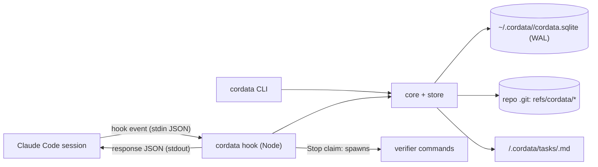

# Cordata architecture (target, v1)

Status: **slice 1 implemented** (2026-09-30), not yet dogfooded. Built: store, snapshots, spec confirm, verifier runner, all seven hooks (`SessionStart`, `UserPromptSubmit` with D-024 attach, `Stop` gate, async journal hooks, `ConfigChange`), tamper detection, ref pruning, warnings, CLI `install | new | confirm | status | verify | tick | done | abandon`. Not built: skills (`/cordata:new` etc.), `log`, and every row of "Deferred, with triggers". Decisions: `docs/DECISIONS.md` (D-001 … D-025). The three documents in `base-docs/` are superseded inputs.

## One sentence

Cordata is a local, hook-driven tool that gives Claude Code durable tasks: a task's goal, acceptance units, verification runs, action journal and workspace snapshots persist outside the session, and Cordata gates "done" by running the declared verifiers itself on a pinned worktree snapshot when Claude claims completion.

## Ownership boundaries

| Owner | Owns |
|---|---|
| Cordata | Task lifecycle, acceptance units and their versions, verification runs, action journal, snapshots under `refs/cordata/*`, the projection text injected at session start |
| Claude Code | Model loop, tools, permissions, sandbox, LSP, subagents and `Workflow`, transcript, compaction, worktrees |
| Git | Code state. Cordata only writes objects and refs under `refs/cordata/`; never the index or HEAD |
| User | Confirms acceptance units, ticks `MANUAL` units, reviews tamper flags |

Explicitly outside Cordata: memory extraction, context compilation and budgets, capability routing, DAG scheduling, worker fleets, permissions, TUI, remote services, model calls of any kind.

## Components

One Node/TypeScript package, no daemon (D-014). Each hook event starts a short-lived `cordata hook <event>` process.



- **Hook entry** (`cordata hook <event>`): reads the event JSON from stdin, calls core, prints the response JSON to stdout, always exits 0. Installed once by `cordata install` into `~/.claude/settings.json` (D-022) as `command` hooks: `SessionStart`, `UserPromptSubmit`, `Stop` (`timeout: 1800`, D-018) synchronous; `PreToolUse`, `PostToolUse`, `PostToolUseFailure` with `async: true` and matcher `Bash|Edit|Write|NotebookEdit|mcp__.*` (D-017); `ConfigChange` async (D-020). Inert where no task is attached. The Stop process runs verifiers itself, inheriting the session's environment, unsandboxed (D-019).
- **Core + store** (flat `src/`, D-025): `claude.ts` (the only host-aware file: event → core call → response shape, `install`), `task.ts` (lifecycle and units), `spec.ts`, `verify.ts` (runner, record path, Stop gate), `git.ts` (snapshots, refs), `projection.ts`, `store.ts`, `journal.ts` (action journal, heuristic effect classifier). SQLite via `node:sqlite`, WAL mode, busy timeout; every process opens, writes in a transaction, exits.
- **CLI** (`cordata`): `install`, `new`, `confirm`, `status`, `verify`, `tick`, `log`, `done`, `abandon` (no `restore`, D-025). `confirm`, `tick`, `done`, `abandon` are user-only: they refuse when `CLAUDE_CODE_CHILD_SESSION=1` (D-016).
- **Skills**: `/cordata:new`, `/cordata:status`, `/cordata:confirm` as Claude Code skills that tell the model to read package scripts and CI config, draft the spec file with Edit, and then ask the user to run the user-only command in their own terminal.

The adapter contract is the only host-specific code: six event kinds in (session start, prompt, tool before, tool after/failure, stop, config change) and a small response type out. A Codex adapter would map its twelve hook events onto the same contract.

## Data model

Runtime state in SQLite; the task spec in a markdown file.

| Record | Fields (essential) | Notes |
|---|---|---|
| Project | id, gitCommonDir | id = hash(realpath(`git rev-parse --git-common-dir`)); shared by all worktrees, one task-id sequence (D-022) |
| Task | id, projectId, worktreePath, branchAtCreation, title, specPath, specVersion (hash), frozenConfig (globs, fail cap), resolvedScripts, status, parentId?, after[], startTree, lastPassTree?, createdAt, updatedAt | status ∈ DRAFT, ACTIVE, VERIFIED_PENDING_MANUAL, DONE, ABANDONED. `parentId`/`after` exist in schema only (D-008) |
| AcceptanceUnit | id, taskId, specVersion, kind (EXEC \| MANUAL), description, command?, cwd?, timeoutMs?, status, lastRunId? | status ∈ PENDING, PASS, FAIL, TICKED; `tickTree` recorded on tick, ticks persist (D-021). Tamper units carry (path, blobHash) pairs (D-020). A new confirmed version resets all to PENDING |
| SessionAttachment | taskId, hostSessionId, transcriptPath, source (startup \| resume \| clear \| compact \| fork), startedAt, lastSeenAt | transcript referenced, never copied |
| Action | id, taskId, hostSessionId, toolUseId, tool, inputHash, inputExcerpt, effectClass, startedAt, endedAt?, outcome (OK \| ERROR \| NO_RESULT \| UNKNOWN), outputExcerpt? | Only Bash/Edit/Write/NotebookEdit/MCP calls (D-017); upsert by toolUseId (async hooks). effectClass ∈ LOCAL_WRITE, REMOTE_WRITE, DESTRUCTIVE (READ for read-only Bash); classified from tool name plus Bash command heuristics, marked heuristic |
| VerificationRun | id, taskId, trigger (STOP \| CLI \| TICK), treeHash, treeAfter, specVersion, ref, leasePid, startedAt, endedAt, verdict (PASS \| FAIL \| ERROR), tamperFiles[] | one per gated Stop claim or `cordata verify`; a claim on an unchanged (treeHash, specVersion) reuses the last run (D-015); one running run per task (lease, D-018); treeAfter ≠ treeHash → ERROR |
| UnitResult | runId, unitId, status, exitCode, signal, error, durationMs, stdout, stderr | output capped at 64 KB per stream (first 8 KB + last 56 KB), D-025 |
| TaskEvent | seq, taskId, type, payload, at | append-only audit of status transitions and `GATE_BYPASS` records (fallback `~/.cordata/bypass.log`, D-018) |

No blob files in v1 (D-025): verifier output is stored capped in SQLite; tool output keeps a 2 KB excerpt. Blob files return with observation packing.

### Task spec file

`<repo>/.cordata/tasks/<id>.md`:

```markdown
---
id: t-0007
title: Add refresh tokens
units:
  - id: u1
    kind: EXEC
    description: auth unit tests pass
    command: npm test -- auth
    timeoutMs: 120000
  - id: u2
    kind: EXEC
    description: typecheck clean
    command: npm run typecheck
  - id: u3
    kind: MANUAL
    description: refresh flow reviewed in browser
---
## Goal
...
## Constraints
...
## Notes
...
```

`cordata confirm` parses, validates (every unit is EXEC with a command or MANUAL), resolves package scripts, freezes the repo config, and stores units with `specVersion` = hash of normalized units + Goal + Constraints + frozen config + resolved scripts (D-021). Title and Notes are free text. The gate always uses the confirmed version; when the file drifts, the projection says what changed until the user confirms again (which resets unit statuses).

## Flows

**Create.** `cordata new "title"` creates `.cordata/` on first use (added to `.git/info/exclude`, D-022), creates a DRAFT task bound to the current repo worktree, records `startTree` (snapshot), writes a spec skeleton. `/cordata:new` has the model read the repo (package scripts, CI) and draft units in the file. The user reviews it and runs `cordata confirm` in their own terminal to activate it (D-016).

**Attach.** `SessionStart` (all five sources; a fork attaches its new session id) → the hook resolves project and worktree → if an ACTIVE or VERIFIED_PENDING_MANUAL task exists there, attach the session and return `additionalContext`: goal, units with status, last run verdict and failing excerpts, UNKNOWN actions ("outcome unknown, verify"), pending manual units, tamper flags, spec version, the completion marker that triggers verification, and warnings: gate bypasses, spec drift, branch ≠ `branchAtCreation`, another session active in the last 30 min, sandbox enabled but verifiers unsandboxed, large untracked files. Capped at ~4,000 chars: stderr excerpts trimmed first, lists collapse to "+N more", ends with "full state: `cordata status`"; factual wording, never system-style commands (D-023). No active task → empty response; Cordata is inert for that session.

**Journal.** Async hooks on Bash/Edit/Write/NotebookEdit/MCP calls only (D-017). `PreToolUse` → upsert Action (open) with effect class; never a decision in v1. A Bash command that mentions a user-only verb, `~/.cordata` or the database adds a MANUAL tamper unit (D-016). `PostToolUse` → OK, `PostToolUseFailure` → ERROR, with output excerpt and blob. At the session's next `Stop` or `UserPromptSubmit`, still-open actions close as NO_RESULT (denied or interrupted). Actions open when a session produced neither are UNKNOWN.

**Stop gate** (D-015). `Stop` → allow without running anything unless all hold: an ACTIVE task is attached; `background_tasks` is empty; `cwd` resolves to the task's worktree; `last_assistant_message` contains the completion marker; the current tree differs from the last run's tree for this task and spec version (an unchanged tree reuses that result and does not re-block). `stop_hook_active` never short-circuits; `false` resets Cordata's consecutive-fail counter, and after 3 consecutive FAIL runs in one chain Cordata allows the stop. When gated (D-018): take the task's run lease (another run in progress → wait within budget, then reuse if (tree, specVersion) matches); warn on untracked non-ignored files over 10 MB; write a tree from a temporary index seeded from a copy of the real index, pin `refs/cordata/<task>/<run>`; tamper checks against `startTree` (globs, resolved scripts; new (path, blob) content → MANUAL unit, D-020); run every EXEC unit sequentially with cwd = worktree, its timeout and a total budget of hook timeout − 60 s; write the tree again (mismatch → ERROR); record the run; prune refs (D-022). All PASS → allow; DONE if no MANUAL units are pending, else VERIFIED_PENDING_MANUAL. FAIL → block with top-level `{"decision":"block","reason":...}` (failing units, exit codes, trimmed stderr, run id), cap 3 per chain. ERROR (126/127, timeout, spawn failure, tree mismatch) → block once per chain with an infrastructure-error reason, then allow with a note. Any internal failure → allow and record `GATE_BYPASS`.

**Compaction.** `SessionStart(compact)` re-injects the projection (mitigates rule loss across compactions). No `PreCompact` hook (D-017).

**Resume.** `SessionStart(resume|startup)` on a task with UNKNOWN actions lists them; nothing is retried automatically. `cordata status` prints the last host session id so the user can `claude --resume <id>`.

**Restore.** No command (D-025): `cordata status` prints `git restore --source=<tree> --worktree -- .` for each retained run, which leaves the index untouched (invariant 6; `git checkout <tree> -- .` would stage). Untracked files absent from the snapshot are left in place.

**Manual.** `cordata tick <unit>` marks TICKED with its tree. DONE requires every EXEC unit PASS on the current tree and every MANUAL unit TICKED; if the tree changed since the last PASS, `tick` runs the EXEC units in the user's terminal (PASS → DONE, FAIL → ACTIVE) (D-021). `cordata done`/`abandon` are explicit overrides recorded as TaskEvents. All four are user-only (D-016).

## Invariants

1. Only Cordata's verify path sets a unit to PASS or FAIL, from verifier exit codes it observed. Model statements never do.
2. Every PASS is bound to a tree hash and a spec version: verifiers exited 0 on a worktree whose non-ignored content was that tree before and after the run. Gitignored inputs (dependencies, env files) are not covered. A new confirmed spec version resets unit statuses.
3. The allowed-tool set never changes mid-session; Cordata never denies a tool in v1 (D-007, D-012).
4. Cordata makes zero model calls. Nothing in Cordata depends on `claude -p` or the Agent SDK.
5. Host transcripts are referenced by path and session id, never copied.
6. Cordata never modifies the user's index, HEAD, or branches; only `refs/cordata/*` and objects.
7. No attached task → Cordata records nothing and gates nothing.
8. One write path: hook processes and the CLI write only through `core` + `store` (SQLite WAL transactions); no other component touches the database (D-014).

## Configuration

- No `~/.cordata/config.json` (D-025): retention days (30), large-file threshold (10 MB), budget and marker are constants in `src/store.ts`. `CORDATA_HOME` overrides the state root (used by `scripts/smoke.sh`).
- `<repo>/.cordata/config.json`: tamper globs (default list in D-020) and stop-fail cap; frozen into the task at `confirm`.
- Hooks: user level, written once by `cordata install` into `~/.claude/settings.json`.

## Setup (planned)

`npm install && npm link` in this repo → `cordata install` once (writes exec-form hooks with absolute `node` and `src/cli.ts` paths; Node ≥ 24.15 runs the TypeScript directly). No per-repo setup; `cordata new` prepares a repo on first use. Enabling Claude Code's sandbox is recommended (D-012), but Cordata's verifiers still run outside it until wrapping lands (D-019); Cordata warns while the sandbox is on.

## Deferred, with triggers

| Item | Trigger to build |
|---|---|
| Observation packing on `PostToolUse` (v1.1) | Wedge in daily use; measured large-output tasks |
| Codex adapter | Wanted second executor; ChatGPT Plus device auth confirmed |
| Herdr sidebar plugin | User wants task state visible in Herdr panes |
| Task-scoped path policy | A real unwanted edit outside the worktree |
| Sub-task scheduling from `after[]` | A task that genuinely needs ordered sub-tasks |
| Coordinator layer: sub-tasks with one worktree each, Cordata computes readiness from `after[]`, spawns one headless worker per ready sub-task, integration sub-task runs cross-branch verifiers. Thin layer over the existing acceptance gate; no redesign | Dogfooding shows genuinely independent parallel work, and subscription coverage of headless workers is settled |
| Journal impact view: files a task touched (from Edit/Write/Bash actions) joined to the verifier units that covered them. Pure SQL over Action + VerificationRun | First time "what did this task change and was it tested" is asked and `cordata log` is not enough |
| Code structure index (tree-sitter outline or SCIP) | Localization failures observed in dogfooding that host LSP + grep do not cover |
| Procedure registry | Repeated task families observed in dogfooding |
| Verifier registry scan (D-011, deferred by D-017) | Drafting picks weak or wrong verifier commands in dogfooding |
| Daemon (D-014) | Synchronous hook latency above ~200 ms or `SQLITE_BUSY` failures in dogfooding |
| Verifier sandboxing via `@anthropic-ai/sandbox-runtime` (D-019) | User enables the Claude Code sandbox |
| AST-level tamper checks (proof-of-done style) | Dogfooding shows test weakening the glob diff misses |
| Project id stored in git config (D-022) | A repo move orphans Cordata state |
| TUI / web view | CLI proves insufficient |

Rule for every row: build it as a separate module behind a flag, keep the invariants, add a decision entry with the trigger evidence.

## Risks and unverified points

- Gated Stop latency equals verifier runtime (only on completion claims, D-015). Long suites make that stop slow; the Stop hook needs an explicit `timeout` above the unit budget, because a timed-out hook renders no decision. Mitigation: focused commands in units, per-unit timeouts, `cordata verify` on demand.
- Claude Code hook contracts change weekly (v2.1.x). Pin a minimum version; keep the adapter isolated.
- Gate is fail-open by design (D-018): a crash or timeout lets Claude stop; bypasses are recorded and surfaced, not prevented. Tamper detection is evidence, not prevention (D-016, D-020).
- The completion marker relies on model compliance (D-015); unmarked "done" claims are not blocked. Measure in dogfooding.
- Subscription coverage of headless use may change; Cordata does not depend on it.
- `git add -A` into a temporary index scales with repo size; acceptable for personal repos, measure on large ones.
- Effect classification of Bash commands is heuristic and labelled as such in the projection.
- `node:sqlite` works on Node 24.15.0 (checked 2026-09-29); pin a minimum Node version.

## References

- Decisions: `docs/DECISIONS.md`
- Research briefs: `docs/research/`
- Host contracts: `docs/research/2026-09-29-claude-code-contracts.md`
